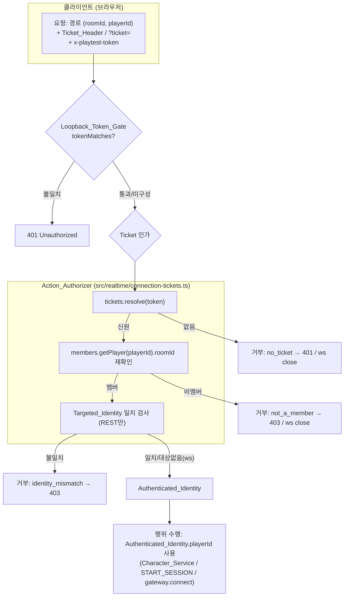

# Design Document

## Overview

이 문서는 ready-gm 플레이테스트 서버의 **인증 신뢰 모델 강화(auth-hardening)** 설계를 정의한다. 목표는 "방/플레이어 UUID 쌍만 알면 남을 사칭한다"는 사소한 사칭 구멍을, **이미 존재하는** `ConnectionTicketStore`/`authorizeConnection` 프리미티브를 **재사용·확장**해 닫는 것이다. 새로운 인증 체계(JWT/OAuth 등)는 도입하지 않는다.

핵심 설계 원칙은 다음과 같다.

- **신원은 티켓에서 도출한다(identity-from-ticket)**: 모든 플레이어-행위(Player_Acting_Endpoint)와 `/ws` 연결의 플레이어 신원은 서버가 발급한 Connection_Ticket에서 도출하며, 클라이언트가 보낸 `playerId`(경로 파라미터·쿼리)는 신원 결정에 사용하지 않는다. 클라이언트 공급 `(roomId, playerId)`는 **요청이 무엇을 대상으로 하는지(Targeted_Identity)** 만 나타내며, 인가는 티켓의 신원이 그 대상과 정확히 일치할 때에만 성공한다.
- **가산적·최소 변경(additive)**: 기존 `ConnectionTicketStore`의 `issue`/`resolve`/`revoke(token)`/`size`는 그대로 두고, (a) `(roomId, playerId)` 일치까지 검사하는 순수 인가 함수 `authorizeAction`을 추가하고, (b) 방 단위 폐기를 위한 역방향 색인과 `revokeRoom(roomId)`을 추가한다. 서버는 모든 플레이어에게 티켓을 발급하고, 플레이어-행위 엔드포인트와 `/ws`에서 이 인가를 호출하도록 배선한다.
- **심층 방어 보존(defence in depth)**: 루프백 공유 비밀 게이트(`tokenMatches`)와 바인딩 안전성 정책은 변경 없이 유지하되, 그것이 **플레이어 신원** 검증의 유일한 수단이 되지 않게 한다. 두 검사는 직교(orthogonal)하며 순서대로(공유 비밀 → 티켓) 적용된다.
- **기존 동작 보존**: 호스트 전용(`NOT_HOST`)·전원 확정(`NOT_ALL_CONFIRMED`) 게이트, 레이트 리미트·세션 슬롯, 비플레이어-행위 엔드포인트의 인가 동작은 그대로 유지된다.

### 설계 목표

- 요구사항 1~8을 모두 충족하는, 티켓 발급·인가·폐기·서버 배선의 가산 확장을 정의한다.
- 인가 결정(authorize)·티켓 발급/해석/폐기를 DOM·네트워크와 분리된 **순수하고 단위·속성 테스트 가능한 함수/메서드**로 명세한다.
- `src/realtime/connection-tickets.test.ts`와 `src/server-security.test.ts`의 기존 계약을 보존하고, 정당하게 바뀌는 부분만 명시적으로 갱신한다.

### 백엔드 계약 매핑 (실제 코드 근거)

| 구성요소 | 실제 코드 근거 | 본 스펙의 확장 |
| --- | --- | --- |
| `ConnectionTicketStore` (`issue`/`resolve`/`revoke`/`size`) | `src/realtime/connection-tickets.ts` | 방→토큰 역방향 색인 + `revokeRoom(roomId): number` 추가(기존 메서드 동작 보존) |
| `authorizeConnection(tickets, members, token)` | `src/realtime/connection-tickets.ts` | 그대로 재사용(연결용 1차 인가). 본 스펙은 그 위에 Targeted_Identity 일치 검사를 더한 `authorizeAction` 추가 |
| `RoomMembershipReader.getPlayer` | `src/realtime/connection-tickets.ts` / `RoomStore` | 그대로 재사용(멤버십 재확인) |
| `POST /play/new` (티켓 발급) | `src/server.ts` | 동작 유지(이미 발급) |
| `POST /rooms`, `POST /rooms/:token/join` | `src/server.ts` | 응답에 발급된 Connection_Ticket(`connectionToken`) 추가 |
| 플레이어-행위 엔드포인트 (proposal/character/confirm/start) | `src/server.ts` | Ticket_Header에서 티켓을 읽어 `authorizeAction`으로 인가 후 신원 도출; 미인가는 401/403 |
| `resolveSocketIdentity` (`/ws`) | `src/server.ts` | 클라이언트 `playerId` 폴백 제거; 유효 티켓에서만 신원 도출 |
| `tokenMatches`/`checkStartupSafety`/`resolveBinding` | `src/server-security.ts` | 변경 없음(심층 방어 보존) |

> **범위 밖(요구사항 가정과 동일)**: 프론트엔드가 발급받은 티켓을 후속 요청에 싣는 실제 배선(`public/character`·`public/lobby`·`public/game`)은 character-sheet·room-lobby 스펙과 같은 가산 작업으로 두고, 본 설계는 서버 측 인가·발급·폐기 계약과 그 순수 로직을 명세한다. 영속화·분산 세션·프로덕션 인증은 다루지 않는다.

### 요구사항 정합성 메모 (Requirement Reconciliation Notes)

설계 중 다음 결정으로 모호함을 해소했다.

1. **거부 상태 코드 401 vs 403.** 요구사항 2.4/7.3은 **티켓 부재·해석 불가**(인증되지 않음)를 401로, 요구사항 3.1/3.2는 **티켓은 유효하나 Targeted_Identity 불일치**(인증되었으나 권한 없음)를 403으로 규정한다. 본 설계는 이를 그대로 따른다: `authorizeAction`이 거부 사유를 `"no_ticket"`(→401)과 `"identity_mismatch"`/`"not_a_member"`(→403)로 구분해 산출하고, 서버 핸들러가 사유→상태 코드로 매핑한다.
2. **`/ws` 거부는 상태 코드가 아니라 소켓 종료.** WebSocket 업그레이드 경로에는 HTTP 상태 본문이 없으므로, 미인가 연결은 기존 관례(`socket.close(1008, ...)`)대로 닫는다(요구사항 4.2/7.3).
3. **Targeted_Identity가 있는 인가 vs 없는 인가.** `/ws`는 클라이언트가 대상 `playerId`를 신뢰 기준으로 보낼 필요가 없으므로(기존 `authorizeConnection`처럼) 티켓 신원을 그대로 채택한다. REST 플레이어-행위는 경로에 `:roomId`·`:playerId`가 이미 존재하므로, 티켓 신원이 그 경로 대상과 일치하는지까지 검사한다(`authorizeAction`). 두 함수는 동일한 멤버십 재확인 로직을 공유한다.

## Architecture

### 신원 도출·인가 흐름 개요



**핵심 추상**: 인가는 두 단계 직교 검사다 — (1) **Loopback_Token_Gate**(비용 표면 보호, 신원 무관), (2) **티켓 인가**(신원 도출 + 멤버십 재확인 + REST의 경우 Targeted_Identity 일치). 행위 주체 `playerId`는 **항상** (2)가 산출한 Authenticated_Identity에서 온다. 클라이언트가 보낸 `playerId`는 REST에서 "대상 검사 입력"으로만 쓰이고 신원 결정에는 쓰이지 않는다.

### 계층 분리 원칙

- **순수 로직 계층**(`src/realtime/connection-tickets.ts`): 티켓 발급/해석/폐기(방 단위 포함)와 인가 결정(`authorizeConnection`·신규 `authorizeAction`)을 무작위·네트워크에서 분리된 순수 단위로 둔다. 무작위 토큰 생성기는 주입 가능(`generateToken`)하여 결정적 테스트가 가능하다.
- **배선 계층**(`src/server.ts`): HTTP/WS 핸들러가 Ticket_Header/쿼리에서 토큰을 읽고, 순수 인가 함수를 호출하고, 거부 사유를 상태 코드(401/403) 또는 소켓 종료로 매핑하고, 성공 시 Authenticated_Identity로 서비스/게이트웨이를 호출한다.

### 인가 알고리즘 (Authorization Algorithm) — 단일 명세

**입력**: `tickets: ConnectionTicketStore`, `members: RoomMembershipReader`, `token: string | null | undefined`, (REST만) `target: { roomId, playerId }`.
**출력**: `{ ok: true, identity }` 또는 `{ ok: false, reason }`.

1. `identity = tickets.resolve(token)`. `undefined`이면 `{ ok: false, reason: "no_ticket" }`.
2. `player = members.getPlayer(identity.playerId)`. `player`가 없거나 `player.roomId !== identity.roomId`이면 `{ ok: false, reason: "not_a_member" }`.
3. (REST `authorizeAction`만) `target`이 주어졌고 `identity.roomId !== target.roomId` 또는 `identity.playerId !== target.playerId`이면 `{ ok: false, reason: "identity_mismatch" }`.
4. 그 외에는 `{ ok: true, identity }`.

`authorizeConnection`(기존)은 1~2단계만 수행한다(이미 구현됨, 변경 없음). `authorizeAction`(신규)은 1~2단계를 `authorizeConnection`에 위임하고 3단계를 더한다 — 즉 `authorizeConnection`의 동작을 그대로 흡수하므로 두 함수의 멤버십 판정은 동일하다.

**거부 사유 → 결과 매핑**

| reason | REST 상태 | `/ws` 처리 | 요구사항 |
| --- | --- | --- | --- |
| `no_ticket` | 401 | `close(1008)` | 2.4, 4.2, 7.3 |
| `not_a_member` | 403 | `close(1008)` | 2.3, 4.3, 7.3 |
| `identity_mismatch` | 403 | (REST 전용) | 3.1, 3.2, 3.3 |

### 결정성·멱등성

인가 결정은 순수 함수이며 직전 호출 상태에 의존하지 않는다. 동일한 스토어 상태·동일한 입력에 대해 매번 동일한 결과를 산출한다. 폐기는 멱등이다(이미 없는 토큰을 폐기해도 무해).

## Components and Interfaces

### 1. Connection_Ticket_Store 확장 — 방 단위 폐기 (`src/realtime/connection-tickets.ts`)

- **책임**
  - 기존 `issue(identity): token` / `resolve(token): identity | undefined` / `revoke(token): void` / `size`를 **변경 없이** 유지한다(요구사항 1.4, 1.5, 7.1).
  - 발급 시 방→토큰 역방향 색인을 갱신하고, `revokeRoom(roomId): number`로 그 방의 모든 티켓을 일괄 폐기한다. 다른 방의 티켓은 영향받지 않는다(요구사항 7.2).
  - `revoke(token)` 시 역방향 색인도 정합하게 정리한다.
- **인터페이스(확장)**
  ```ts
  class ConnectionTicketStore {
    issue(identity: ConnectionIdentity): string;          // 기존 + 역색인 갱신
    resolve(token: string | null | undefined): ConnectionIdentity | undefined; // 기존
    revoke(token: string): void;                          // 기존 + 역색인 정리
    revokeRoom(roomId: string): number;                   // 신규: 폐기된 티켓 수 반환
    get size(): number;                                   // 기존
  }
  ```

### 2. Action_Authorizer — Targeted_Identity 일치 인가 (`src/realtime/connection-tickets.ts`)

- **책임**
  - 위 "인가 알고리즘"의 1~3단계를 실현한다. 1~2단계는 기존 `authorizeConnection`에 위임하여 멤버십 판정을 공유하고, 3단계로 Targeted_Identity 일치를 검사한다(요구사항 2.1, 2.3, 3.1, 3.2, 3.3, 3.4).
  - 거부 시 사유(`no_ticket`/`not_a_member`/`identity_mismatch`)를 구분해 산출한다.
- **인터페이스(신규)**
  ```ts
  type ActionAuthResult =
    | { readonly ok: true; readonly identity: ConnectionIdentity }
    | { readonly ok: false; readonly reason: "no_ticket" | "not_a_member" | "identity_mismatch" };

  function authorizeAction(
    tickets: ConnectionTicketStore,
    members: RoomMembershipReader,
    token: string | null | undefined,
    target: { roomId: string; playerId: string },
  ): ActionAuthResult;
  ```
- 기존 `authorizeConnection`의 반환 형태(`{ ok, reason: string }`)는 보존한다. `authorizeAction`은 사유를 좁은 유니온으로 산출해 서버가 상태 코드로 매핑할 수 있게 한다.

### 3. 티켓 발급 배선 — 모든 플레이어 (`src/server.ts`)

- **책임**
  - `POST /play/new`: 기존대로 시드 호스트에게 발급(요구사항 1.1, 변경 없음).
  - `POST /rooms`: Host_Player 생성 직후 `connectionTickets.issue({ roomId, playerId })`를 호출하고 응답에 `connectionToken`을 추가한다(요구사항 1.2).
  - `POST /rooms/:token/join`: `roomService.joinRoom` 성공 후 그 참가 플레이어에 대해 발급하고 응답에 `connectionToken`을 추가한다(요구사항 1.3).
- **인터페이스(응답 본문 확장)**: 두 엔드포인트 응답에 `connectionToken: string` 필드 추가(기존 필드 보존).

### 4. 플레이어-행위 엔드포인트 인가 배선 (`src/server.ts`)

- **책임**
  - 대상 엔드포인트: `POST /rooms/:roomId/players/:playerId/proposal`, `.../character`, `.../character/confirm`, `.../start`.
  - 각 핸들러에서 (1) 기존 `restAuthorized(req)`(Loopback_Token_Gate) 먼저 검사 → 실패 시 401(요구사항 5.1, 5.2). (2) Ticket_Header(`x-connection-ticket`)에서 토큰을 읽어 `authorizeAction(connectionTickets, roomStore, token, { roomId, playerId })` 호출. 거부 사유→상태 코드(`no_ticket`→401, `not_a_member`/`identity_mismatch`→403)로 매핑하고 **어떤 상태 변경도 하기 전에** 반환한다(요구사항 2.2, 2.4, 3.1, 3.2).
  - 인가 성공 시 `auth.identity.playerId`(클라이언트가 보낸 `req.params.playerId`가 아님)를 행위 주체로 `characterService`/세션 시작에 넘긴다(요구사항 2.1, 2.5).
  - `start`는 인가 성공 후 기존 호스트·전원 확정 게이트를 그대로 적용한다(요구사항 6.1, 6.2, 6.3).
- **헬퍼(신규)**
  ```ts
  function ticketFromRequest(req: express.Request): string | undefined; // x-connection-ticket 헤더
  function authorizePlayerAction(req, res, roomId, playerId): ConnectionIdentity | null;
  // 인가 실패 시 res에 401/403을 쓰고 null 반환; 성공 시 identity 반환.
  ```

### 5. Realtime_Channel 신원 도출 (`src/server.ts`)

- **책임**
  - `resolveSocketIdentity(params)`에서 **클라이언트 공급 `roomId`/`playerId` 폴백 경로를 제거**하고, 유효한 `ticket`에서 `authorizeConnection`으로 도출한 신원만 채택한다. 티켓이 없거나 무효이면 `null`을 반환해 `wss.on("connection")`이 소켓을 닫게 한다(요구사항 4.1, 4.2, 4.3).
  - 신원 도출 성공 시 그 신원의 `playerId`를 `WsConnection`과 인바운드 메시지→오케스트레이터 명령 변환의 행위 주체로 사용한다(요구사항 4.4).
  - 기존 Loopback_Token_Gate(`tokenMatches`)는 `/ws`에서도 먼저 적용된다(요구사항 5.1).
- **인터페이스(변경)**: `resolveSocketIdentity(params): { roomId, playerId } | null` — 시그니처 유지, 내부에서 티켓 전용 도출로 단순화.

### 6. Ticket_Revocation 배선 (`src/server.ts`)

- **책임**
  - 세션 종료 또는 방 teardown 지점에서 `connectionTickets.revokeRoom(roomId)`를 호출해 그 방의 모든 티켓을 폐기한다(요구사항 7.2, 7.3). 본 스펙은 인메모리 범위이므로 명시적 teardown 훅(예: 방 상태가 종료로 전이될 때)에서 호출하도록 배선한다.
  - 폐기 이후 동일 티켓으로 온 플레이어-행위·`/ws` 요청은 `resolve`가 `undefined`를 반환하므로 자동으로 거부된다(요구사항 7.1, 7.3).

### 7. 기존 동작 보존 지점 (`src/server.ts`)

- 비플레이어-행위 엔드포인트(`GET /rooms/:id/readiness`, `GET /rooms/:id/sheet-schema`, `GET /scenarios`, `GET /rooms/:token`, `POST /solo/*`)와 로비 소켓(`/lobby/ws`)의 인가 동작은 변경하지 않는다(요구사항 8.4). 레이트 리미트·세션 슬롯·바인딩 안전성도 그대로다(요구사항 5.4).

## Data Models

### Connection_Ticket / Ticket_Identity (기존, 보존)

```ts
interface ConnectionIdentity {        // = Ticket_Identity
  readonly roomId: string;
  readonly playerId: string;
}
// Connection_Ticket = 24바이트 무작위에서 만든 base64url 문자열(불투명 토큰).
```

### Connection_Ticket_Store 내부 상태 (확장)

```ts
class ConnectionTicketStore {
  private readonly tickets = new Map<string /* token */, ConnectionIdentity>();   // 기존
  private readonly byRoom  = new Map<string /* roomId */, Set<string /* token */>>(); // 신규 역색인
}
```

- 불변식(invariant): `byRoom`의 모든 토큰은 `tickets`에 존재하고, `tickets`의 모든 토큰은 그 신원의 `roomId`에 해당하는 `byRoom` 엔트리에 정확히 한 번 들어 있다. `issue`/`revoke`/`revokeRoom`은 이 불변식을 보존한다.

### 인가 결과

```ts
type ActionAuthResult =
  | { ok: true; identity: ConnectionIdentity }
  | { ok: false; reason: "no_ticket" | "not_a_member" | "identity_mismatch" };
// REST 매핑: no_ticket → 401, not_a_member → 403, identity_mismatch → 403.
```

### Targeted_Identity (요청 입력)

```ts
interface TargetedIdentity {          // REST 경로 파라미터에서 읽음 (신뢰 기준이 아님)
  roomId: string;   // :roomId
  playerId: string; // :playerId
}
```

### 티켓 발급 응답 (확장)

```ts
// POST /rooms, POST /rooms/:token/join 응답에 추가:
interface IssuedTicketFields { connectionToken: string; }
// POST /play/new 는 기존대로 connectionToken 포함.
```

## Correctness Properties

*속성(property)이란 시스템의 모든 유효한 실행에서 참이어야 하는 특성 또는 동작으로, 시스템이 무엇을 해야 하는지에 대한 형식적 진술이다. 속성은 사람이 읽는 명세와 기계가 검증 가능한 정확성 보증 사이의 다리 역할을 한다.*

본 기능의 PBT 대상은 네트워크·DOM과 분리된 **순수 인가·티켓 로직**이다: `ConnectionTicketStore`(`issue`/`resolve`/`revoke`/`revokeRoom`)와 인가 결정 함수(`authorizeConnection`·`authorizeAction`). 입력(임의의 방·플레이어·티켓·대상 조합)에 따라 판정이 의미 있게 달라지며, 100회 이상 반복이 교차 사칭·폐기·멤버십 경계의 엣지 케이스를 드러낸다. 반면 Express 라우팅·HTTP 상태 코드 배선·`/ws` 소켓 종료·실제 무작위 토큰 생성은 입력에 따라 의미 있게 변하지 않거나 외부 프레임워크 동작이므로 **예제/통합 테스트**로 다룬다(Testing Strategy 참조). 아래 속성들은 prework 분석을 reflection으로 통합한 것이다(중복 분류 항목은 통합·흡수했다).

### Property 1: 발급·해석 라운드 트립과 티켓 고유성

*For any* `(Room_Id, Player_Id)` 쌍에 대해, `Connection_Ticket_Store.issue`가 발급한 Connection_Ticket을 `resolve`로 해석하면 발급에 쓰인 바로 그 Ticket_Identity를 돌려준다. 그리고 *For any* 서로 다른 두 발급 요청에 대해 산출된 두 Connection_Ticket은 서로 구별된다.

**Validates: Requirements 1.4, 1.5**

### Property 2: 인가는 신원을 티켓에서 도출하고 멤버십을 재확인한다

*For any* 티켓 스토어·멤버 리더 상태와 임의의 토큰에 대해, `authorizeConnection`(그리고 대상 일치 시 `authorizeAction`)은 (a) 토큰이 스토어에서 해석되지 않으면 `no_ticket`으로 거부하고, (b) 해석된 Ticket_Identity의 Player_Id가 멤버 리더에서 그 Ticket_Identity의 Room_Id의 멤버가 아니면 `not_a_member`로 거부하며, (c) 두 조건을 모두 만족하면 그 Ticket_Identity를 Authenticated_Identity로 산출한다. 산출된 Authenticated_Identity는 항상 토큰의 Ticket_Identity와 같고, 함수에 함께 전달된 어떤 클라이언트 공급 `Player_Id`와도 무관하다.

**Validates: Requirements 2.1, 2.3, 4.1, 4.3**

### Property 3: Targeted_Identity 일치 인가와 불일치 거부

*For any* 유효한(해석되고 멤버인) Connection_Ticket과 임의의 Targeted_Identity에 대해, `authorizeAction`은 Ticket_Identity의 Room_Id와 Player_Id가 Targeted_Identity의 둘 모두와 정확히 일치할 때에만 `ok: true`(그 Ticket_Identity 산출)를 반환하고, Room_Id 또는 Player_Id가 다르면 `identity_mismatch`로 거부하며 어떤 Authenticated_Identity도 산출하지 않는다.

**Validates: Requirements 2.2, 3.1, 3.2, 3.3**

### Property 4: 같은 방 안에서도 교차 플레이어 위조는 거부된다

*For any* 같은 Room_Id에 속한 서로 다른 두 플레이어 A·B와 각자에게 발급된 Connection_Ticket에 대해, A의 Connection_Ticket으로 B를 Targeted_Identity(`{ roomId, playerId: B }`)로 한 `authorizeAction` 호출은 `identity_mismatch`로 거부되고, A의 Connection_Ticket은 A 자신을 대상으로 할 때에만 인가된다.

**Validates: Requirements 3.4**

### Property 5: 폐기된 티켓은 더 이상 인가하지 않는다

*For any* 발급된 Connection_Ticket에 대해, `revoke(token)` 이후 그 토큰을 `resolve`하면 `undefined`이고, `authorizeConnection`·`authorizeAction`은 그 토큰에 대해 `no_ticket`으로 거부한다. 폐기는 멱등이다(이미 폐기된 토큰을 다시 폐기해도 다른 토큰의 해석·인가에 영향을 주지 않는다).

**Validates: Requirements 7.1, 7.3**

### Property 6: 방 단위 폐기는 대상 방만 무효화한다

*For any* 여러 방에 걸쳐 발급된 Connection_Ticket 집합과 임의의 대상 Room_Id에 대해, `revokeRoom(roomId)` 이후 그 Room_Id를 Room_Id로 가진 모든 Connection_Ticket은 `resolve`가 `undefined`를 반환하고(따라서 어떤 인가도 산출하지 못하고), 다른 Room_Id에 묶인 모든 Connection_Ticket은 폐기 전과 동일하게 해석·인가된다.

**Validates: Requirements 7.2, 7.3**

### Property 7: 인가 결정의 결정성·멱등성

*For any* 고정된 티켓 스토어·멤버 리더 상태와 동일한 입력(토큰, 그리고 해당 시 Targeted_Identity)에 대해, `authorizeConnection`·`authorizeAction`을 임의의 횟수(2회 이상) 호출해도 매번 동일한 판정과 동일한 거부 사유를 산출하며, 인가 호출 자체는 스토어 상태(`size`·해석 결과)를 변경하지 않는다.

**Validates: Requirements 2.1, 3.3**

### Property 8: 발급된 티켓의 역색인 정합성 불변식

*For any* `issue`·`revoke`·`revokeRoom` 연산의 임의의 순열을 적용한 뒤에도, `Connection_Ticket_Store`의 방→토큰 역색인은 `tickets` 맵과 정합한다: 역색인이 가리키는 모든 토큰은 `tickets`에 존재하고 그 신원의 Room_Id가 역색인 키와 같으며, `tickets`의 모든 토큰은 자신의 Room_Id 역색인에 정확히 한 번 들어 있다. 따라서 `revokeRoom(roomId)`가 폐기한 티켓 수는 그 시점에 그 Room_Id에 묶여 있던 티켓 수와 같다.

**Validates: Requirements 7.2**

## Error Handling

### 거부 사유와 응답 매핑

플레이어-행위 REST 인가의 거부는 두 계층으로 나뉜다.

| 계층 | 조건 | 응답 | 요구사항 |
| --- | --- | --- | --- |
| Loopback_Token_Gate | 공유 비밀 불일치 | 401, 티켓 검증 미수행 | 5.1, 5.2 |
| 티켓 인가 — `no_ticket` | 티켓 부재·해석 불가 | 401, 상태 변경 없음 | 2.4, 7.3 |
| 티켓 인가 — `not_a_member` | 신원이 더 이상 방 멤버 아님 | 403, 상태 변경 없음 | 2.3, 4.3, 7.3 |
| 티켓 인가 — `identity_mismatch` | 티켓 신원 ≠ Targeted_Identity | 403, 상태 변경 없음 | 3.1, 3.2 |

- 모든 거부는 `characterService.recordCharacter`/`confirmCharacter`·세션 시작을 **호출하기 전에** 반환하여 어떤 캐릭터 데이터 기록·확정·세션 시작도 일어나지 않게 한다(요구사항 2.4, 3.1, 3.2, 7.3).
- `/ws` 업그레이드의 미인가는 HTTP 상태 대신 기존 관례(`socket.close(1008, "unauthorized")`)로 처리한다(요구사항 4.2, 7.3).
- `start` 엔드포인트는 티켓 인가를 통과한 뒤에만 `NOT_HOST`/`NOT_ALL_CONFIRMED` 비즈니스 사유(200 + 판별 본문)를 산출한다(요구사항 6.1, 6.2).

### 폐기·정합성

- `revoke`/`revokeRoom`은 역색인을 정합하게 정리하여, 폐기 이후 `resolve`가 폐기된 토큰을 절대 해석하지 못하게 한다(요구사항 7.1, 7.2). 폐기는 멱등이다.
- 인가 함수는 순수하며 스토어를 변경하지 않으므로, 반복 호출이나 호출 순서가 인가 결과를 바꾸지 않는다(요구사항 2.1).

### 후방 호환·심층 방어

- 모든 플레이어가 발급 시 티켓을 받으므로(요구사항 1.1~1.3), 올바른 티켓을 제시하는 정상 흐름은 그대로 성공한다(요구사항 8.1~8.3).
- Loopback_Token_Gate가 미구성이어도 티켓 인가는 여전히 적용된다(요구사항 5.3). 두 게이트는 직교한다.
- 비플레이어-행위 엔드포인트·로비 소켓·레이트 리미트·바인딩 안전성은 변경하지 않는다(요구사항 5.4, 8.4).

## Testing Strategy

### 이중 테스트 접근

- **속성 테스트(Property tests)**: 위 Correctness Properties 1~8을 검증한다. 대상은 `src/realtime/connection-tickets.ts`의 순수 로직이며, `src/realtime/connection-tickets.test.ts`(또는 `*.props.test.ts`)에서 노드 환경 vitest로 실행한다. 토큰 생성기는 주입(`generateToken`)으로 결정화하고, 멤버 리더는 기존 테스트의 `members({...})` 페이크를 재사용한다.
- **예제/단위 테스트(Example tests)**: 거부 사유→HTTP 상태 매핑(`no_ticket`→401, `*_mismatch`→403)의 대표 사례, `POST /rooms`·`/rooms/:token/join` 응답에 `connectionToken`이 포함됨, `start`의 `NOT_HOST`/`NOT_ALL_CONFIRMED` 보존을 예제로 검증한다. 기존 `src/server-security.test.ts`의 헬퍼 계약은 변경 없이 통과해야 한다.
- **통합 테스트(Integration tests)**: 실제 Express 핸들러를 통해 (a) 유효 티켓 + 일치 대상 → 정상 수행, (b) 티켓 부재 → 401, (c) 교차 플레이어 티켓 → 403 + 상태 무변경, (d) `/ws` 업그레이드가 티켓 없이는 닫히고 유효 티켓으로는 게이트웨이에 등록됨, (e) 정상 멀티플레이 해피패스(생성→참가→캐릭터→확정→시작)를 올바른 티켓으로 통과함을 1~3개 대표 사례로 검증한다(요구사항 8.1~8.3).

### 도구

- **속성 테스트 라이브러리**: `fast-check`(기존 devDependency). 직접 구현하지 않는다.
- **테스트 러너**: `vitest`(기존). `src/**/*.test.ts`는 노드 환경.
- **결정적 토큰**: `ConnectionTicketStoreOptions.generateToken`을 주입해 충돌·고유성·역색인 시나리오를 결정적으로 만든다.
- **윈도우 셸 주의**: `src/` 변경 후에는 `& npm run build`로 컴파일한 뒤 `& npx vitest run`으로 테스트한다(명령 첫 글자 누락 방지를 위해 `& ` 접두 필수).

### 속성 테스트 규칙

- 각 속성 테스트는 최소 **100회 반복**으로 실행한다(`fast-check`의 `numRuns: 100` 이상).
- 각 속성 테스트는 설계 문서의 속성을 주석으로 참조한다.
- 태그 형식: **Feature: auth-hardening, Property {번호}: {속성 텍스트}**
- 각 Correctness Property는 **하나의** 속성 기반 테스트로 구현한다.

#### 생성기(Generator) 전략

- **신원 생성기**: 임의 Room_Id·Player_Id 문자열(UUID 형태 + 빈/특수문자 경계 포함) — Property 1~8.
- **스토어 상태 생성기**: 여러 방·여러 플레이어에 걸친 발급 집합과, 그 일부를 멤버 리더에 등록/미등록 — Property 2, 4, 6, 8.
- **토큰 입력 생성기**: 유효 발급 토큰 / 미발급(위조) 문자열 / 빈·null — Property 2, 5.
- **Targeted_Identity 생성기**: 티켓 신원과 일치 / Room_Id만 불일치 / Player_Id만 불일치 / 둘 다 불일치 — Property 3, 4.
- **연산 순열 생성기**: `issue`·`revoke`·`revokeRoom`의 임의 순서 시퀀스 — Property 5, 6, 8.
