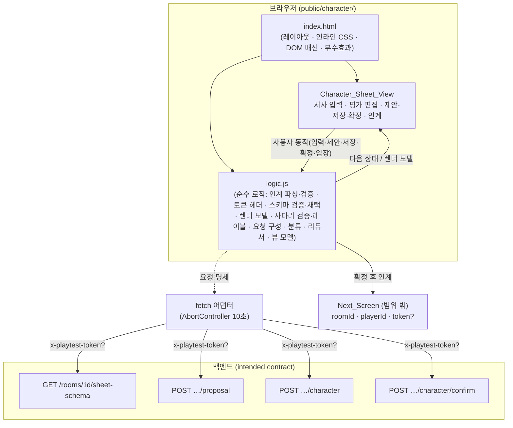

# Design Document

## Overview

이 문서는 ready-gm의 **캐릭터 시트 작성 화면(Character_Sheet_App)** 의 설계를 정의한다. 이 화면은 host-entry(방 생성) → room-lobby(대기실) → game-play(세션 진행) 흐름 사이에서, 인계 계약(`?roomId=...&playerId=...&token=...`)으로 진입하는 **플레이어 전용 화면**이며, 플레이어가 다음을 수행하는 경험을 다룬다.

- 인계된 식별자(`roomId`·`playerId`, 필요 시 `token`)로 올바른 방·플레이어에 연결된다.
- 방에 선택된 시나리오에 대응하는 **시나리오 적응형 캐릭터 시트 스키마(Scenario_Sheet_Schema)** 를 불러와 그 구성대로 시트를 렌더링한다. 스키마가 없거나 로드가 실패하면 **Default_Sheet_Schema**(EZFudge 네 능력치 Might·Agility·Wits·Spirit, 사다리 `[-2, +4]`, 이름·컨셉 서사 항목)로 폴백한다.
- 이름·컨셉 등 서사 항목(Narrative_Field)을 입력한다.
- AI에게 컨셉에 맞는 평가 항목(Rated_Trait) 제안을 받고, 각 항목의 사다리(Trait_Ladder) 안에서 직접 다듬는다.
- 캐릭터를 저장(편집 가능)했다가 확정(잠금)한다.
- 확정 후 다음 화면(Next_Screen)으로의 인계 지점을 제공한다.

### 설계 목표

- 요구사항 1~13을 모두 충족하는 단일 화면 프론트엔드를 구현한다.
- host-entry·room-lobby·game-play가 확립한 아키텍처·관례를 **그대로 미러링**한다(빌드 단계 없는 정적 `public/*.html`, 바닐라 JS ES 모듈, 인라인 CSS, 다크 테마, 순수 로직 분리).
- 비즈니스 로직(인계 파싱·검증, 토큰 헤더 구성, **스키마 검증·채택·렌더 모델 도출**, 사다리 검증·등급 레이블, 서사 입력 보존·길이 제한·이스케이프, 요청 명세 구성, 응답/오류 분류, 저장/확정 결과 분류, 상태 전이, 인계 구성)을 DOM·네트워크에서 분리해 자동 테스트가 가능하도록 한다.
- 부수효과(`fetch`, `AbortController` 10초 타임아웃, 타이머, 네비게이션, DOM 갱신)를 **주입 가능(injectable)** 하게 만들어, 아직 배선되지 않은 백엔드 항목에 대해서도 모킹으로 완전히 단위/DOM 테스트할 수 있게 한다.

### 기술 선택과 근거 (sibling 일관성)

`package.json`에는 프론트엔드 빌드 도구(번들러·프레임워크·JSX 변환기)가 없다. 현재 프론트엔드는 빌드 없이 Express 정적 서빙으로 제공되는 바닐라 JS + 인라인 CSS이며, host-entry·room-lobby가 이미 `?token=` → `x-playtest-token` 헤더, `fetch` + `AbortController` 10초 타임아웃, `esc()` HTML 이스케이프, `computeVisibility` 형태의 뷰 모델, 1회 인계(handoff-once) 패턴을 검증된 형태로 보여준다.

따라서 본 화면도 **새 빌드 도구를 도입하지 않고** `public/character/` 아래 정적 HTML 페이지(바닐라 JS ES 모듈, 인라인 CSS)로 구현하며, 순수 로직을 `public/character/logic.js`로 분리하고 `public/character/index.html`이 그 모듈을 import 해 DOM·부수효과에 배선한다. 이유:

- 요구사항이 단일 화면 범위(소수의 REST 호출 + 동적 시트 렌더 + 네비게이션)이며 프레임워크 비용을 정당화할 복잡도가 없다.
- sibling 화면과 서빙 방식·스타일·토큰 처리·테스트 방식을 일관되게 유지한다.
- 순수 로직 분리는 새 런타임 의존성이나 빌드 단계를 추가하지 않으면서 vitest(이미 devDependency)로 노드 환경에서 직접 테스트할 수 있게 한다. DOM 배선은 happy-dom 환경에서 검증한다. `vitest.config.ts`의 `include`는 이미 `public/**/*.test.js`를 매칭한다.

#### 주입 가능성(Injectability)과 가정(Assumptions)

요구사항의 "범위 밖 / 가정" 절은 **Scenario_Sheet_Schema_Endpoint, Attribute_Proposal_Endpoint, Record_Character_Endpoint, Confirm_Character_Endpoint** 가 현재 플레이테스트 서버(`src/http/app.ts`)에 아직 배선되지 않았음을 명시한다. 본 화면은 이들을 **의도된(intended) 백엔드 계약** 으로 삼아 설계하되, 모든 외부 의존성을 어댑터로 주입받아 모킹 가능하게 한다.

- **`fetch`**: 부수효과 계층이 전역 `fetch`를 사용하지만, 순수 로직은 요청 명세(`{ url, method, headers, body }`)를 만들기만 하고 실행하지 않는다. 테스트는 `fetch`를 모킹한다.
- **타이머/네비게이션**: 10초 `AbortController` 타임아웃, 진행 인디케이터 200ms 규칙, `window.location` 이동은 부수효과 계층이 담당하며 가짜 타이머·가짜 네비게이터로 테스트한다.

> 보안 메모: 백엔드 REST(`src/http/app.ts`)는 MVP에서 인증되지 않은 엔드포인트다. 공개 바인딩 시 운영자는 `?token=` 공유 비밀로 접근을 제한하며, 본 화면은 그 토큰을 모든 REST 요청의 `x-playtest-token` 헤더로(요구사항 11.1), 그리고 Next_Screen 인계 시 쿼리로(요구사항 11.3) 전달하는 책임만 진다. 토큰 검증·발급은 서버/운영의 책임이다.

### 백엔드 계약 매핑 (실제 코드 근거)

본 화면이 통합하는 의도된 엔드포인트는 다음 실제 서비스 계약 위에서 정의된다.

| 의도된 엔드포인트 | 서비스 근거 | 본 화면 사용 |
| --- | --- | --- |
| `GET /rooms/:roomId/sheet-schema` (Scenario_Sheet_Schema_Endpoint) | `Scenario`(`scenario-service.ts`) + `EngineConfig.attributeLadder` 구성 가능 사다리 주석(`core/types.ts`, `core/ezfudge.ts`) | 방의 선택 시나리오에 대응하는 Scenario_Sheet_Schema 조회 (요구사항 13) |
| `POST /rooms/:roomId/players/:playerId/proposal` (Attribute_Proposal_Endpoint) | AI 요청 종류 `attributes`(`core/types.ts`의 `RequestType`) | 컨셉 기반 Proposed_Trait_Values 요청 (요구사항 4) |
| `POST /rooms/:roomId/players/:playerId/character` (Record_Character_Endpoint) | `CharacterService.recordCharacter` | 확정 전 캐릭터 기록/갱신 (요구사항 6) |
| `POST /rooms/:roomId/players/:playerId/character/confirm` (Confirm_Character_Endpoint) | `CharacterService.confirmCharacter` | 캐릭터 확정/잠금 (요구사항 7) |

- **EZFudge 능력치 키**(`src/core/types.ts`의 `AttributeKey`)는 정확히 `Might`, `Agility`, `Wits`, `Spirit` 네 개다.
- **EZFudge 사다리**(`src/core/ezfudge.ts`)는 기본 `[-2, +4]`이며 `isValidAttributeLevel(level, ladder)`은 정수이면서 사다리 안에 있을 때만 참이다. 사다리는 **구성 가능**하므로(시나리오/대체 규칙계), Rated_Trait마다 Trait_Ladder를 스키마가 지정할 수 있고 미지정 시 기본 `[-2, +4]`를 따른다.
- **Record_Character_Endpoint 거부 사유**는 `CharacterService.recordCharacter`의 결과 코드를 그대로 따른다: `NAME_TAKEN`, `INVALID_ATTRIBUTES`, `ALREADY_CONFIRMED`, `UNKNOWN_PLAYER`.
- **Confirm_Character_Endpoint 거부 사유**는 `confirmCharacter`를 따른다: `NO_CHARACTER`(기록된 캐릭터 없음), 이미 확정된 경우 멱등 성공.

## Architecture

### 컴포넌트 구조

본 화면은 정적 페이지 하나와, 그 페이지가 import 하는 순수 로직 모듈로 구성된다. sibling 화면과 동일한 3계층 구조다.



### 계층 분리 원칙 (sibling 미러링)

- **순수 로직 계층 (`logic.js`)**: DOM·네트워크에 의존하지 않는 순수 함수들. 인계 파싱·검증, REST 요청 명세 구성(헤더·본문 포함), **스키마 검증·채택(Active_Sheet_Schema 결정)**, **렌더 모델 도출**, 사다리 검증·초기값·등급 레이블, 서사 입력 보존·길이 제한·이스케이프, 응답/오류·저장/확정 결과 분류, 상태 전이(reducer), 뷰 모델 도출, Next_Screen 인계 페이로드 구성을 담당한다. vitest로 직접 테스트한다.
- **부수효과 계층 (`index.html`의 스크립트)**: `fetch` 호출과 10초 `AbortController` 타임아웃, 진행 인디케이터 200ms 타이밍, 네비게이션, DOM 갱신을 담당한다. 순수 로직이 만든 결정·명세를 실행만 한다.
- **View 계층**: 단일 상태 객체에서 도출한 렌더 모델을 받아 화면을 렌더한다. 상태가 단일 진실 원천이며 View는 상태의 순수 함수다.

### 단방향 데이터 흐름

```
사용자 동작 ─→ 액션(Action) → reduce(state, action) → 새 상태 → 렌더 모델 → render → DOM
                                   │
                      부수효과 요청(REST 전송 / 네비게이션)
                                   │
                              부수효과 계층 실행 → 결과 액션(성공/거부/오류/타임아웃)
```

REST 응답·네트워크오류·타임아웃·거부는 모두 동일한 `dispatch` 통로를 거쳐 순수 `reduce`로 흡수된다. 부수효과는 액션을 통해서만 트리거된다.

## Components and Interfaces

### 1. Handoff_Reader (인계 파라미터 파서 + 검증기)

페이지 URL 쿼리에서 인계 값을 읽고 유효성을 판정한다. room-lobby의 `parseHandoff`/`isHandoffValid`를 `playerId` 키로 미러링한다.

- **책임**
  - `roomId`·`playerId`의 공백 제거 후 값을 읽고, 공백 제거 후 비어 있지 않은 `token`을 Access_Token으로 보존한다. (요구사항 1.1, 1.2, 1.5)
  - 공백 제거 후 `roomId` 또는 `playerId` 중 하나라도 비면 인계를 무효로 판정한다. (요구사항 1.3)
- **인터페이스 (순수 로직)**
  - `parseHandoff(search: string): { roomId, playerId, token }` — 쿼리 문자열에서 트림된 값 추출(토큰은 트림 후 빈 문자열이면 `""`).
  - `isHandoffValid(handoff): boolean` — `roomId`와 `playerId`가 모두 비어 있지 않을 때만 true.

### 2. Auth_Header_Builder (토큰 전달)

- **책임**: 길이 ≥ 1인 Access_Token이 있으면 모든 REST 요청에 `x-playtest-token` 헤더로 값 그대로 첨부, 없으면 헤더 자체를 생략한다. (요구사항 1.2, 1.5, 11.1, 11.2)
- **인터페이스**: `buildAuthHeaders(token: string): Record<string, string>` — 토큰 비어 있지 않으면 `{ "x-playtest-token": token }`, 아니면 `{}`.

### 3. Schema_Engine (스키마 검증 · 채택 · 기본 스키마)

본 화면의 핵심이자 sibling에 없던 신규 책임이다. Scenario_Sheet_Schema_Endpoint 응답을 검증하고 Active_Sheet_Schema를 결정한다.

- **책임**
  - Default_Sheet_Schema를 제공한다: 네 Attribute_Key(Might·Agility·Wits·Spirit)를 Trait_Ladder `[-2, +4]`의 Rated_Trait로, Character_Name·Character_Concept을 Narrative_Field로 갖는다. (요구사항 13.8)
  - 스키마 응답이 유효한지 검증한다: Rated_Trait가 1개 이상이고, 각 Rated_Trait가 Trait_Key와 Trait_Ladder(미지정 시 기본 사다리로 보정)를 가지며, Narrative_Field에 이름·컨셉이 포함됨을 보장한다. (요구사항 13.2, 13.5)
  - 유효하면 채택, 무효/누락이면 Default_Sheet_Schema를 채택한다. 어느 경우든 정확히 하나의 Active_Sheet_Schema가 존재한다. (요구사항 13.7)
- **인터페이스**
  - `defaultSheetSchema(): SheetSchema` — 결정적 기본 스키마.
  - `validateSchema(body: unknown): { ok: true, schema: SheetSchema } | { ok: false }` — Rated_Trait·Trait_Key·Trait_Ladder·이름/컨셉 Narrative_Field 존재를 검증하고, 누락된 Trait_Ladder는 기본 `[-2, +4]`로 정규화한다. (요구사항 13.2, 13.5)
  - `selectActiveSchema(outcome): SheetSchema` — 스키마 요청 결과(성공+유효 / 성공+무효 / 오류)를 받아 채택할 Active_Sheet_Schema 하나를 결정한다(무효·오류는 Default_Sheet_Schema). (요구사항 13.5, 13.6, 13.7)
  - `buildSchemaRequest(roomId, token): { url, method, headers }` — `GET /rooms/{encodeURIComponent(roomId)}/sheet-schema`. (요구사항 13.1)

### 4. Sheet_Renderer (시트 렌더 모델)

Active_Sheet_Schema로부터 화면이 그릴 렌더 모델을 도출한다.

- **책임**
  - Active_Sheet_Schema가 정의한 Sheet_Section·Narrative_Field·Rated_Trait만 렌더하고, 정의되지 않은 것은 렌더하지 않는다. (요구사항 13.3, 2.1, 2.2)
  - 렌더된 Sheet_Section 집합·Rated_Trait 집합(Trait_Key 기준)·Narrative_Field 집합(식별자 기준)이 스키마 집합과 개수·식별자 모두에서 정확히 일치한다. (요구사항 13.4)
  - 각 Rated_Trait의 평가 편집 요소는 해당 Trait_Ladder의 정수 값들로만 선택을 제한한다. (요구사항 5.2)
  - 모든 텍스트(서사 값·레이블)는 `esc()`로 이스케이프해 렌더한다. (요구사항 3.4)
- **인터페이스**
  - `renderModel(schema, values): { sections: RenderedSection[] }` — 각 섹션 안에 그 섹션 소속 Narrative_Field 입력·Rated_Trait 편집을 배치한 렌더 모델.
  - `renderedTraitKeys(schema): string[]` / `renderedFieldIds(schema): string[]` / `renderedSectionIds(schema): string[]` — 집합 일치 검증·테스트용. (요구사항 13.4)
  - `esc(value): string` — host-entry의 이스케이프 패턴 재사용.

### 5. Ladder_Engine (사다리 검증 · 초기값 · 등급 레이블)

`src/core/ezfudge.ts`의 `isValidAttributeLevel` 의미를 프론트엔드 순수 함수로 미러링한다.

- **책임**
  - 한 Trait_Level이 그 Trait_Ladder 안의 정수인지 판정한다. (요구사항 5.1, 5.5)
  - 초기 Trait_Level을 결정한다: 0이 Trait_Ladder 안에 있으면 0, 아니면 그 사다리의 최소 정수. (요구사항 2.3)
  - Trait_Level에 대응하는 Ladder_Rung_Label을 돌려준다. 기본 Attribute_Ladder는 고정 매핑(-2=끔찍함 … +4=탁월함)을 쓰고, 비기본 Trait_Ladder는 스키마가 제공한 등급 레이블을 쓴다. (요구사항 2.5)
- **인터페이스**
  - `isValidLevel(level, ladder): boolean` — `Number.isInteger(level) && ladder.min <= level <= ladder.max`.
  - `initialLevel(ladder): number` — 0이 사다리 안이면 0, 아니면 `ladder.min`. (요구사항 2.3)
  - `rungLabel(level, trait): string` — 기본 사다리 고정 매핑 또는 스키마 제공 레이블. (요구사항 2.5)
  - `DEFAULT_ATTRIBUTE_LADDER = { min: -2, max: 4 }`, `DEFAULT_RUNG_LABELS` 상수.

### 6. Narrative_Field_Handler (서사 입력 보존 · 길이 제한 · 전송 정규화)

- **책임**
  - Character_Name·각 Narrative_Field의 입력 값을 앞뒤 공백 포함 입력 그대로 보존·표시한다. (요구사항 3.1, 3.2)
  - 백엔드 전송 시 각 값의 앞뒤 공백만 제거하고 내부 공백은 보존한다. (요구사항 3.3)
  - Character_Name은 100자, 그 외 Narrative_Field는 2000자로 보존 길이를 제한한다. (요구사항 3.5, 3.6)
- **인터페이스**
  - `clampFieldValue(value, maxLength): string` — 보존 길이 제한(이름 100 / 기타 2000).
  - `trimForSend(value): string` — 앞뒤 공백만 제거.

### 7. Trait_Editor (평가 항목 편집 전이)

- **책임**
  - 한 Rated_Trait의 평가 편집으로 사다리 안 정수가 지정되면 그 Trait_Level만 갱신하고 나머지는 불변으로 둔다. (요구사항 5.1)
  - 사다리 밖/비정수 값은 적용하지 않고 직전 Trait_Level을 유지한다. (요구사항 5.5)
  - 화면에 표시된 Trait_Level 한 벌을 변형 없이 Rated_Trait_Set으로 모은다. (요구사항 5.4)
- **인터페이스**
  - `setTraitLevel(values, schema, traitKey, level): Record<string, number>` — 유효하면 해당 키만 갱신한 새 맵, 무효면 입력 맵 그대로.
  - `collectRatedTraitSet(values, schema): Record<string, number>` — 스키마 정의 Trait_Key 한 벌을 그대로 모은다.

### 8. Proposal_Client (AI 평가 항목 제안)

- **책임**
  - 공백 제거 후 길이 ≥ 1인 Character_Concept으로 Propose_Action 시, 트림된 컨셉·Room_Id·Active_Sheet_Schema의 Trait_Key 목록(+토큰)을 담아 Attribute_Proposal_Endpoint에 요청한다. (요구사항 4.1)
  - 컨셉이 비어 있으면 요청을 보내지 않고 한국어 안내를 표시한다. (요구사항 4.2)
  - 성공 응답의 Proposed_Trait_Values를 검증한다: 모든 Rated_Trait에 대한 값이 있고 각 값이 해당 Trait_Ladder 안의 정수일 때만 적용, 아니면 거부하고 기존 값을 유지한다. (요구사항 4.3, 4.5)
  - 적용 후에도 값은 편집 가능 상태로 유지된다. (요구사항 4.4)
- **인터페이스**
  - `buildProposalRequest(roomId, playerId, concept, traitKeys, token): { url, method, headers, body }` — `POST /rooms/{roomId}/players/{playerId}/proposal`, body `{ concept: trimForSend(concept), traitKeys }`. (요구사항 4.1)
  - `validateProposal(body, schema): { ok: true, values } | { ok: false }` — 모든 Trait_Key 존재 + 각 값 사다리 안 정수 검증. (요구사항 4.3, 4.5)

### 9. Record_Client (캐릭터 저장/기록)

- **책임**
  - Save_Action 시 트림된 Character_Name·각 Narrative_Field 값·현재 Rated_Trait_Set·Room_Id·Player_Id(+토큰)를 담아 Record_Character_Endpoint에 요청한다. (요구사항 6.1)
  - 거부 사유(`NAME_TAKEN`, `INVALID_ATTRIBUTES`, `ALREADY_CONFIRMED`, `UNKNOWN_PLAYER`, 기타)를 분류해 대응 메시지·상태 전이를 결정한다. (요구사항 6.4~6.8)
- **인터페이스**
  - `buildRecordRequest(handoff, name, narrative, ratedTraitSet): { url, method, headers, body }` — `POST /rooms/{roomId}/players/{playerId}/character`, body `{ name: trimForSend(name), narrative: <트림된 필드 맵>, attributes: ratedTraitSet }`. (요구사항 6.1, 7.1)
  - `classifyRecordResult(outcome): "success" | RecordRejection | ErrorKind` — 성공/거부 사유/전송 오류를 단일 결과로 환원. (요구사항 6.3~6.8)

### 10. Confirm_Client (캐릭터 확정/잠금)

- **책임**
  - Confirm_Action은 먼저 Record_Character_Endpoint로 기록한 뒤, 기록이 성공하면 Confirm_Character_Endpoint로 확정을 요청하는 2단계 순차 흐름이다. (요구사항 7.1, 7.2)
  - 선행 기록이 `NAME_TAKEN`/`INVALID_ATTRIBUTES`면 확정 요청을 보내지 않는다. `ALREADY_CONFIRMED`면 확정 요청 없이 Confirmed_State로 표시한다. (요구사항 7.3, 7.4)
  - 확정이 `NO_CHARACTER`로 거부되면 Confirmed_State로 전이하지 않는다. (요구사항 7.5)
- **인터페이스**
  - `buildConfirmRequest(handoff): { url, method, headers, body }` — `POST /rooms/{roomId}/players/{playerId}/character/confirm`. (요구사항 7.2)
  - `decideConfirmStep(recordResult): "send-confirm" | "blocked-rejection" | "blocked-already-confirmed"` — 선행 기록 결과로 다음 단계 결정. (요구사항 7.2, 7.3, 7.4)

### 11. Next_Screen_Handoff (확정 후 인계 + 인계-once)

- **책임**
  - Confirmed_State 전이 시 Next_Screen 진입 동작을 활성화한다. (요구사항 8.1)
  - 진입 동작 시 Room_Id·Player_Id(+토큰)를 쿼리 문자열 형태로 Next_Screen에 전달한다. (요구사항 8.2, 11.3, 11.4)
  - 인계는 정확히 1회만 수행하고 이후 동작 요소를 비활성화한다. (요구사항 8.3)
  - 확정 전에는 진입 동작을 비활성화하고 인계하지 않는다. (요구사항 8.4)
- **인터페이스**
  - `buildNextHandoff(handoff): { roomId, playerId, token? }` — 식별자 + (있으면) 토큰. (요구사항 8.2, 11.3, 11.4)
  - `buildNextSearch(handoff): string` — `?roomId=…&playerId=…&token=…`(토큰은 있을 때만) 쿼리 문자열.

### 12. Loading_Error_Model (로딩/오류 모델 + 결과 분류 + 재시도)

- **책임**
  - 각 요청(스키마/제안/기록/확정)에 대해 전송 200ms 이내 진행 인디케이터 표시, 인디케이터가 표시되는 동안 제안·저장·확정 동작 비활성. (요구사항 9.1, 9.3, 13.9)
  - 완료 200ms 이내 인디케이터 해제 + 동작 재활성화(단 확정 성공은 Confirmed_State 규칙에 따라 비활성 유지). (요구사항 9.4)
  - 타임아웃(10초)·네트워크·서버(5xx)·인증 거부를 서로 구분되는 한국어 메시지로 환원하고, 마지막 실패 요청을 동일 입력으로 1회 재전송하는 재시도 동작을 제공한다. (요구사항 9.5, 10.x, 11.5)
- **인터페이스**
  - `classifyOutcome(outcome): "success" | ErrorKind` — 네트워크/타임아웃/서버(5xx)/인증거부(401·403)/성공을 단일 결과로 환원. (요구사항 9.5, 10.1, 10.2, 10.3, 11.5)
  - `computeVisibility(state): { ... }` — 영역별 진행 인디케이터·동작 활성/비활성·읽기전용·재시도·Next 활성 가시성을 상태의 함수로 도출. (요구사항 1.4, 5.3, 8.1, 8.4, 9.x)
  - `nextRequestForRetry(state): RequestSpec | null` — 보존된 입력으로 직전 실패 요청을 재구성. (요구사항 10.6)

## Data Models

### 스키마 모델 (Sheet Schema Model)

Active_Sheet_Schema는 Scenario_Sheet_Schema(채택된 유효 스키마) 또는 Default_Sheet_Schema 중 하나다. 두 경우 동일 형태를 갖는다.

```typescript
interface SheetSchema {
  sections: SheetSection[];           // 시트 구획 (요구사항 13.3)
  narrativeFields: NarrativeField[];  // 이름·컨셉을 항상 포함 (요구사항 13.8)
  traits: RatedTrait[];               // 1개 이상 (요구사항 13.2)
}

interface SheetSection {
  id: string;        // 섹션 식별자 (요구사항 13.4 집합 일치 기준)
  label: string;     // 표시 레이블 (비어 있지 않음)
}

interface NarrativeField {
  id: string;        // 식별자 ("name", "concept" 또는 시나리오별 키) (요구사항 13.4)
  label: string;     // 표시 레이블
  guidance: string;  // 목적 안내 텍스트 (요구사항 2.1)
  sectionId: string; // 소속 섹션
  maxLength: number; // name=100, 그 외=2000 (요구사항 3.5, 3.6)
}

interface RatedTrait {
  key: string;                          // Trait_Key (요구사항 13.4)
  label: string;                        // 표시 레이블 (요구사항 2.2)
  sectionId: string;                    // 소속 섹션
  ladder: { min: number; max: number }; // Trait_Ladder, 미지정 시 [-2,4]로 정규화 (요구사항 13.5)
  rungLabels?: Record<number, string>;  // 비기본 사다리의 등급 레이블 (요구사항 2.5)
}
```

**Default_Sheet_Schema** (요구사항 13.8):

```typescript
const DEFAULT_ATTRIBUTE_LADDER = { min: -2, max: 4 };
const DEFAULT_RUNG_LABELS = {
  "-2": "끔찍함", "-1": "빈약함", "0": "평범함",
  "1": "양호함", "2": "우수함", "3": "훌륭함", "4": "탁월함",
};
// sections: [{ id: "narrative", label: "서사" }, { id: "attributes", label: "능력치" }]
// narrativeFields:
//   { id: "name",    label: "이름", guidance: "...", sectionId: "narrative", maxLength: 100 }
//   { id: "concept", label: "컨셉", guidance: "...", sectionId: "narrative", maxLength: 2000 }
// traits: Might/Agility/Wits/Spirit — ladder [-2,4], sectionId "attributes"
```

### 상태 모델 (State Model)

화면 전체는 하나의 상태 객체로 표현되며, 모든 렌더링은 이 상태의 함수다.

```typescript
type AreaPhase = "idle" | "loading" | "loaded" | "error";

// 사용자에게 보일 한국어 메시지를 결정하는 오류 종류
type ErrorKind =
  | "server"    // HTTP 5xx (요구사항 10.3)
  | "network"   // 네트워크 실패 (요구사항 10.2)
  | "timeout"   // 클라이언트 타임아웃 10초 (요구사항 9.5, 10.1)
  | "auth"      // 토큰 인증 거부 401/403 (요구사항 11.5)
  | "invalid";  // 응답 본문 형식 위반 (제안 검증 실패 등, 요구사항 4.5)

// Record_Character_Endpoint 거부 사유 (CharacterService 결과 코드)
type RecordRejection =
  | "NAME_TAKEN" | "INVALID_ATTRIBUTES" | "ALREADY_CONFIRMED"
  | "UNKNOWN_PLAYER" | "OTHER";

// 직전에 전송해 실패한 요청 종류 (재시도용, 요구사항 10.6)
type LastRequest = "schema" | "proposal" | "record" | "confirm" | null;

interface CharacterSheetState {
  // 인계 (요구사항 1.x, 11.x) — 불변(어떤 오류로도 변하지 않음, 요구사항 10.5)
  handoff: { roomId: string; playerId: string; token: string };
  handoffValid: boolean;

  // 활성 스키마 — 항상 정확히 하나 존재 (요구사항 13.7)
  schemaArea: AreaPhase;                 // 스키마 요청 진행/오류 추적 (요구사항 13.9)
  schemaErrorKind: ErrorKind | null;
  activeSchema: SheetSchema;             // 채택된 유효 스키마 또는 Default_Sheet_Schema
  usingDefaultSchema: boolean;           // 폴백 안내 표시용 (요구사항 13.6)

  // 작성 값 (요구사항 2.x, 3.x, 5.x)
  narrativeValues: Record<string, string>; // fieldId → 보존된 값(앞뒤 공백 포함)
  traitValues: Record<string, number>;     // traitKey → Trait_Level

  // 요청 단계 (요구사항 9.x)
  proposal: AreaPhase;
  record: AreaPhase;
  confirm: AreaPhase;

  // 오류 / 안내 메시지 (요구사항 4.2, 6.2, 9.5, 10.x, 11.5)
  errorKind: ErrorKind | null;           // 마지막 전송 오류 종류(재시도 메시지 결정)
  notice: string | null;                 // 안내/확인/거부 메시지
  lastRequest: LastRequest;              // 재시도 대상 (요구사항 10.6)

  // 확정 / 인계 (요구사항 7.x, 8.x)
  confirmed: boolean;                    // Confirmed_State (요구사항 7.7, 7.8)
  nextHandoffDone: boolean;              // Next_Screen 인계 1회 보장 (요구사항 8.3)
}
```

상태 불변식:

- **정확히 하나의 Active_Sheet_Schema**: `activeSchema`는 항상 유효한 `SheetSchema`다. 초기값은 Default_Sheet_Schema이며, 스키마 채택(요구사항 13.2) 또는 폴백(요구사항 13.5, 13.6)으로만 바뀐다. (요구사항 13.7)
- **인계 불변**: `handoff`의 `roomId`·`playerId`·`token`은 생성 후 어떤 오류·거부로도 변경되지 않는다. (요구사항 10.5)
- **traitValues 키 집합 = activeSchema.traits 키 집합**: 스키마 채택 시 각 Rated_Trait의 초기값(요구사항 2.3)으로 재구성된다.

### 액션 모델 (Action Model)

```typescript
type Action =
  // 인계 (요구사항 1.x)
  | { type: "HANDOFF_PARSED"; handoff: { roomId; playerId; token } }
  // 스키마 (요구사항 13.x)
  | { type: "SCHEMA_STARTED" }
  | { type: "SCHEMA_RESOLVED"; outcome: SchemaOutcome }   // 성공+유효 / 성공+무효 / 오류 → selectActiveSchema
  // 서사·평가 입력 (요구사항 3.x, 5.x)
  | { type: "NARRATIVE_CHANGED"; fieldId: string; value: string }
  | { type: "TRAIT_CHANGED"; traitKey: string; level: number }
  // AI 제안 (요구사항 4.x)
  | { type: "PROPOSAL_STARTED" }
  | { type: "PROPOSAL_SUCCEEDED"; body: unknown }          // validateProposal로 적용/거부
  | { type: "PROPOSAL_FAILED"; kind: ErrorKind }
  | { type: "PROPOSAL_BLANK_CONCEPT" }                     // 컨셉 비어 있음 (요구사항 4.2)
  // 저장 (요구사항 6.x)
  | { type: "RECORD_STARTED" }
  | { type: "RECORD_RESULT"; result: "success" | RecordRejection }
  | { type: "RECORD_FAILED"; kind: ErrorKind }
  | { type: "SAVE_BLANK_NAME" }                            // 이름 비어 있음 (요구사항 6.2)
  // 확정 (요구사항 7.x)
  | { type: "CONFIRM_RECORD_RESULT"; result: "success" | RecordRejection } // 선행 기록 결과
  | { type: "CONFIRM_STARTED" }
  | { type: "CONFIRM_RESULT"; result: "success" | "NO_CHARACTER" }
  | { type: "CONFIRM_FAILED"; kind: ErrorKind }
  | { type: "CONFIRM_BLANK_NAME" }                         // 이름 비어 있음 (요구사항 7.6)
  // 인계 (요구사항 8.x)
  | { type: "NEXT_HANDOFF" };
```

핵심 전이 규칙 (`reduce(state, action) -> state`):

- `HANDOFF_PARSED`: `handoff` 저장, `isHandoffValid`로 `handoffValid` 설정. 무효면 어떤 요청도 시작하지 않고 모든 작성 컨트롤을 비활성으로 둔다(요구사항 1.3/1.4).
- `SCHEMA_RESOLVED`: `selectActiveSchema(outcome)`로 Active_Sheet_Schema를 채택하고 `traitValues`를 각 Rated_Trait의 `initialLevel`로 재구성한다. 오류/무효면 Default_Sheet_Schema + `usingDefaultSchema = true` + 폴백 안내(요구사항 13.2/13.5/13.6/13.7).
- `NARRATIVE_CHANGED`: `clampFieldValue`로 길이 제한 후 입력 그대로 보존(요구사항 3.1/3.2/3.5/3.6).
- `TRAIT_CHANGED`: `setTraitLevel`로 유효 값이면 해당 키만 갱신, 무효면 불변(요구사항 5.1/5.5).
- `PROPOSAL_SUCCEEDED`: `validateProposal` 통과 시 `traitValues`를 제안 값으로 갱신(편집 가능 유지), 실패 시 기존 값 유지 + invalid 오류(요구사항 4.3/4.4/4.5).
- `RECORD_RESULT`: `success`면 저장 확인 + 편집 가능 유지(요구사항 6.3). 거부 사유별 메시지 + 입력 보존, `ALREADY_CONFIRMED`는 `confirmed = true`(요구사항 6.4~6.8).
- `CONFIRM_RECORD_RESULT`: `success`면 확정 단계로(부수효과가 `CONFIRM_STARTED` 후 확정 전송). `NAME_TAKEN`/`INVALID_ATTRIBUTES`면 확정 미전송 + 메시지(요구사항 7.3). `ALREADY_CONFIRMED`면 확정 미전송 + `confirmed = true`(요구사항 7.4).
- `CONFIRM_RESULT`: `success`면 `confirmed = true`(요구사항 7.7). `NO_CHARACTER`면 `confirmed` 불변 + 메시지(요구사항 7.5).
- `*_FAILED`: 해당 단계 `error`, `errorKind`·`lastRequest` 설정, **인계·입력 보존**(요구사항 10.5). `auth`는 별도 메시지(요구사항 11.5).
- `NEXT_HANDOFF`: `confirmed === true`이고 `nextHandoffDone === false`일 때만 `nextHandoffDone = true`로 전이(인계 1회, 요구사항 8.3). 그 외 무변화(요구사항 8.4).

### 백엔드 계약 매핑

| 의도된 엔드포인트 | 성공 | 거부/오류 | 화면 처리 |
| --- | --- | --- | --- |
| `GET /rooms/:id/sheet-schema` | 200 `SheetSchema` | 무효 본문 / 4xx·5xx·net·timeout | `validateSchema` 통과 → 채택(13.2), 무효·오류 → Default + 안내(13.5/13.6) |
| `POST …/proposal` | 200 `{ values: Record<traitKey, number> }` | net·timeout·5xx·auth | `validateProposal` 통과 → 적용(4.3), 무효 → 거부+기존 유지(4.5) |
| `POST …/character` | 200 `{ character }` | 200 `{ ok:false, reason }` 또는 4xx·5xx | `classifyRecordResult` → 거부 사유 메시지(6.4~6.8) |
| `POST …/character/confirm` | 200 `{ character }` | `NO_CHARACTER` / net·timeout·5xx·auth | 성공 → Confirmed_State(7.7), `NO_CHARACTER` → 비전이(7.5) |

> **거부 응답 형태**: `CharacterService`는 `{ ok: false, reason, message }` 판별 유니온을 반환한다. 의도된 엔드포인트는 이 결과를 HTTP 200 본문으로 그대로 노출하거나(서비스 거부) HTTP 4xx로 매핑할 수 있으므로, `classifyRecordResult`는 **본문의 `reason` 필드**를 우선 분류하고 전송/HTTP 오류는 `classifyOutcome`로 환원한다.

### 타임아웃 정책

- REST: 모든 요청에 **10초(10000ms)** 클라이언트 타임아웃을 `AbortController`로 적용한다(요구사항 9.5, 10.1). host-entry·room-lobby의 `REQUEST_TIMEOUT_MS`와 동일하다.
- 진행 인디케이터: 전송~완료 사이 표시하며 전송 200ms·완료 200ms 규칙은 부수효과 계층 타이밍이다(요구사항 9.1, 9.4, 13.9).

## Correctness Properties

*속성(property)이란 시스템의 모든 유효한 실행에서 참이어야 하는 특성 또는 동작으로, 시스템이 무엇을 해야 하는지에 대한 형식적 진술이다. 속성은 사람이 읽는 명세와 기계가 검증 가능한 정확성 보증 사이의 다리 역할을 한다.*

본 화면의 PBT 대상은 DOM·네트워크에 의존하지 않는 **순수 로직 계층**(`parseHandoff`, `isHandoffValid`, `buildAuthHeaders`, `buildSchemaRequest`/`buildProposalRequest`/`buildRecordRequest`/`buildConfirmRequest`, `classifyOutcome`, `classifyRecordResult`, `validateSchema`/`selectActiveSchema`/`defaultSheetSchema`, `renderModel`/`renderedTraitKeys`/`renderedFieldIds`/`renderedSectionIds`, `initialLevel`, `rungLabel`, `clampFieldValue`, `trimForSend`, `esc`, `validateProposal`, `setTraitLevel`, `collectRatedTraitSet`, `decideConfirmStep`, `buildNextHandoff`/`buildNextSearch`, `reduce`, `computeVisibility`, `nextRequestForRetry`)이다. 진행 인디케이터 200ms 타이밍·10초 타임아웃 발화·레이아웃·접근성·포커스는 속성이 아닌 예제 및 통합 테스트로 검증한다(아래 Testing Strategy 참조). 아래 속성들은 prework 분석에서 도출·통합한 것이다.

### Property 1: 인계 파싱과 검증, 무효 시 요청 차단

*For any* `roomId`·`playerId`·`token` 값(앞뒤에 임의의 공백이 붙거나 키가 부재할 수 있음)으로 구성된 쿼리 문자열에 대해, `parseHandoff`는 각 값을 공백 제거한 결과로(부재 키는 빈 문자열로) 추출하고, `isHandoffValid`는 트림된 `roomId`와 `playerId`가 둘 다 비어 있지 않을 때에만 true를 반환한다. 인계가 무효이면 `HANDOFF_PARSED`를 reduce 한 뒤에도 어떤 요청 단계도 `loading`으로 진입하지 않는다.

**Validates: Requirements 1.1, 1.3**

### Property 2: 접근 토큰과 요청 헤더는 동치다

*For any* 토큰 문자열과 임의의 요청 빌더(`buildSchemaRequest`, `buildProposalRequest`, `buildRecordRequest`, `buildConfirmRequest`)에 대해, 토큰이 비어 있지 않으면 생성된 요청 헤더는 `x-playtest-token`에 그 값을 한 글자도 변경하지 않고 포함하고, 토큰이 비어 있거나 없으면 헤더에 `x-playtest-token`이 존재하지 않는다.

**Validates: Requirements 1.2, 1.5, 11.1, 11.2**

### Property 3: REST 요청 명세는 올바른 URL·메서드·본문을 만든다

*For any* `roomId`·`playerId`와 Active_Sheet_Schema·작성 값에 대해, `buildSchemaRequest`는 `GET /rooms/{encodeURIComponent(roomId)}/sheet-schema`를, `buildProposalRequest`는 `POST /rooms/{roomId}/players/{playerId}/proposal`(본문에 트림된 컨셉과 스키마의 Trait_Key 목록)을, `buildRecordRequest`는 `POST /rooms/{roomId}/players/{playerId}/character`(본문에 트림된 이름·서사 값과 Rated_Trait_Set)를, `buildConfirmRequest`는 `POST /rooms/{roomId}/players/{playerId}/character/confirm`을 생성한다.

**Validates: Requirements 4.1, 6.1, 7.1, 7.2, 13.1**

### Property 4: 요청 결과는 오류 종류로 정확히 환원된다

*For any* 요청 결과(`response`/`network`/`timeout`)에 대해, `classifyOutcome`는 네트워크 실패를 `network`, 타임아웃을 `timeout`, HTTP 401·403 응답을 `auth`, HTTP 500 이상 응답을 `server`로 환원하고, 2xx 성공 응답을 `success`로 환원한다. 이렇게 환원된 `timeout`·`network`·`server`·`auth`는 서로 구별되는 종류여서 서로 다른 한국어 메시지로 매핑된다.

**Validates: Requirements 9.5, 10.1, 10.2, 10.3, 11.5**

### Property 5: 스키마 검증·채택과 단일 Active_Sheet_Schema 불변식

*For any* 스키마 요청 결과(성공+임의 본문 / 네트워크·타임아웃·서버·인증 오류)에 대해, `selectActiveSchema`는 항상 정확히 하나의 유효한 `SheetSchema`를 반환한다. 본문이 Rated_Trait를 1개 이상 정의하고 각 Rated_Trait가 Trait_Key를 가지면(누락된 Trait_Ladder는 기본 `[-2, +4]`로 정규화) 그 스키마를 채택하고, 본문이 Rated_Trait를 하나도 정의하지 않거나 어떤 Rated_Trait가 Trait_Key·Trait_Ladder를 결여하거나 요청이 오류로 종료되면 Default_Sheet_Schema를 반환한다.

**Validates: Requirements 13.2, 13.5, 13.6, 13.7**

### Property 6: Default_Sheet_Schema 구성

`defaultSheetSchema`는 정확히 네 Attribute_Key(Might, Agility, Wits, Spirit)를 Trait_Ladder `[-2, +4]`의 Rated_Trait로, Character_Name과 Character_Concept을 Narrative_Field로(이름은 maxLength 100, 컨셉은 2000) 갖는 스키마를 반환하며, 이는 입력과 무관하게 항상 동일하다.

**Validates: Requirements 13.8**

### Property 7: 렌더 모델은 Active_Sheet_Schema와 정확히 일치한다

*For any* 유효한 Active_Sheet_Schema에 대해, `renderModel`이 만든 렌더 모델의 Sheet_Section 집합·Rated_Trait 집합(Trait_Key 기준)·Narrative_Field 집합(식별자 기준)은 각각 그 스키마가 정의한 집합과 개수·식별자 모두에서 정확히 일치하고(스키마에 없는 섹션·필드·항목은 렌더되지 않음), 각 Rated_Trait 편집 요소의 선택 가능 값 집합은 그 Trait_Ladder의 정수 집합 `[min..max]`와 일치하며, 모든 Narrative_Field는 비어 있지 않은 안내 텍스트를, 모든 Rated_Trait는 비어 있지 않은 레이블을 가진다. 따라서 서로 다른 구성을 정의한 두 Active_Sheet_Schema는 서로 다른 렌더 집합을 만든다.

**Validates: Requirements 2.1, 2.2, 5.2, 13.3, 13.4**

### Property 8: 초기 Trait_Level

*For any* Trait_Ladder에 대해, `initialLevel`은 0이 그 사다리의 정수 구간 안에 있으면 0을, 그렇지 않으면 그 사다리의 최소 정수를 반환한다.

**Validates: Requirements 2.3**

### Property 9: Trait_Level → Ladder_Rung_Label 매핑

*For any* Rated_Trait와 그 Trait_Ladder 안의 Trait_Level에 대해, Trait_Ladder가 기본 Attribute_Ladder `[-2, +4]`이면 `rungLabel`은 고정 매핑(-2=끔찍함, -1=빈약함, 0=평범함, +1=양호함, +2=우수함, +3=훌륭함, +4=탁월함)을 반환하고, 기본 사다리가 아니면 스키마가 제공한 등급 레이블을 반환한다.

**Validates: Requirements 2.5**

### Property 10: 서사 입력은 그대로 보존되고 길이만 제한된다

*For any* Narrative_Field 식별자와 임의의 입력 문자열(앞뒤 공백 포함)에 대해, `NARRATIVE_CHANGED`를 reduce 한 뒤 그 필드의 보존 값은 입력 문자열을 (Character_Name은 100자, 그 외 Narrative_Field는 2000자로) 길이 제한한 결과와 정확히 일치하며, 길이 제한에 걸리지 않는 입력에 대해서는 앞뒤 공백을 포함해 입력과 완전히 동일하다.

**Validates: Requirements 3.1, 3.2, 3.5, 3.6**

### Property 11: 전송 정규화는 내부 공백을 보존한다

*For any* 문자열에 대해, `trimForSend`는 앞뒤 공백만 제거하고 값 내부의 공백은 모두 보존한다(즉 결과는 입력을 트림한 것과 같고, 내부 부분 문자열을 그대로 포함한다).

**Validates: Requirements 3.3**

### Property 12: 텍스트는 HTML로 해석되지 않게 이스케이프된다

*For any* 문자열에 대해, `esc`의 출력에는 이스케이프되지 않은 `<`·`>`·`&` 문자가 존재하지 않으며, 출력을 디코드하면 원래 문자열과 같다(텍스트 의미 보존).

**Validates: Requirements 3.4**

### Property 13: 제안 요청과 빈 컨셉 차단

*For any* Active_Sheet_Schema와 컨셉 문자열에 대해, 컨셉을 공백 제거한 길이가 1 이상이면 `buildProposalRequest`의 본문은 트림된 컨셉과 스키마가 정의한 모든 Rated_Trait의 Trait_Key 목록을 포함하고, 공백 제거 후 길이가 0이면 제안 요청을 보내지 않기로 결정하고 컨셉 입력이 필요하다는 안내로 전이한다.

**Validates: Requirements 4.1, 4.2**

### Property 14: 제안 응답 검증과 적용

*For any* Active_Sheet_Schema와 제안 응답 본문에 대해, `validateProposal`은 본문이 그 스키마의 모든 Rated_Trait에 대한 값을 담고 각 값이 해당 Trait_Ladder 안의 정수일 때에만 `ok: true`를 반환하며, 이때 `PROPOSAL_SUCCEEDED`를 reduce 하면 모든 Rated_Trait의 Trait_Level이 제안 값으로 갱신된다. 하나라도 누락되거나 사다리 밖이거나 정수가 아니면 `ok: false`이며 reduce는 기존 Trait_Level을 변경 없이 유지한다.

**Validates: Requirements 4.3, 4.5**

### Property 15: 평가 편집은 해당 항목만 갱신하고 무효 값은 거부한다

*For any* 현재 Rated_Trait_Set과 임의의 Trait_Key·지정 값에 대해, 지정 값이 그 Rated_Trait의 Trait_Ladder 안의 정수이면 `setTraitLevel`은 그 Trait_Key의 Trait_Level만 지정 값으로 갱신하고 다른 모든 Rated_Trait의 Trait_Level은 변경하지 않으며, 지정 값이 사다리 밖이거나 정수가 아니면 Rated_Trait_Set을 변경 없이 그대로 유지한다.

**Validates: Requirements 5.1, 5.5**

### Property 16: Rated_Trait_Set은 변형 없이 수집된다

*For any* 현재 Trait_Level 한 벌과 Active_Sheet_Schema에 대해, `collectRatedTraitSet`은 스키마가 정의한 각 Trait_Key에 대해 화면에 표시된 Trait_Level을 변형 없이 그대로 담은 Rated_Trait_Set을 반환한다.

**Validates: Requirements 5.4**

### Property 17: 기록 결과 분류는 상태를 정확히 전이하고 입력을 보존한다

*For any* 기록 요청 결과(성공 / `NAME_TAKEN` / `INVALID_ATTRIBUTES` / `ALREADY_CONFIRMED` / `UNKNOWN_PLAYER` / 기타 거부 사유)에 대해, `classifyRecordResult`로 분류한 뒤 `RECORD_RESULT`를 reduce 하면: 성공은 저장 확인 안내를 설정하고 캐릭터를 비확정(편집 가능) 상태로 유지하며, 모든 거부 사유는 플레이어가 입력한 Narrative_Field 값과 Rated_Trait_Set을 변경 없이 보존하고, 그중 `ALREADY_CONFIRMED`만 캐릭터를 Confirmed_State로 표시한다.

**Validates: Requirements 6.3, 6.4, 6.5, 6.6, 6.7, 6.8**

### Property 18: 빈 이름은 저장·확정을 차단하고 입력을 보존한다

*For any* 공백 제거 후 길이가 0인 Character_Name과 임의의 작성 상태에 대해, Save_Action 또는 Confirm_Action을 시도하면 Record_Character_Endpoint·Confirm_Character_Endpoint 요청을 모두 보내지 않기로 결정하고 이름 입력이 필요하다는 안내로 전이하며, 플레이어가 입력한 모든 값(Narrative_Field·Rated_Trait_Set)은 변경 없이 보존된다.

**Validates: Requirements 6.2, 7.6**

### Property 19: 확정은 기록 성공 시에만 진행된다

*For any* 선행 기록 결과에 대해, `decideConfirmStep`은 성공이면 `send-confirm`(Confirm_Character_Endpoint 전송), `NAME_TAKEN`/`INVALID_ATTRIBUTES`이면 `blocked-rejection`(확정 미전송 + 대응 메시지), `ALREADY_CONFIRMED`이면 `blocked-already-confirmed`(확정 미전송 + Confirmed_State 표시)를 반환한다. 그리고 `CONFIRM_RESULT`가 `NO_CHARACTER`이면 캐릭터는 Confirmed_State로 전이하지 않고 입력이 보존된다.

**Validates: Requirements 7.2, 7.3, 7.4, 7.5**

### Property 20: 확정 성공은 작성 상태를 잠근다

*For any* 작성 상태에 대해, `CONFIRM_RESULT`가 `success`이면 reduce 후 `confirmed === true`가 되고, `computeVisibility`는 모든 Narrative_Field 입력·Rated_Trait 편집·Propose_Action·Save_Action을 비활성(읽기 전용)으로, 확정된 값을 읽기 전용 표시로 도출한다.

**Validates: Requirements 7.7, 7.8**

### Property 21: Next_Screen 인계 페이로드와 1회 인계

*For any* 인계 값과 임의 횟수(N≥1)의 `NEXT_HANDOFF` 액션에 대해, `buildNextHandoff`/`buildNextSearch`의 결과는 `roomId`·`playerId`를 포함하고 Access_Token이 비어 있지 않으면 그 토큰을(변형 없이) 포함하며 비어 있으면 포함하지 않는다. `confirmed === true`이면 인계는 정확히 한 번만 수행되어 `nextHandoffDone`이 한 번만 false→true로 전이하고(이후 추가 `NEXT_HANDOFF`는 무효), `confirmed === false`인 동안에는 인계가 수행되지 않으며 어느 경우에도 `handoff`의 식별자·토큰은 변경되지 않는다.

**Validates: Requirements 8.2, 8.3, 8.4, 8.5, 11.3, 11.4**

### Property 22: 복구 가능 오류는 입력을 보존하고 동일 입력 재시도를 허용한다

*For any* 임의의 작성 상태와 임의의 전송 오류(`timeout`/`network`/`server`/`auth`)에 대해, 해당 `*_FAILED`를 reduce 한 뒤에도 `handoff`의 `roomId`·`playerId`·`token`과 플레이어가 입력한 Narrative_Field 값·Rated_Trait_Set은 변경되지 않고, 실패한 요청 종류가 `lastRequest`로 기록되어 `nextRequestForRetry`가 동일한 보존 입력으로 직전 요청을 1회 재구성한다.

**Validates: Requirements 10.5, 10.6, 11.5**

### Property 23: 가시성은 상태의 함수다

*For any* 화면 상태에 대해, `computeVisibility`는 (a) 인계가 무효이면 모든 작성 컨트롤을 비활성으로, 유효하고 비확정이면 Narrative_Field 입력·Rated_Trait 편집·Propose/Save/Confirm을 활성으로 도출하고, (b) 어느 요청 단계(schema/proposal/record/confirm)가 `loading`이면 그 진행 인디케이터를 표시하면서 Propose_Action·Save_Action·Confirm_Action을 비활성으로 유지하고, 모든 단계가 `loading`을 벗어나면 인디케이터를 해제하며(확정 성공 시에는 잠금 규칙이 우선), (c) 오류로 종료된 요청에 대해 동일 입력 재시도 동작을 활성으로 두고, (d) Next_Screen 진입 동작을 `confirmed === true`일 때만 활성으로 둔다.

**Validates: Requirements 1.4, 2.4, 4.4, 5.3, 8.1, 9.2, 9.3, 9.4, 10.4, 13.9**

## Error Handling

### 오류 분류와 사용자 메시지

모든 REST 실패 경로는 단일 결과 타입(`ErrorKind`)으로 환원한 뒤 단계별 `*_FAILED` 액션으로 reduce 한다. 종류별로 서로 구별되는 한국어 메시지가 매핑된다(요구사항 10.1/10.2/10.3/11.5).

| ErrorKind | 발생 조건 | 사용자 메시지(요지) | 요구사항 |
| --- | --- | --- | --- |
| `timeout` | 10초 초과(`AbortController`) | 요청이 지연되어 완료되지 못했다는 안내(네트워크·서버와 구분) | 9.5, 10.1 |
| `network` | 응답 미수신(fetch reject) | 네트워크 연결 문제 안내(타임아웃·서버와 구분) | 10.2 |
| `server` | HTTP 500~599 | 서버 오류 안내(타임아웃·네트워크와 구분) | 10.3 |
| `auth` | HTTP 401/403(토큰 인증 거부) | 토큰이 유효하지 않아 거부되었다는 안내(타임아웃·네트워크·서버와 구분) | 11.5 |
| `invalid` | 응답 본문 형식 위반(제안 검증 실패 등) | 제안을 받지 못했다는 안내 | 4.5 |

기록 거부 사유(`NAME_TAKEN`, `INVALID_ATTRIBUTES`, `ALREADY_CONFIRMED`, `UNKNOWN_PLAYER`, 기타)는 `classifyRecordResult`로 분류해 각각 대응하는 한국어 메시지를 매핑한다(요구사항 6.4~6.8). 확정 단계의 `NO_CHARACTER`는 확정할 캐릭터가 없다는 별도 메시지로 처리한다(요구사항 7.5).

### 회복 정책

- 모든 복구 가능 오류·거부에서 인계 식별자·Access_Token과 플레이어 입력(Narrative_Field·Rated_Trait_Set)을 보존하고, 전송 오류에 대해서는 동일 입력 재요청 동작을 제공한다(Property 22). 인계 값은 어떤 오류로도 변경되지 않는다(요구사항 10.5).
- 스키마 로드 실패는 Default_Sheet_Schema로 우아하게 폴백하고 플레이어가 작성을 계속할 수 있게 한다(Property 5, 요구사항 13.6).
- 제안 응답 무효는 적용하지 않고 기존 Trait_Level을 유지한다(Property 14).
- 진행 인디케이터는 단계 `phase`가 `loading`을 벗어나면(`loaded`/`error`) 자동 해제된다(Property 23). 단 확정 성공 시에는 Confirmed_State 잠금 규칙이 우선한다(요구사항 9.4).

### 타임아웃 처리 (REST)

각 REST 요청에 `AbortController`로 10초 타이머를 건다. 10초 내 응답이 없으면 fetch를 취소(`abort`)하고 `timeout` 결과를 만들어(요구사항 9.5, 10.1) 해당 단계를 `error`로 전이시킨다. 응답이 먼저 도착하면 타이머를 해제한다. 타이머 발화 자체는 가짜 타이머를 쓰는 통합 테스트로 검증하고, `timeout`으로의 분류는 Property 4가 커버한다.

### 진행 인디케이터·중복 요청 차단

전송 시점부터 200ms 이내에 진행 인디케이터를 표시하고, 인디케이터가 표시되는 동안 Propose_Action·Save_Action·Confirm_Action을 비활성으로 유지해 중복·동시 요청을 막는다(요구사항 9.1/9.3, 13.9). 완료 200ms 이내 인디케이터를 해제하고 동작을 재활성화한다(요구사항 9.4). 200ms 타이밍은 부수효과 계층의 책임이며 가짜 타이머 통합 테스트로 검증한다. 비활성/재활성 규칙 자체는 `computeVisibility`의 함수로 Property 23이 커버한다.

## Testing Strategy

### 이중 테스트 접근

- **속성 테스트(Property tests)**: 위 Correctness Properties 1~23을 순수 로직 계층(`logic.js`)에 대해 검증한다. 인계 파싱·검증, 토큰 헤더, 요청 구성, 결과·기록 분류, 스키마 검증·채택, 렌더 일치, 사다리 초기값·레이블, 서사 보존·정규화·이스케이프, 제안 검증, 평가 편집, 확정 시퀀싱·잠금, 인계, 오류 보존·재시도, 가시성이 입력 전반에서 성립함을 보장한다.
- **예제/단위 테스트(Example tests)**: 특정 한국어 메시지 문구, 정적 DOM 존재(제안·저장·확정·입장 버튼, 접근성 레이블, 라이브 영역), 키보드 Tab 포커스 순서·Enter/Space 활성화를 검증한다.
- **통합 테스트(Integration tests)**: 부수효과(10초 `AbortController` 타임아웃 발화·fetch 취소, fetch 배선, 진행 인디케이터 200ms 타이밍, 확정 2단계 순차 전송, Next_Screen 네비게이션)를 가짜 의존성·가짜 타이머로 검증한다.

### 도구

- **속성 테스트 라이브러리**: `fast-check`(이미 `package.json` devDependency). 직접 구현하지 않고 이 라이브러리를 사용한다.
- **테스트 러너**: `vitest`(이미 존재). 순수 로직 모듈은 노드 환경에서 직접 import 해 테스트하고, DOM 배선 테스트는 `happy-dom` 환경에서 수행한다. `vitest.config.ts`의 `include`가 이미 `public/**/*.test.js`를 매칭한다.
- 새로운 무거운 빌드 도구는 도입하지 않는다.

### 속성 테스트 규칙

- 각 속성 테스트는 최소 **100회 반복**으로 실행한다(`fast-check`의 `numRuns: 100` 이상).
- 각 속성 테스트는 설계 문서의 속성을 주석으로 참조한다.
- 태그 형식: **Feature: character-sheet, Property {번호}: {속성 텍스트}**
- 각 Correctness Property는 **하나의** 속성 기반 테스트로 구현한다.

#### 생성기(Generator) 전략

- **인계 생성기**: 앞뒤 임의 공백이 붙은 `roomId`/`playerId`/`token`, 공백만/빈 값, 키 부재 조합 — Property 1, 2.
- **토큰 생성기**: 빈 문자열과 임의의 비공백 문자열(특수문자 포함) — Property 2, 21.
- **스키마 생성기**: 임의 개수(1개 이상)의 Rated_Trait(임의 Trait_Key·Trait_Ladder, 일부는 Trait_Ladder 누락), 임의 Sheet_Section, 이름·컨셉 포함 Narrative_Field — Property 5, 7. 그리고 무효 스키마(Rated_Trait 0개, Trait_Key 결여) — Property 5.
- **사다리 생성기**: 0을 포함/불포함하는 임의 정수 구간 `[min, max]`(min ≤ max) — Property 8. 기본 `[-2, +4]`와 비기본 사다리 — Property 9.
- **요청 결과 생성기**: 2xx·401·403·임의 5xx 응답, `network`·`timeout` 결과 — Property 4.
- **제안 응답 생성기**: 스키마의 모든 Trait_Key에 사다리 안 정수(유효), 일부 누락·사다리 밖·비정수(무효) — Property 14.
- **서사 값 생성기**: 앞뒤 공백·내부 공백·특수문자(`<`,`>`,`&`)·이모지 포함 임의 문자열, 한도 초과 길이(100/2000 경계) — Property 10, 11, 12.
- **Trait_Level 맵 생성기**: 스키마와 일관된 임의 Trait_Level 한 벌, 유효/무효 지정 값 — Property 15, 16.
- **기록 결과 생성기**: success와 5개 거부 사유(`NAME_TAKEN`/`INVALID_ATTRIBUTES`/`ALREADY_CONFIRMED`/`UNKNOWN_PLAYER`/기타) — Property 17, 19.
- **상태 생성기**: 인계 유효/무효, 각 단계 `idle`/`loading`/`loaded`/`error` 조합, `confirmed` true/false — Property 23.
- **엣지 케이스**: 특수문자/이모지/매우 긴 입력, 0폭 공백, 사다리 경계값(min·max·0) — Property 8, 10, 12.

### 예제·통합·스냅샷 테스트 대상 (속성 비적용 요구사항)

다음 요구사항은 입력에 따라 의미 있게 달라지지 않거나(정적 렌더·문구), 부수효과 배선·시각/접근성 영역이라 속성이 아닌 예제·통합·수동/스냅샷으로 다룬다:

- **9.1 / 13.9(타이밍)** — 전송 200ms 이내 인디케이터 표시, 완료 200ms 이내 해제(가짜 타이머 통합 테스트). 가시성 규칙은 Property 23.
- **9.5 / 10.1(타이머·취소)** — 가짜 타이머로 10초 경과 시 `AbortController`가 fetch를 취소하는지(통합 테스트). 분류는 Property 4.
- **10.1 / 10.2 / 10.3 / 11.5(문구)** — 타임아웃·네트워크·서버·인증 거부 메시지가 서로 구분되는지(예제 테스트). 분류는 Property 4.
- **7.1 / 7.2(2단계 순차)** — 확정이 기록 성공 후에만 확정 요청을 전송하는 순차 배선(통합 테스트). 결정 로직은 Property 19.
- **8.2(네비게이션)** — Next_Screen으로 실제 쿼리 인계가 1회 일어나는지(통합 테스트, 가짜 네비게이터). 페이로드 구성은 Property 21.
- **12.1 / 12.7** — 모바일(320~767px)·데스크톱(≥768px) 레이아웃·가로 스크롤 부재(반응형 CSS, 수동/스냅샷).
- **12.2 / 12.3** — Tab 포커스 순서가 DOM 순서와 일치하고 비활성·읽기전용을 제외, Enter/Space 활성화(예제 DOM 테스트).
- **12.4** — 보이는 포커스 표시(CSS `:focus-visible`, 수동/스냅샷).
- **12.5 / 12.6** — 비어 있지 않은 접근성 레이블, 메시지 라이브 영역(`aria-live`)(예제 DOM 테스트).

## 요구사항 추적 요약

| 요구사항 | 설계 반영 |
| --- | --- |
| 1.1 인계 값 트림 읽기 | Property 1 |
| 1.2 토큰 보존·헤더 첨부 | Property 2 |
| 1.3 인계 무효 시 차단 | Property 1 |
| 1.4 작성 상태·컨트롤 활성 | Property 23 |
| 1.5 토큰 없이 요청 | Property 2 |
| 2.1 Narrative_Field 빈 값·안내 | Property 7 |
| 2.2 Rated_Trait 편집·레이블·섹션 | Property 7 |
| 2.3 초기 Trait_Level | Property 8 |
| 2.4 동작 활성 | Property 23 |
| 2.5 Ladder_Rung_Label 매핑 | Property 9 |
| 3.1 이름 그대로 보존 | Property 10 |
| 3.2 Narrative_Field 그대로 보존 | Property 10 |
| 3.3 전송 시 앞뒤 공백만 제거 | Property 11 |
| 3.4 텍스트 이스케이프 | Property 12 |
| 3.5 이름 길이 ≤ 100 | Property 10 |
| 3.6 Narrative_Field 길이 ≤ 2000 | Property 10 |
| 4.1 제안 요청 구성 | Property 3, 13 |
| 4.2 빈 컨셉 차단 | Property 13 |
| 4.3 유효 제안 적용 | Property 14 |
| 4.4 적용 후 편집 가능 | Property 23 |
| 4.5 무효 제안 거부·유지 | Property 14 |
| 5.1 해당 항목만 갱신 | Property 15 |
| 5.2 사다리 정수로 제한 | Property 7 |
| 5.3 비확정 시 편집 활성 | Property 23 |
| 5.4 표시 값 그대로 전송 | Property 16 |
| 5.5 무효 값 미적용·유지 | Property 15 |
| 6.1 기록 요청 구성 | Property 3 |
| 6.2 빈 이름 차단·보존 | Property 18 |
| 6.3 기록 성공 확인·편집 유지 | Property 17 |
| 6.4 NAME_TAKEN 보존·이름 활성 | Property 17 |
| 6.5 INVALID_ATTRIBUTES 보존 | Property 17 |
| 6.6 ALREADY_CONFIRMED 확정 표시 | Property 17 |
| 6.7 UNKNOWN_PLAYER 보존 | Property 17 |
| 6.8 기타 거부 보존 | Property 17 |
| 7.1 확정 시 선행 기록 | Property 3, 19 |
| 7.2 기록 성공 시 확정 요청 | Property 19 |
| 7.3 기록 거부 시 확정 미전송 | Property 19 |
| 7.4 ALREADY_CONFIRMED 확정 미전송 | Property 19 |
| 7.5 NO_CHARACTER 비전이 | Property 19 |
| 7.6 빈 이름 차단·보존 | Property 18 |
| 7.7 확정 성공 잠금 | Property 20 |
| 7.8 확정 동안 읽기전용 | Property 20 |
| 8.1 Next 동작 활성 | Property 23 |
| 8.2 Next 인계 페이로드 | Property 21 |
| 8.3 인계 1회 | Property 21 |
| 8.4 비확정 시 Next 비활성 | Property 21, 23 |
| 8.5 미수행 시 보존 | Property 21 |
| 9.1 진행 인디케이터 타이밍 | 통합(타이머) / Property 23 |
| 9.2 완료 전 인디케이터 유지 | Property 23 |
| 9.3 인디케이터 동안 동작 비활성 | Property 23 |
| 9.4 완료 시 해제·재활성 | Property 23 |
| 9.5 타임아웃 처리 | Property 4 / 통합(타이머) |
| 10.1 타임아웃 메시지 | Property 4 / 예제(문구) |
| 10.2 네트워크 메시지 | Property 4 / 예제(문구) |
| 10.3 서버 메시지 | Property 4 / 예제(문구) |
| 10.4 재시도 동작 활성 | Property 22, 23 |
| 10.5 오류 시 입력 보존 | Property 22 |
| 10.6 동일 입력 재시도 | Property 22 |
| 11.1 토큰 헤더 그대로 | Property 2 |
| 11.2 토큰 없으면 헤더 생략 | Property 2 |
| 11.3 인계 시 토큰 그대로 | Property 21 |
| 11.4 토큰 없으면 인계 미포함 | Property 21 |
| 11.5 인증 거부 메시지·보존 | Property 4, 22 |
| 12.1 모바일 레이아웃 | 반응형 CSS(수동/스냅샷) |
| 12.2 Tab 포커스 순서 | 예제 DOM |
| 12.3 Enter/Space 활성화 | 예제 DOM |
| 12.4 포커스 표시 | CSS(수동) |
| 12.5 접근성 레이블 | 예제 DOM |
| 12.6 메시지 라이브 영역 | 예제 DOM |
| 12.7 데스크톱 레이아웃 | 반응형 CSS(수동/스냅샷) |
| 13.1 스키마 요청 | Property 2, 3 |
| 13.2 유효 스키마 채택 | Property 5 |
| 13.3 정의된 것만 렌더 | Property 7 |
| 13.4 렌더 집합 정확 일치 | Property 7 |
| 13.5 무효 스키마 Default | Property 5 |
| 13.6 스키마 오류 Default·안내 | Property 5 |
| 13.7 단일 Active_Sheet_Schema | Property 5 |
| 13.8 Default 스키마 구성 | Property 6 |
| 13.9 스키마 진행 인디케이터 | Property 23 / 통합(타이머) |
