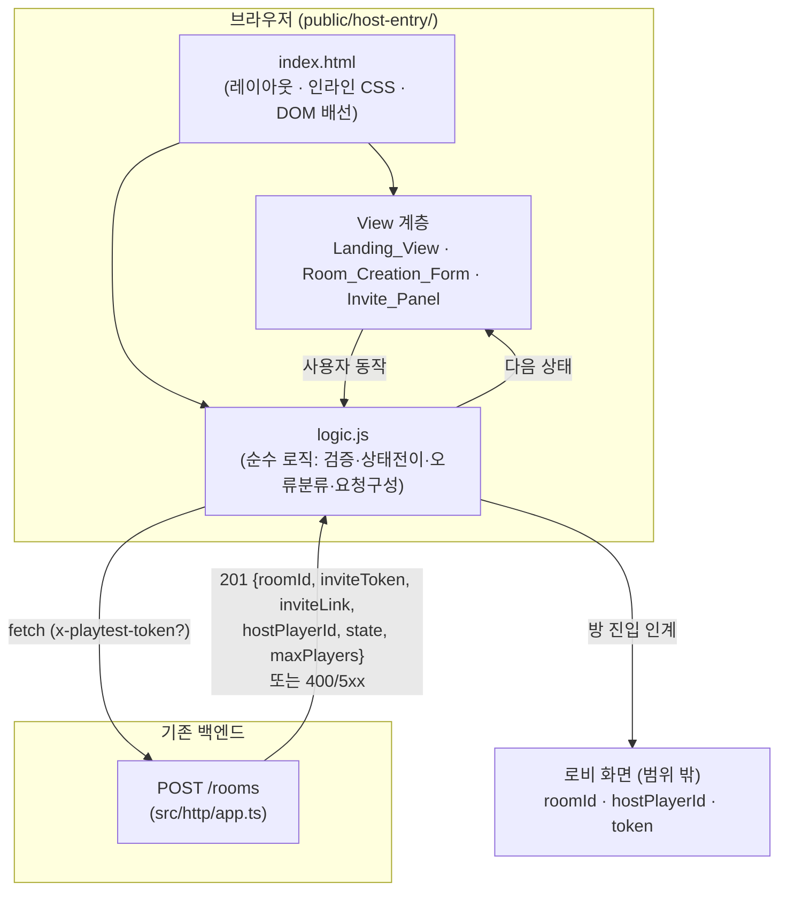

# Design Document

## Overview

이 문서는 ready-gm의 첫 프론트엔드 진입점인 **"랜딩 / 방 생성(호스트 진입)" 화면(Host_Entry_App)** 의 설계를 정의한다. 호스트가 서비스에 도착해 표시 이름을 입력하고, 백엔드 `POST /rooms`로 방을 생성하고, 초대 링크와 방 정보를 받아 복사하고, 생성된 방(로비)으로 진입하기 직전까지의 경험을 다룬다. 로비 이후의 모든 흐름은 범위 밖이며, 본 화면은 로비로의 **인계(handoff)** 지점만 제공한다.

### 설계 목표

- 요구사항 1~10을 모두 충족하는, 단일 화면 프론트엔드를 구현한다.
- 기존 프로젝트의 접근 방식(빌드 단계 없는 정적 `public/*.html`, 바닐라 JS, 인라인 CSS, 다크 테마)을 그대로 따른다.
- 비즈니스 로직(검증, 상태 전이, 오류 분류, 토큰 헤더 구성)을 DOM에서 분리해 자동 테스트가 가능하도록 한다.

### 기술 선택과 근거 (기존 접근 방식 준수)

`package.json`에는 프론트엔드 빌드 도구(번들러, 프레임워크, JSX 변환기 등)가 전혀 없다. 현재 프론트엔드는 `public/index.html` 하나로, 빌드 없이 Express의 정적 서빙으로 제공되는 바닐라 JS + 인라인 CSS 페이지다. 기존 페이지는 이미 `?token=` → `x-playtest-token` 헤더 패턴, `fetch` 호출, 다크 테마 스타일을 보여준다.

따라서 본 화면도 **새 빌드 도구를 도입하지 않고** `public/` 아래의 정적 HTML 페이지(바닐라 JS, ES 모듈, 인라인 CSS)로 구현한다. 이유:

- 요구사항이 단일 화면, 단일 REST 호출, 클립보드/네비게이션 정도의 범위로, 프레임워크의 비용을 정당화할 만한 복잡도가 없다.
- 기존 코드베이스와 서빙 방식·스타일·토큰 처리 관례를 일관되게 유지한다.
- 빌드 단계가 없으므로 배포·서빙이 단순하다.

다만 **테스트 가능성** 을 위해 한 가지 최소한의 조정을 둔다: 순수 로직(검증·상태·오류 분류·요청 구성)을 인라인 스크립트가 아니라 별도의 ES 모듈(`public/host-entry/logic.js`)로 분리하고, HTML 페이지(`public/host-entry/index.html`)는 그 모듈을 import 하여 DOM에 배선만 한다. 이렇게 하면 vitest(이미 devDependency)로 순수 로직을 노드 환경에서 직접 import 해 단위/속성 테스트할 수 있다. 이 분리는 새 런타임 의존성이나 빌드 단계를 추가하지 않는다.

> 보안 메모: 백엔드 `POST /rooms`는 MVP에서 인증되지 않은 엔드포인트다(`src/http/app.ts` 보안 주석 참조). 공개 바인딩 시 운영자는 `?token=` 공유 비밀로 접근을 제한하며, 본 화면은 그 토큰을 `x-playtest-token` 헤더로 전달하는 책임만 진다(요구사항 9). 토큰 자체의 검증·발급은 서버/운영의 책임이다.

## Architecture

### 컴포넌트 구조

본 화면은 정적 페이지 하나와, 그 페이지가 import 하는 순수 로직 모듈로 구성된다.



### 계층 분리 원칙

- **순수 로직 계층 (`logic.js`)**: DOM·네트워크에 의존하지 않는 순수 함수들. 입력 검증, 상태 전이(reducer), 응답/오류 분류, 요청 구성(헤더·바디), 인계 페이로드 구성을 담당한다. vitest로 직접 테스트한다.
- **부수효과 계층 (`index.html`의 스크립트)**: `fetch` 호출, 타임아웃 타이머, 클립보드 접근, 네비게이션, DOM 갱신 같은 부수효과를 담당한다. 순수 로직이 만든 결정을 실행만 한다.
- **View 계층**: 상태 모델의 한 값을 받아 화면을 렌더링한다. 상태가 단일 진실 원천(single source of truth)이며, View는 상태의 함수다.

### 단방향 데이터 흐름

```
사용자 동작 → 액션(Action) → reduce(state, action) → 새 상태 → render(상태) → DOM
                                       │
                                 부수효과 요청(예: 요청 전송) → 부수효과 계층 실행 → 결과 액션
```

상태 전이는 순수 함수 `reduce`로 집중시켜 테스트 가능하게 하고, 부수효과는 액션을 통해서만 트리거한다.

## Components and Interfaces

### 1. Landing_View

호스트가 처음 도착하는 화면 영역. 서비스 소개 문구(한국어)와 함께 Room_Creation_Form을 노출하고, 초기 상태에서 Invite_Panel을 숨긴다.

- **책임**
  - ready-gm 서비스 소개 문구를 한국어로 표시한다. (요구사항 1.1)
  - Room_Creation_Form(입력 + Submit_Action)을 표시한다. (요구사항 1.1)
  - 초기 상태에서 Invite_Panel을 숨긴다. (요구사항 1.2)
- **입력**: 현재 상태(`phase`)
- **출력**: 렌더링된 DOM

### 2. Room_Creation_Form

표시 이름 입력과 방 생성 시작을 담당하는 입력 영역.

- **책임**
  - Display_Name 입력 필드와 Submit_Action 요소를 표시한다. (요구사항 2.1)
  - Submit_Action 시 입력값의 앞뒤 공백을 제거한 값을 사용하고 원본 입력값은 보존한다. (요구사항 2.2)
  - 공백 제거 후 비어 있으면 요청을 보내지 않고, 입력 인접 위치에 한국어 안내를 표시한다. (요구사항 1.3, 2.3, 10.5)
  - 요청 진행 중에는 Submit_Action을 비활성화해 중복 제출을 막는다. (요구사항 2.4, 3.2, 8.4)
  - 400 오류 후에도 입력값을 보존하고 편집·재제출 가능 상태를 유지한다. (요구사항 7.2)
  - 400 오류 메시지가 표시된 상태에서 입력값이 바뀌면 메시지를 제거한다. (요구사항 7.3)
- **인터페이스 (순수 로직)**
  - `validateDisplayName(raw: string): { valid: boolean; trimmed: string }`
  - `buildCreateRoomRequest(trimmedName, token): { url, method, headers, body }`

### 3. Progress_Indicator (진행 상태)

요청 진행 중임을 나타내는 시각적 인디케이터.

- **책임**
  - 요청 전송 후 200ms 이내에 진행 인디케이터를 표시하고 응답 도착까지 유지한다. (요구사항 3.1)
  - 성공/오류 어느 쪽으로든 완료되면 인디케이터를 해제한다. (요구사항 3.3, 3.4, 3.5)
- **참고**: 인디케이터 노출/해제는 `phase === "submitting"` 여부로 결정되는 상태의 함수다.

### 4. Invite_Panel

방 생성 성공 후 초대 링크와 방 정보를 표시하고 공유·진입 동작을 제공하는 영역.

- **책임**
  - 성공 응답 수신 후 1초 이내에 `inviteLink` 전체 문자열을 표시한다. (요구사항 4.1)
  - `maxPlayers` 정수 값을 최대 인원 정보로 표시한다. (요구사항 4.2)
  - Room_Creation_Form의 Submit_Action을 비활성으로 유지한 채 패널을 표시 상태로 전환한다. (요구사항 4.3)
  - 초대 링크 복사 동작 요소를 제공한다. (요구사항 5.1)
  - 방 진입(로비 인계) 단일 동작 요소를 활성 상태로 제공한다. (요구사항 6.1)
- **인터페이스 (순수 로직)**
  - `canEnterRoom(success): boolean` — `roomId`와 `hostPlayerId`가 모두 있을 때만 true. (요구사항 6.1, 6.3)

### 5. Clipboard_Copier (초대 링크 복사)

- **책임**
  - `inviteLink` 전체 문자열을 클립보드에 복사한다. (요구사항 5.2)
  - 성공 시 확인 메시지를 최소 3초간 표시한다. (요구사항 5.3)
  - 실패 시 실패 표시를 제공하고, 링크 전체를 사용자가 직접 선택·복사할 수 있는 형태로 표시한다. (요구사항 5.4)
- **전략**: `navigator.clipboard.writeText`를 우선 시도하고, 사용 불가/거부 시 폴백으로 링크를 선택 가능한 텍스트(예: `readonly` 입력 또는 `text` 영역)로 노출한다. 폴백은 항상 DOM에 존재하므로 복사 API가 없는 환경에서도 수동 복사가 가능하다.

### 6. Lobby_Handoff (로비 인계)

- **책임**
  - 방 진입 동작 시 `roomId`, `hostPlayerId`, (있으면) `Access_Token`을 후속 로비 화면이 사용할 수 있는 형태로 1회만 전달한다. (요구사항 6.2, 9.3)
  - 인계 전에는 `roomId`/`hostPlayerId`를 변경 없이 보존한다. (요구사항 6.4)
- **인터페이스 (순수 로직)**
  - `buildHandoff(success, token): { roomId, hostPlayerId, token? }`

### 7. Room_Creation_Client (부수효과 계층)

`POST /rooms`를 호출하고 응답/오류/타임아웃을 분류해 액션으로 환원한다.

- **책임**
  - 요청에 `Access_Token`이 있으면 `x-playtest-token` 헤더를 포함한다. (요구사항 9.1, 9.2)
  - 응답 상태를 분류해 결과 액션을 만든다(성공 201 / 400 / 5xx / 네트워크 / 타임아웃).
  - 타임아웃: 본 화면은 요청에 대해 클라이언트 타임아웃을 적용한다(아래 "타임아웃 정책" 참조).
- **인터페이스 (순수 로직)**
  - `classifyResponse({ ok, status }): "success" | "validation" | "server" | "unknown"`
  - `classifyOutcome(...)` — 응답/네트워크오류/타임아웃을 단일 결과 타입으로 환원

## Data Models

### 상태 모델 (State Model)

화면 전체는 하나의 상태 객체로 표현되며, 모든 렌더링은 이 상태의 함수다.

```typescript
// 화면의 단계
type Phase =
  | "idle"        // 초기: 폼 표시, 패널 숨김 (요구사항 1.2)
  | "submitting"  // 요청 전송~응답 도착 전: 인디케이터 표시, Submit 비활성 (요구사항 3.1, 3.2)
  | "success"     // 방 생성 성공: Invite_Panel 표시 (요구사항 4.x)
  | "error";      // 오류: 메시지 표시, Submit 재활성 (요구사항 3.4, 8.x)

// 오류 종류 (사용자에게 보일 한국어 메시지를 결정)
type ErrorKind =
  | "validation"  // HTTP 400: 표시 이름 수정 안내 (요구사항 7.1)
  | "server"      // HTTP 5xx (요구사항 8.2)
  | "network"     // 네트워크 실패 (요구사항 8.1)
  | "timeout";    // 클라이언트 타임아웃 (요구사항 3.5, 8.1)

interface CreateRoomSuccess {
  roomId: string;
  inviteToken: string;
  inviteLink: string;
  hostPlayerId: string;
  state: string;
  maxPlayers: number;
}

interface HostEntryState {
  phase: Phase;
  displayNameInput: string;     // 원본 입력값 (보존 대상, 요구사항 2.2/7.2/8.1/8.2)
  token: string;                // ?token= 값, 빈 문자열이면 토큰 없음 (요구사항 9)
  validationMessage: string | null; // 입력 인접 안내 (요구사항 1.3/2.3/7.1)
  errorKind: ErrorKind | null;
  errorMessage: string | null;
  success: CreateRoomSuccess | null;
  copyConfirmedUntil: number | null; // 복사 확인 메시지 표시 만료 시각(ms) (요구사항 5.3)
  handoffDone: boolean;         // 인계 1회 보장 (요구사항 6.2)
}
```

### 액션 모델 (Action Model)

```typescript
type Action =
  | { type: "INPUT_CHANGED"; value: string }       // 요구사항 7.3, 2.2
  | { type: "SUBMIT" }                              // 요구사항 2.4
  | { type: "REQUEST_SUCCEEDED"; payload: CreateRoomSuccess } // 요구사항 2.5, 4.x
  | { type: "REQUEST_FAILED"; kind: ErrorKind }    // 요구사항 3.4, 7.1, 8.x
  | { type: "COPY_SUCCEEDED"; now: number }         // 요구사항 5.3
  | { type: "COPY_FAILED" }                         // 요구사항 5.4
  | { type: "ENTER_ROOM" };                         // 요구사항 6.2
```

핵심 전이 규칙(`reduce(state, action) -> state`):

- `SUBMIT`: `validateDisplayName(displayNameInput)`이 무효면 phase 변화 없이 `validationMessage`만 설정(요청 미발송, 요구사항 1.3/2.3). 유효하면 `phase = "submitting"`, 오류·검증 메시지 클리어.
- `REQUEST_SUCCEEDED`: `phase = "success"`, `success` 저장(요구사항 2.5).
- `REQUEST_FAILED`: `phase = "error"`, `errorKind`/`errorMessage` 설정, `displayNameInput`·`token` 보존(요구사항 3.4/7.2/8.1/8.2).
- `INPUT_CHANGED`: `displayNameInput` 갱신; `errorKind === "validation"`이거나 `validationMessage`가 있으면 함께 제거(요구사항 7.3).
- `ENTER_ROOM`: `handoffDone === false`이고 `canEnterRoom(success)`일 때만 인계를 표시(`handoffDone = true`); 그 외에는 무변화(요구사항 6.2/6.4).

### 백엔드 응답 매핑 (`POST /rooms`)

`src/http/app.ts`의 실제 동작에 맞춘 매핑:

| 백엔드 결과 | 상태/바디 | 화면 처리 |
| --- | --- | --- |
| 성공 | HTTP 201, `{ roomId, inviteToken, inviteLink, hostPlayerId, state, maxPlayers }` | `REQUEST_SUCCEEDED` → Invite_Panel (요구사항 2.5, 4.1~4.3, 6.1) |
| 표시 이름 누락/공백 | HTTP 400, `{ error: "A non-empty display name is required" }` | `REQUEST_FAILED("validation")` → 입력 인접 한국어 안내 (요구사항 7.1) |
| 서버 오류 | HTTP ≥ 500 | `REQUEST_FAILED("server")` (요구사항 8.2) |
| 그 외 비정상 응답 | 기타 비-2xx | `REQUEST_FAILED("server")` 로 보수적 처리 |
| 네트워크 실패 | fetch reject | `REQUEST_FAILED("network")` (요구사항 8.1) |
| 응답 지연 | 클라이언트 타임아웃 | `REQUEST_FAILED("timeout")` (요구사항 3.5, 8.1) |

> 클라이언트는 `displayName`을 **전송 전에** 트림·검증하므로 정상 흐름에서 400은 발생하지 않는다. 그러나 백엔드 검증과 클라이언트 검증이 어긋나는 경우(예: 서버 측 규칙 변경)에도 견고하도록 400 처리 경로를 명시적으로 둔다.

### 타임아웃 정책

요구사항은 두 개의 타임아웃 임계값을 명시한다:

- 요구사항 3.5 / 4.4 / 2.6: **10초(10000ms)** 이내에 응답이 없으면 오류로 처리.
- 요구사항 8.1: **30초(30000ms)** 이내에 응답이 없으면 연결 문제 오류 메시지.

10초 임계값이 더 엄격하므로 이를 만족하면 30초 임계값도 자동으로 만족한다. 따라서 본 화면은 **클라이언트 타임아웃을 10초로 적용** 하여 둘 다 충족한다. 10초 경과 시 진행 인디케이터를 해제하고 Submit_Action을 재활성화하며(요구사항 3.5), 연결 문제를 알리는 한국어 메시지를 표시하고 입력값을 보존한다(요구사항 8.1). 타임아웃 시각은 `AbortController`로 진행 중인 `fetch`를 취소해 구현한다.

## Correctness Properties

*속성(property)이란 시스템의 모든 유효한 실행에서 참이어야 하는 특성 또는 동작으로, 시스템이 무엇을 해야 하는지에 대한 형식적 진술이다. 속성은 사람이 읽는 명세와 기계가 검증 가능한 정확성 보증 사이의 다리 역할을 한다.*

본 화면의 PBT 대상은 DOM·네트워크·클립보드에 의존하지 않는 **순수 로직 계층**(`validateDisplayName`, `reduce`, `classifyResponse`, `buildCreateRoomRequest`, `buildHandoff`, `canEnterRoom`, 그리고 모킹 가능한 복사 어댑터)이다. 레이아웃·포커스·스크린리더 레이블 등 시각/접근성 요구사항은 속성이 아닌 예제 및 통합 테스트로 검증한다(아래 Testing Strategy 참조).

### Property 1: 공백 표시 이름은 거부되고 요청을 보내지 않는다

*For any* 공백 문자로만 이루어진(또는 빈) 문자열을 Display_Name 입력값으로 가질 때, `SUBMIT` 액션을 reduce 하면 `Room_Creation_Endpoint` 요청이 발생하지 않고(phase가 `submitting`으로 바뀌지 않음), 입력값이 그대로 보존되며, 입력에 인접한 검증 안내 메시지가 설정된다.

**Validates: Requirements 1.3, 2.3, 10.5**

### Property 2: 유효 제출은 트림된 이름을 전송하고 원본 입력을 보존한다

*For any* 앞뒤 공백이 임의로 붙어 있으나 트림 후 한 글자 이상인 Display_Name에 대해, 생성되는 `POST /rooms` 요청 바디의 `displayName`은 트림된 값과 정확히 같고, 화면 상태의 `displayNameInput`은 사용자가 입력한 원본 문자열을 그대로 보존한다.

**Validates: Requirements 2.2**

### Property 3: 접근 토큰과 요청 헤더는 동치다

*For any* 토큰 문자열에 대해, 토큰이 비어 있지 않으면 생성되는 `POST /rooms` 요청은 `x-playtest-token` 헤더에 그 값을 그대로 포함하고, 토큰이 없거나 빈 문자열이면 요청에 `x-playtest-token` 헤더가 존재하지 않는다.

**Validates: Requirements 1.4, 9.1, 9.2**

### Property 4: 처리 중 추가 제출은 멱등이다

*For any* `submitting` 단계의 상태에 대해, 추가 `SUBMIT` 액션을 reduce 해도 새로운 `Room_Creation_Endpoint` 요청을 발생시키지 않으며 상태는 `submitting`으로 유지된다(중복 요청 방지).

**Validates: Requirements 3.2, 8.4**

### Property 5: 성공 응답은 success 단계로 전이하며 응답 데이터를 보존한다

*For any* 유효한 `POST /rooms` 성공 페이로드에 대해, `REQUEST_SUCCEEDED`를 reduce 하면 phase가 `success`가 되고 응답의 모든 필드(`roomId`, `inviteToken`, `inviteLink`, `hostPlayerId`, `state`, `maxPlayers`)가 변경 없이 상태에 저장된다.

**Validates: Requirements 2.5**

### Property 6: 모든 실패는 동일한 회복 가능 상태로 전이한다

*For any* 오류 종류(`validation`, `server`, `network`, `timeout`)와 임의의 입력·토큰 상태에 대해, `REQUEST_FAILED`를 reduce 하면 phase가 `error`가 되고, Invite_Panel이 표시되지 않으며, `displayNameInput`과 `token`이 그대로 보존되고, Submit_Action이 다시 활성화되는 상태가 된다.

**Validates: Requirements 2.6, 3.4, 4.4, 7.2, 8.1, 8.3**

### Property 7: HTTP 응답 상태는 오류 종류로 정확히 분류된다

*For any* 비-2xx HTTP 응답 상태 코드에 대해, `classifyResponse`는 상태가 정확히 400이면 `validation`으로, 500 이상이면 `server`로 분류한다.

**Validates: Requirements 7.1, 8.2**

### Property 8: Invite_Panel 렌더는 필수 방 정보를 모두 포함한다

*For any* 성공 페이로드에 대해, Invite_Panel을 렌더한 출력 문자열에는 `inviteLink` 전체 문자열과 `maxPlayers` 값이 모두 포함된다.

**Validates: Requirements 4.1, 4.2**

### Property 9: 가시성은 단계의 함수다

*For any* 화면 상태에 대해, 진행 인디케이터는 phase가 `submitting`일 때만 표시되고, Invite_Panel은 phase가 `success`일 때만 표시되며, Submit_Action은 phase가 `submitting` 또는 `success`일 때 비활성, 그 외에는 활성이다.

**Validates: Requirements 1.2, 3.1, 3.3, 4.3**

### Property 10: 방 진입 가능 여부는 식별자 존재와 동치다

*For any* 성공 페이로드(일부 필드가 누락될 수 있음)에 대해, `canEnterRoom`은 `roomId`와 `hostPlayerId`가 둘 다 비어 있지 않을 때에만 true를 반환한다.

**Validates: Requirements 6.1, 6.3**

### Property 11: 로비 인계는 정확히 한 번 수행되며 식별자와 토큰을 전달한다

*For any* `success` 상태와 임의 횟수(N≥1)의 `ENTER_ROOM` 액션에 대해, 인계는 정확히 한 번만 수행되고(`handoffDone`이 true가 된 이후의 추가 `ENTER_ROOM`은 무효), 인계 페이로드는 응답의 `roomId`와 `hostPlayerId`를 포함하며, 토큰이 비어 있지 않으면 그 토큰도 함께 포함한다.

**Validates: Requirements 6.2, 9.3**

### Property 12: 인계 전 식별자는 불변이다

*For any* `success` 상태와 `ENTER_ROOM`을 제외한 임의의 액션 시퀀스에 대해, reduce를 모두 적용한 뒤에도 상태에 저장된 `roomId`와 `hostPlayerId`는 변경되지 않는다.

**Validates: Requirements 6.4**

### Property 13: 복사 동작은 초대 링크 전체를 클립보드에 기록한다

*For any* `inviteLink` 문자열에 대해, 복사 동작을 실행하면 클립보드 어댑터에 전달되는 값은 `inviteLink` 전체 문자열과 정확히 일치한다.

**Validates: Requirements 5.2**

### Property 14: 복사 성공 확인 메시지는 최소 3초 표시된다

*For any* 시각 값 `now`에 대해, `COPY_SUCCEEDED`를 reduce 하면 `copyConfirmedUntil`은 정확히 `now + 3000`(ms)으로 설정된다.

**Validates: Requirements 5.3**

### Property 15: 입력 변경은 검증·오류 메시지를 제거한다

*For any* 검증 오류(`validation`)가 표시된 상태와 임의의 새 입력값에 대해, `INPUT_CHANGED`를 reduce 하면 검증 안내 메시지가 제거되고 `validation` 오류 종류가 더 이상 활성이 아니다.

**Validates: Requirements 7.3**

## Error Handling

### 오류 분류와 사용자 메시지

모든 실패 경로는 단일 결과 타입(`ErrorKind`)으로 환원한 뒤 `REQUEST_FAILED` 액션으로 reduce 한다. 각 종류는 한국어 메시지로 매핑된다.

| ErrorKind | 발생 조건 | 사용자 메시지(요지) | 표시 위치 | 요구사항 |
| --- | --- | --- | --- | --- |
| `validation` | HTTP 400 | 표시 이름은 공백을 제외하고 최소 1자 이상이어야 한다는 수정 안내 | Display_Name 입력 인접 | 7.1, 7.2 |
| `server` | HTTP ≥ 500 | 서버 오류가 발생했으니 잠시 후 다시 시도하라는 안내 | 폼 상단/오류 영역 | 8.2 |
| `network` | fetch reject(네트워크 실패) | 연결 문제가 발생했다는 안내 | 폼 상단/오류 영역 | 8.1 |
| `timeout` | 10초 내 무응답(AbortController) | 연결이 지연된다는 안내(연결 문제) | 폼 상단/오류 영역 | 3.5, 8.1 |

### 회복 정책

- 모든 오류 종류에서 `displayNameInput`과 `token`을 보존하고 Submit_Action을 재활성화해 즉시 재시도를 허용한다(Property 6).
- `validation` 오류 메시지는 입력값이 변경되면 자동 제거된다(Property 15).
- 진행 인디케이터는 phase가 `submitting`을 벗어나면(success 또는 error) 자동 해제된다(Property 9).

### 타임아웃 처리

`AbortController`로 10초 타이머를 건다. 10초 안에 응답이 없으면 fetch를 취소하고 `timeout` 결과를 만든다. 10초 임계값이 30초보다 엄격하므로 요구사항 3.5/4.4/2.6(10초)과 8.1(30초)을 모두 충족한다. 응답이 먼저 도착하면 타이머를 해제한다.

### 클립보드 폴백

`navigator.clipboard.writeText`를 우선 시도한다. API가 없거나 거부(예: 비보안 컨텍스트, 권한 거부)되면:
1. 복사 실패 표시를 제공한다(요구사항 5.4).
2. `inviteLink` 전체를 `readonly` 입력/텍스트 요소로 노출해 사용자가 직접 선택·복사할 수 있게 한다(요구사항 5.4).

이 폴백 요소는 성공 패널에 항상 존재하므로, 복사 API 지원 여부와 무관하게 링크는 언제나 수동 복사 가능하다.

## Testing Strategy

### 이중 테스트 접근

- **속성 테스트(Property tests)**: 위 Correctness Properties 1~15를 순수 로직 계층(`logic.js`)에 대해 검증한다. 본 화면의 핵심 정확성(검증·상태 전이·분류·요청 구성·인계)이 입력 전반에 걸쳐 성립함을 보장한다.
- **예제/단위 테스트(Example tests)**: 특정 시나리오·메시지 문구·정적 DOM 존재를 검증한다.
- **통합 테스트(Integration tests)**: 부수효과(타임아웃 타이머, fetch 배선, 클립보드 어댑터)와 DOM 배선을 검증한다.

### 도구

- **속성 테스트 라이브러리**: `fast-check`(이미 `package.json` devDependency). 직접 구현하지 않고 이 라이브러리를 사용한다.
- **테스트 러너**: `vitest`(이미 존재). 순수 로직 모듈을 노드 환경에서 직접 import 해 테스트한다.
- **DOM 테스트**: `vitest`의 `jsdom`/`happy-dom` 환경 또는 경량 DOM 통합 테스트로 정적 존재·포커스 순서·접근성 레이블을 검증한다. 새로운 무거운 빌드 도구는 도입하지 않는다.

### 속성 테스트 규칙

- 각 속성 테스트는 최소 **100회 반복**으로 실행한다(fast-check 기본 또는 명시적 `numRuns: 100`).
- 각 속성 테스트는 설계 문서의 속성을 주석으로 참조한다.
- 태그 형식: **Feature: frontend-applications, Property {번호}: {속성 텍스트}**
- 각 Correctness Property는 **하나의** 속성 기반 테스트로 구현한다.

#### 생성기(Generator) 전략

- **공백 문자열 생성기**: 스페이스·탭·개행·전각 공백 등 다양한 공백 문자 조합(빈 문자열 포함) — Property 1.
- **유효 이름 생성기**: 트림 후 1자 이상이 보장되는 문자열(앞뒤 임의 공백 포함, 비-ASCII/한글 포함) — Property 2.
- **토큰 생성기**: 빈 문자열과 임의의 비공백 문자열을 모두 포함 — Property 3.
- **성공 페이로드 생성기**: `roomId`/`hostPlayerId`가 존재/누락되는 조합과 임의 정수 `maxPlayers` — Property 5, 8, 10.
- **상태 코드 생성기**: 400, 임의 4xx, 임의 5xx, 기타 비-2xx — Property 7.
- **엣지 케이스**: 비-ASCII/이모지/매우 긴 문자열, 특수문자가 포함된 `inviteLink`(전체 문자열 일치 확인) — Property 8, 13.

### 예제·통합 테스트 대상(속성 비적용 요구사항)

다음 요구사항은 입력에 따라 의미 있게 달라지지 않거나(정적 렌더), 시각/접근성 영역이라 속성이 아닌 예제·통합·수동 검증으로 다룬다:

- **1.1, 2.1** — 초기 렌더에 소개 문구·입력·Submit가 한국어로 존재(예제 DOM 테스트).
- **5.1** — 성공 패널에 복사 버튼 존재(예제 DOM 테스트).
- **5.4** — 복사 실패 시 수동 복사용 링크 요소 노출(예제 통합 테스트, 클립보드 어댑터 실패 모킹).
- **3.5 (타이머 발화)** — 가짜 타이머로 10초 경과 시 AbortController가 fetch를 취소하는지(통합 테스트).
- **7.1 / 8.1 / 8.2 (메시지 문구)** — 각 오류 종류의 한국어 메시지 내용(예제 테스트). 분류 로직 자체는 Property 7/6이 커버.
- **10.1** — 모바일 뷰포트(320~767px)에서 가로 스크롤 부재·세로 단일 열(반응형 CSS, 예제/수동 검증).
- **10.2** — Tab 포커스 순서가 DOM 순서와 일치, Enter/Space 활성화(예제 DOM 테스트).
- **10.3** — 포커스 시 보이는 포커스 표시(CSS `:focus-visible`, 수동/스냅샷 검증).
- **10.4** — 모든 상호작용 요소의 비어 있지 않은 접근성 레이블(예제 DOM 테스트).
- **10.5 (aria 연관)** — 유효성 안내가 `aria-describedby`로 입력과 연관(예제 DOM 테스트). 제출 중단·입력 보존은 Property 1이 커버.

## 요구사항 추적 요약

| 요구사항 | 설계 반영 |
| --- | --- |
| 1.1 랜딩 소개·폼 표시 | Landing_View / 예제 테스트 |
| 1.2 초기 상태·패널 숨김 | 상태 모델(idle), Property 9 |
| 1.3 빈 이름 제출 거부 | Property 1 |
| 1.4 토큰 헤더 포함 | Property 3 |
| 2.1 폼 구성 | Room_Creation_Form / 예제 |
| 2.2 트림·입력 보존 | Property 2 |
| 2.3 빈 이름 안내 | Property 1 |
| 2.4 유효 제출·Submit 비활성 | reduce(SUBMIT), Property 9 |
| 2.5 성공 저장·패널 전환 | Property 5 |
| 2.6 오류/타임아웃 회복 | Property 6 |
| 3.1~3.3 진행 인디케이터 | Property 9 / 예제 |
| 3.2 중복 요청 방지 | Property 4 |
| 3.4 오류 회복 | Property 6 |
| 3.5 10초 타임아웃 | 타임아웃 정책, Property 6 / 통합 |
| 4.1 inviteLink 표시 | Property 8 |
| 4.2 maxPlayers 표시 | Property 8 |
| 4.3 패널 전환·Submit 비활성 | Property 9 |
| 4.4 오류 시 패널 미표시 | Property 6, 9 |
| 5.1 복사 요소 | Invite_Panel / 예제 |
| 5.2 inviteLink 복사 | Property 13 |
| 5.3 복사 확인 3초 | Property 14 |
| 5.4 복사 폴백 | 클립보드 폴백 / 예제 |
| 6.1 진입 활성 | Property 10 |
| 6.2 인계 1회 | Property 11 |
| 6.3 진입 비활성 | Property 10 |
| 6.4 식별자 보존 | Property 12 |
| 7.1 400 안내 | Property 7 / 예제(문구) |
| 7.2 400 입력 보존 | Property 6 |
| 7.3 입력 변경 시 메시지 제거 | Property 15 |
| 8.1 네트워크/30초 | Property 6, 타임아웃 정책 |
| 8.2 5xx 서버 오류 | Property 7, 6 |
| 8.3 재시도 활성 | Property 6 |
| 8.4 중복 제출 방지 | Property 4 |
| 9.1 토큰 헤더 | Property 3 |
| 9.2 토큰 없음 | Property 3 |
| 9.3 인계에 토큰 전달 | Property 11 |
| 10.1 반응형 | 예제/수동(CSS) |
| 10.2 키보드 포커스 순서 | 예제 DOM |
| 10.3 포커스 표시 | 수동/스냅샷(CSS) |
| 10.4 접근성 레이블 | 예제 DOM |
| 10.5 무효 입력·aria | Property 1 / 예제(aria) |
