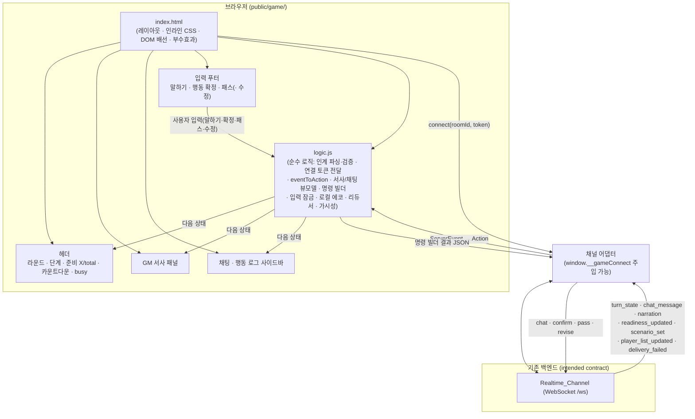

# Design Document

## Overview

이 문서는 ready-gm의 세 번째이자 **종착(terminal)** 프론트엔드 화면인 **"게임 플레이" 화면(Game_Play_App)** 의 설계를 정의한다. 이 화면은 이미 완료된 **room-lobby(호스트 로비)** 화면의 인계 대상이다. room-lobby는 방이 세션 진행 상태로 전이하면 `/lobby/game?roomId=...&hostPlayerId=...&token=...` 로 이동하면서 식별자(그리고 공유 비밀이 사용될 때 `token`)를 쿼리로 인계한다. 본 화면은 그 인계 계약으로 진입하는 **세션 진행 중(in-session) 화면**으로, 플레이어가 다음을 수행하는 경험을 다룬다.

- 인계된 식별자로 올바른 방의 Realtime_Channel에 연결한다.
- GM 서사(opening/resolution/closing)를 순서대로 읽는다.
- 일행의 채팅과 본인의 행동(확정/패스)을 행동 로그에서 본다.
- 라운드/단계/준비 수/준비 체크 카운트다운을 헤더에서 확인한다.
- 말하기·행동 확정·패스·행동 수정으로 라운드 루프에 참여한다.
- 세션이 끝나면(phase `ended` 또는 closing narration) 화면 내에서 입력이 마무리되고 종료 안내를 본다. **추가 인계는 없다.**

### 설계 목표

- 요구사항 1~11을 모두 충족하는 단일 화면 프론트엔드를 구현한다.
- host-entry·room-lobby가 확립한 아키텍처·관례를 **그대로 미러링**한다(빌드 단계 없는 정적 `public/*.html`, 바닐라 JS ES 모듈, 인라인 CSS, 다크 테마, 순수 로직 분리).
- 기존 `public/index.html`의 검증된 게임 UX(2분할 서사/사이드바, 헤더 라운드·단계·준비·busy, 말하기·확정·패스 푸터, MAX_ENTRIES 상한, 본인 행동 로컬 에코, append-new-only 채팅)를 깔끔하게 재구현하되, `POST /play/new`가 아니라 **room-lobby 인계로 진입**한다.
- 비즈니스 로직(인계 파싱·검증, 연결 토큰 전달, `ServerEvent` → Action 환원, 서사 추가·상한, 채팅 append-new-only, 준비 수·카운트다운 도출, 명령 빌더, 입력 잠금 술어, 로컬 에코, 상태 전이, 뷰 모델)을 DOM·WebSocket에서 분리해 자동 테스트가 가능하도록 한다.
- 부수효과(`WebSocket`, 타이머)를 **주입 가능(injectable)** 하게 만들어, 아직 배선되지 않은 백엔드 항목(ws 연결 티켓 간극)에 대해서도 모킹으로 완전히 단위/DOM 테스트할 수 있게 한다.

### 기술 선택과 근거 (host-entry · room-lobby 일관성)

`package.json`에는 프론트엔드 빌드 도구(번들러·프레임워크·JSX 변환기)가 없다. 현재 프론트엔드는 빌드 없이 Express 정적 서빙으로 제공되는 바닐라 JS + 인라인 CSS이며, host-entry(`public/host-entry/`)와 room-lobby(`public/lobby/`)가 이미 `?token=` 전달, `esc()` HTML 이스케이프, `computeVisibility` 형태의 뷰 모델, 주입 가능한 `connect` 어댑터, `eventToAction` 환원을 검증된 형태로 보여준다. 또한 기존 `public/index.html`은 게임 화면 UX(2분할 레이아웃, `MAX_ENTRIES = 250`, `chatCount` 기반 append-new-only, 본인 confirm/pass 로컬 에코)를 이미 구현하고 있다.

따라서 본 화면도 **새 빌드 도구를 도입하지 않고** `public/game/` 아래 정적 HTML 페이지(바닐라 JS ES 모듈, 인라인 CSS)로 구현하며, 순수 로직을 `public/game/logic.js`로 분리하고 `public/game/index.html`이 그 모듈을 import 해 DOM·부수효과에 배선한다. 이유:

- 요구사항이 단일 화면 범위(단일 WebSocket 구독 + 입력 명령 전송)이며 프레임워크 비용을 정당화할 복잡도가 없다.
- host-entry·room-lobby와 서빙 방식·스타일·토큰 처리·테스트 방식을 일관되게 유지한다.
- 순수 로직 분리는 새 런타임 의존성이나 빌드 단계를 추가하지 않으면서 vitest(이미 devDependency)로 노드 환경에서 직접 테스트할 수 있게 한다. DOM·실시간 배선은 happy-dom(이미 devDependency) 환경에서 검증한다. `vitest.config.ts`의 `include`는 이미 `public/**/*.test.js`를 매칭한다.

#### 주입 가능성(Injectability)과 가정(Assumptions)

요구사항의 "범위 밖 / 가정" 절은 **게임용 실시간 연결 티켓 발급(ws ticket gap)** 이 현재 플레이테스트 서버에 아직 배선되지 않았음을 명시한다(`/ws`는 서버 발급 `ticket`을 요구하나 room-lobby → game 인계에는 티켓이 없고 티켓 발급 REST도 없다). 본 화면은 이를 **의도된(intended) 백엔드 계약** 으로 삼아 설계하되, 모든 외부 의존성을 어댑터로 주입받아 모킹 가능하게 한다.

- **WebSocket(Realtime_Channel)**: 순수 로직은 WebSocket을 모른다. 부수효과 계층은 **주입 가능한 `connect(roomId, token)` 어댑터 함수**(`window.__gameConnect`로 교체 가능, room-lobby의 `window.__lobbyConnect`와 동형)를 통해 채널을 연다. 이 어댑터는 `{ send, close, onEvent, onClose }` 형태의 핸들을 반환하며, 들어오는 `ServerEvent`를 순수 액션으로 환원해 `dispatch`한다. 테스트는 가짜 채널 어댑터를 주입한다.
- **타이머**: 카운트다운 갱신과 재연결 간격 타이머는 주입 가능하게 두어 가짜 타이머로 검증한다.

> 보안 메모: 실시간 연결은 서버 발급 연결 티켓을 요구하지만(범위 밖 가정), 본 화면의 실시간 요구사항은 "유효한 티켓을 획득할 수 있다"는 가정 위에서 정의되며, `connect` 어댑터 뒤에 캡슐화된다. 본 화면은 운영자가 공유 비밀(`?token=`)을 쓰는 경우 그 토큰을 연결 URL/파라미터에 안전하게 인코딩해 전달하는 책임만 진다(요구사항 10). 토큰 검증·티켓 발급은 서버/운영의 책임이다.

## Architecture

### 컴포넌트 구조

본 화면은 정적 페이지 하나와, 그 페이지가 import 하는 순수 로직 모듈로 구성된다. host-entry·room-lobby와 동일한 3계층 구조다.



### 계층 분리 원칙 (host-entry · room-lobby 미러링)

- **순수 로직 계층 (`logic.js`)**: DOM·WebSocket·타이머에 의존하지 않는 순수 함수들. 인계 파싱·검증, 연결 토큰 전달 명세 구성, `ServerEvent` → Action 환원, GM 서사 추가·상한, 채팅 append-new-only, 준비 수·카운트다운 도출, 입력 명령 빌더, 입력 잠금 술어, 본인 행동 로컬 에코, 상태 전이(reducer), 뷰 모델 도출을 담당한다. vitest로 직접 테스트한다.
- **부수효과 계층 (`index.html`의 스크립트)**: 실시간 채널 `connect`/구독/재연결, 명령 `send`, 카운트다운/재연결 타이머, DOM 갱신을 담당한다. 순수 로직이 만든 결정·명세·JSON을 실행만 한다.
- **View 계층**: 단일 상태 객체를 받아 화면을 렌더한다. 상태가 단일 진실 원천이며 View는 상태의 순수 함수다.

### 단방향 데이터 흐름 (ServerEvent 인입 경로 포함)

```
사용자 입력 ─┐
            ├─→ 액션(Action) → reduce(state, action) → 새 상태 → render(상태) → DOM
ServerEvent ┘                         │
ServerEvent → (채널 어댑터가 eventToAction으로 액션 환원) ┘
                                      │
                         부수효과 요청(채널 send / 재연결 / 타이머)
                                      │
                                 부수효과 계층 실행 → 결과 액션
```

실시간 `ServerEvent`와 사용자 입력은 모두 동일한 `dispatch` 통로를 거쳐 순수 `reduce`로 흡수된다. 즉 실시간 이벤트도 부수효과 계층(채널 어댑터)에서 `eventToAction`으로 순수 액션으로 변환된 뒤 단일 방향으로 흐른다. 부수효과(채널 `send`)는 명령 빌더가 만든 JSON을 통해서만 트리거된다.

## Components and Interfaces

### 1. Handoff_Reader (인계 파라미터 파서 + 검증기)

페이지 URL 쿼리에서 인계 값을 읽고 유효성을 판정한다.

- **책임**
  - `roomId`·`hostPlayerId`의 공백 제거 후 값을 읽고, 공백 제거 후 비어 있지 않은 `token`을 Access_Token으로 보존한다. (요구사항 1.1, 1.2)
  - 공백 제거 후 `roomId` 또는 `hostPlayerId` 중 하나라도 비면 인계를 무효로 판정한다. (요구사항 1.3)
- **인터페이스 (순수 로직)**
  - `parseHandoff(search: string): { roomId: string; hostPlayerId: string; token: string }` — 쿼리 문자열에서 트림된 값 추출(토큰은 공백 제거 후 빈 문자열이면 `""`).
  - `isHandoffValid(handoff): boolean` — `roomId`와 `hostPlayerId`가 모두 비어 있지 않을 때만 true.

### 2. Connect_Spec_Builder (연결 토큰 전달)

- **책임**: 길이 ≥ 1인 Access_Token이 있으면 연결 URL/파라미터에 `token`을 안전하게 인코딩해 그대로 첨부, 없으면 생략한다. (요구사항 1.2, 1.5, 10.1, 10.2, 10.3)
- **인터페이스 (순수 로직)**
  - `buildConnectParams(roomId: string, token: string): { roomId: string; token: string; query: string }` — `query`는 `roomId`와 (있으면) `token`을 `encodeURIComponent`로 인코딩한 쿼리 문자열. 토큰이 비어 있으면 `token`은 `query`에 포함되지 않는다.

### 3. Event_Ingestor (ServerEvent → Action 환원)

주입 가능한 `connect` 어댑터 뒤에서 들어오는 `ServerEvent`를 순수 액션으로 환원한다.

- **책임 (부수효과 계층)**
  - Room_Id·Player_Id가 유효하면 `connect(roomId, token)`으로 채널 연결을 시작한다. (요구사항 2.1)
  - 연결 활성/끊김을 액션으로 dispatch 하고, 끊기면 일정 간격으로 재연결을 시도한다. (요구사항 2.4, 2.5, 8.1, 8.3)
- **이벤트 → 액션 환원 (순수 로직)**
  - `turn_state` → `TURN_STATE { state }`
  - `chat_message` → `CHAT_MESSAGE { message }`
  - `narration` → `NARRATION { kind, roundNumber, text }`
  - `readiness_updated` → `READINESS_UPDATED { readiness }`
  - `scenario_set` → `SCENARIO_SET { scenarioId, title, summary }`
  - `delivery_failed` → `DELIVERY_FAILED { failedType, detail }`
  - 연결 상태 → `CONNECTION_OPENED` / `CONNECTION_LOST`
  - `eventToAction(event: ServerEvent): Action | null` — 관심 없는 이벤트(`player_list_updated`)는 `null`(게임 화면 무시).

### 4. Narration_View (GM 서사 뷰 모델)

- **책임**
  - `narration` 이벤트의 `text`를 `kind` 표시와 함께 서사 패널 끝에 추가하여 도착 순서대로 표시한다. (요구사항 3.1)
  - 재동기화 시 Turn_State의 Narrative_Context를 기록 순서대로 반영한다. (요구사항 3.2)
  - 표시 항목 수가 MAX_ENTRIES를 넘으면 가장 오래된 것부터 제거한다. (요구사항 3.3)
  - 텍스트는 HTML로 해석하지 않고 이스케이프한다. (요구사항 3.4)
- **인터페이스 (순수 로직)**
  - `appendNarration(entries: NarrationEntry[], entry: NarrationEntry): NarrationEntry[]` — 끝에 추가하고 길이가 MAX_ENTRIES를 넘으면 앞에서 잘라 상한을 유지(불변, 새 배열 반환).
  - `narrativeContextToEntries(narrativeContext: { round, text }[]): NarrationEntry[]` — Narrative_Context를 표시용 항목으로 순서 보존 변환.
  - `esc(value): string` — `&`, `<`, `>` 이스케이프(`public/index.html` 패턴).

### 5. Chat_View (채팅 뷰 모델, append-new-only)

- **책임**
  - `turn_state`의 Chat_Log를 적용할 때 직전 표시 수를 초과하는 새 항목만 추가한다. (요구사항 4.1)
  - 라이브 `chat_message`를 끝에 추가한다. (요구사항 4.2)
  - `characterName` 귀속·`text` 이스케이프로 표시한다. (요구사항 4.3)
  - Chat_Log가 직전 수보다 짧으면(라운드 전환) 표시 수를 0으로 리셋한 뒤 새로 추가한다. (요구사항 4.4)
- **인터페이스 (순수 로직)**
  - `appendNewChats(prevCount: number, chatLog: ChatEntry[]): { entries: ChatEntry[]; nextCount: number }` — `chatLog.length < prevCount`이면 `prevCount`를 0으로 보고 전부를 새 항목으로, 아니면 `prevCount` 이후 항목만 새 항목으로 반환. `nextCount = chatLog.length`.

### 6. Header_View (헤더/상태 뷰 모델)

- **책임**
  - `roundNumber`·`phase`를 표시한다. (요구사항 5.1)
  - 준비 수("준비 X/전체")를 표시한다. (요구사항 5.2, 5.3)
  - Ready_Check_Deadline 기준 남은 시간을 0 이상으로 카운트다운한다. (요구사항 5.4)
  - `phase === "resolving"`일 때만 busy 표시를 노출한다. (요구사항 5.4, 5.5)
- **인터페이스 (순수 로직)**
  - `computeReadyCount(readiness: ReadinessEntry[]): { ready: number; total: number }` — `ready = status === "ready" 개수`, `total = readiness.length`.
  - `computeCountdownMs(deadlineIso: string | null, nowMs: number): number | null` — `deadline`이 null이면 null, 아니면 `max(0, deadlineMs - nowMs)`(마감을 지났으면 0).
  - `computeBusy(phase: string): boolean` — `phase === "resolving"`일 때만 true.

### 7. Command_Builders (입력 명령 빌더)

플레이어 입력을 Realtime_Channel로 보낼 JSON으로 만든다. 빈 입력은 거부한다.

- **책임**: 말하기/확정/패스/수정 명령 JSON을 만들고(요구사항 6.1, 6.2, 6.3, 6.4), 공백 제거 후 비어 있는 입력은 명령을 만들지 않는다(요구사항 6.5).
- **인터페이스 (순수 로직)**
  - `buildChatCommand(text: string): { type: "chat"; text: string } | null` — 트림된 `text`가 비어 있으면 `null`.
  - `buildConfirmCommand(action: string): { type: "confirm"; action: string } | null` — 트림된 `action`이 비어 있으면 `null`.
  - `buildPassCommand(): { type: "pass" }` — 항상 유효(입력 불필요).
  - `buildReviseCommand(action: string): { type: "revise"; action: string } | null` — 트림된 `action`이 비어 있으면 `null`.

### 8. Input_Lock (입력 잠금 술어)

- **책임**: `phase`가 `resolving` 또는 `ended`이면 입력을 잠근다. (요구사항 7.1, 7.2, 7.3)
- **인터페이스 (순수 로직)**
  - `isInputLocked(phase: string): boolean` — `phase === "resolving" || phase === "ended"`일 때만 true.

### 9. Local_Echo (본인 행동 로컬 에코)

서버가 echo 하지 않는 본인의 확정 행동·패스를 행동 로그에 직접 추가한다.

- **책임**: 본인의 확정 행동·패스를 Action_Log에 로컬 에코로 추가한다. (요구사항 6.2, 6.3) 행동 로그도 MAX_ENTRIES 상한을 지킨다.
- **인터페이스 (순수 로직)**
  - `appendActionLog(log: ActionEntry[], entry: ActionEntry): ActionEntry[]` — 끝에 추가하고 길이가 MAX_ENTRIES를 넘으면 앞에서 잘라 상한 유지(불변, 새 배열 반환).
  - `makeConfirmEcho(playerId: string, action: string): ActionEntry` / `makePassEcho(playerId: string): ActionEntry` — 로컬 에코 항목 구성.

### 10. Session_End_Detector (세션 종료 감지)

- **책임**: `phase === "ended"` 이거나 `closing` Narration이 도착하면 Session_Ended로 기록하고 입력을 비활성으로 유지한다. (요구사항 9.1, 9.2) 종착 화면이므로 추가 인계는 없다(요구사항 9.4).
- **인터페이스 (순수 로직)**
  - `detectSessionEnded(input: { phase?: string; narrationKind?: string }): boolean` — `phase === "ended"` 또는 `narrationKind === "closing"`이면 true.

### 11. Reducer + Visibility (상태 전이 + 뷰 모델 가시성)

- **인터페이스 (순수 로직)**
  - `reduce(state, action): state` — 단방향 상태 전이. 입력 상태를 변형하지 않고 새 객체를 반환(no-op은 동일 참조).
  - `computeVisibility(state): { ... }` — 입력 잠금, 연결 활성 표시, busy, 종료 안내, 적재 전 비활성 등 가시성을 상태의 함수로 도출.

## Data Models

### 상태 모델 (State Model)

화면 전체는 하나의 상태 객체로 표현되며, 모든 렌더링은 이 상태의 함수다.

```typescript
// 라운드 루프 단계 (src/core/types.ts의 Phase와 동일)
type Phase = "free_chat" | "ready_check" | "resolving" | "ended";

// 실시간 연결 상태 (요구사항 2.4, 2.5, 8.x)
type ConnectionStatus = "connecting" | "open" | "disconnected";

// GM 서사 패널 표시 항목 (요구사항 3.x)
interface NarrationEntry { kind: "opening" | "resolution" | "closing"; roundNumber: number; text: string; }

// 채팅 표시 항목 (turn_state.chatLog / chat_message) (요구사항 4.x)
interface ChatEntry { playerId: string; characterName: string; text: string; ts: string; }

// 행동 로그 로컬 에코 항목 (요구사항 6.2, 6.3)
interface ActionEntry { kind: "confirm" | "pass"; playerId: string; text: string | null; }

// 준비 항목 (src/core/turn-state.ts의 ReadinessEntry 부분 집합)
interface ReadinessEntry { playerId: string; status: "ready" | "not_ready"; actionKind: string | null; actionText: string | null; }

interface GameState {
  // 인계 (요구사항 1.x, 10.x) — 불변
  handoff: { roomId: string; hostPlayerId: string; token: string };
  handoffValid: boolean;

  // 실시간 연결 (요구사항 2.x, 8.x)
  connection: ConnectionStatus;
  deliveryFailedNotice: string | null;     // delivery_failed 표시 (요구사항 8.2)

  // Turn_State 파생 스냅샷 (요구사항 2.2, 5.x) — 첫 turn_state 전에는 null/기본값
  turnReceived: boolean;                    // 첫 turn_state 수신 여부 (요구사항 1.4)
  roundNumber: number | null;
  phase: Phase | null;
  readiness: ReadinessEntry[];              // 준비 수 도출 원천 (요구사항 5.2, 5.3)
  readyCheckDeadline: string | null;        // 카운트다운 기준 (요구사항 5.4)
  chatCount: number;                        // append-new-only 추적 (요구사항 4.1, 4.4)

  // 표시 항목(상한 적용) (요구사항 3.3, 6.2)
  narrationEntries: NarrationEntry[];       // MAX_ENTRIES 상한
  chatEntries: ChatEntry[];                 // 표시된 채팅(append-new-only)
  actionLog: ActionEntry[];                 // 본인 confirm/pass 로컬 에코, MAX_ENTRIES 상한

  // 세션 종료 (요구사항 9.x)
  ended: boolean;                           // Session_Ended (요구사항 9.1)
}
```

### 액션 모델 (Action Model)

실시간 이벤트와 사용자 입력을 모두 단일 액션 통로로 흡수한다.

```typescript
type Action =
  // 인계 (요구사항 1.x)
  | { type: "HANDOFF_PARSED"; handoff: { roomId: string; hostPlayerId: string; token: string } }
  // 연결 상태 (요구사항 2.4, 2.5, 8.x)
  | { type: "CONNECTION_OPENED" }
  | { type: "CONNECTION_LOST" }
  // 실시간 이벤트 (요구사항 2.2, 3.x, 4.x, 5.x, 8.2)
  | { type: "TURN_STATE"; state: TurnState }
  | { type: "CHAT_MESSAGE"; message: ChatEntry }
  | { type: "NARRATION"; kind: "opening" | "resolution" | "closing"; roundNumber: number; text: string }
  | { type: "READINESS_UPDATED"; readiness: ReadinessEntry[] }
  | { type: "SCENARIO_SET"; scenarioId: string; title: string; summary: string }
  | { type: "DELIVERY_FAILED"; failedType: string; detail: string }
  // 사용자 입력 로컬 에코 (요구사항 6.2, 6.3) — 명령 전송은 부수효과, 로컬 에코는 reduce
  | { type: "CONFIRM_ACTION"; playerId: string; action: string }
  | { type: "PASS"; playerId: string }
  | { type: "SEND_CHAT"; text: string }      // 채팅은 서버가 echo 하므로 로컬 에코하지 않음(전송만)
  | { type: "REVISE"; playerId: string; action: string };
```

핵심 전이 규칙 (`reduce(state, action) -> state`):

- `HANDOFF_PARSED`: `handoff` 저장, `isHandoffValid`로 `handoffValid` 설정. 무효면 연결을 시작하지 않으며 입력은 비활성으로 둔다(요구사항 1.3/1.4).
- `CONNECTION_OPENED` / `CONNECTION_LOST`: `connection` 갱신(요구사항 2.4/2.5/8.1/8.3).
- `TURN_STATE`: `turnReceived = true`로 두고 `roundNumber`·`phase`·`readiness`·`readyCheckDeadline`을 갱신하며(요구사항 2.2/5.x), `appendNewChats`로 새 Chat_Entry만 추가하고 `chatCount`를 갱신한다(요구사항 4.1/4.4). 재동기화 시 `narrativeContextToEntries`로 서사 패널을 반영한다(요구사항 3.2). `detectSessionEnded({ phase })`가 참이면 `ended = true`(요구사항 9.1).
- `CHAT_MESSAGE`: 라이브 채팅을 `chatEntries` 끝에 추가하고 `chatCount`를 증가시킨다(요구사항 4.2).
- `NARRATION`: `appendNarration`으로 서사 패널 끝에 추가(상한 적용, 요구사항 3.1/3.3). `kind === "closing"`이면 `ended = true`(요구사항 9.1).
- `READINESS_UPDATED`: `readiness`를 이벤트 스냅샷으로 교체(준비 수 갱신, 요구사항 5.2/5.3).
- `SCENARIO_SET`: (선택) 시나리오 표시 정보 보존. 게임 진행에는 영향 없음.
- `DELIVERY_FAILED`: `deliveryFailedNotice`를 한국어 안내로 설정(요구사항 8.2).
- `CONFIRM_ACTION`: `appendActionLog`로 본인 확정 행동을 로컬 에코(요구사항 6.2).
- `PASS`: `appendActionLog`로 본인 패스를 로컬 에코(요구사항 6.3).
- `REVISE`: 상태 변화 없음(명령 전송만, 서버가 readiness로 반영). 필요 시 로컬 에코 없음.
- `SEND_CHAT`: 상태 변화 없음(채팅은 서버가 echo 하므로 `chat_message`/`turn_state`로 표시).

> 명령 전송 자체(채널 `send`)와 입력 필드 비우기(요구사항 6.6)는 부수효과 계층의 책임이며, `reduce`는 로컬 에코·표시 상태만 다룬다. 입력이 잠긴(`isInputLocked`) 동안에는 부수효과 계층이 명령을 전송하지 않고 로컬 에코 액션도 dispatch 하지 않는다(요구사항 7.3, 8.4).

### 백엔드 계약 매핑

`src/realtime/connection.ts`, `src/core/turn-state.ts`, `src/core/types.ts`의 실제 코드에 맞춘 매핑이다.

| Server_Event | 페이로드 | eventToAction | 화면 처리 |
| --- | --- | --- | --- |
| `turn_state` | `{ roomId, state: TurnState }` | `TURN_STATE { state }` | 헤더·채팅(append-new-only)·서사(재동기화)·종료 감지 갱신(2.2, 3.2, 4.1, 5.x, 9.1) |
| `chat_message` | `{ roomId, message: ChatEntry }` | `CHAT_MESSAGE { message }` | 채팅 로그 끝에 추가(4.2, 4.3) |
| `narration` | `{ roomId, narration: { kind, roundNumber, text } }` | `NARRATION { kind, roundNumber, text }` | 서사 패널 끝에 추가(상한), closing이면 종료(3.1, 3.3, 9.1) |
| `readiness_updated` | `{ roomId, readiness: ReadinessEntry[] }` | `READINESS_UPDATED { readiness }` | 준비 수 갱신(5.2, 5.3) |
| `scenario_set` | `{ roomId, scenarioId, title, summary }` | `SCENARIO_SET { … }` | (선택) 시나리오 표시 |
| `player_list_updated` | `{ roomId, players }` | `null` | 게임 화면 무시 |
| `delivery_failed` | `{ roomId, failedType, detail }` | `DELIVERY_FAILED { failedType, detail }` | 전달 실패 안내(8.2) |
| 연결 open/lost | (어댑터 콜백) | `CONNECTION_OPENED` / `CONNECTION_LOST` | 연결 표시·재연결(2.4, 2.5, 8.1, 8.3) |

> **클라이언트 → 서버 명령**: `buildChatCommand`/`buildConfirmCommand`/`buildPassCommand`/`buildReviseCommand`가 각각 `{ type: "chat", text }`, `{ type: "confirm", action }`, `{ type: "pass" }`, `{ type: "revise", action }` JSON을 만들어 채널 `send`로 보낸다. 서버는 본인의 confirm/pass를 echo 하지 않으므로 화면이 로컬 에코한다.

### 입력 잠금 정책

- `isInputLocked(phase)`는 `phase`가 `resolving` 또는 `ended`일 때만 true이며, 이때 말하기·행동 확정·패스·수정 컨트롤과 입력 필드를 비활성으로 표시한다(요구사항 7.1).
- 잠금 동안 입력 동작이 트리거돼도 부수효과 계층은 명령을 전송하지 않는다(요구사항 7.3). 또한 연결이 끊긴 동안에도 명령을 전송하지 않는다(요구사항 8.4).
- Session_Ended(`ended === true`) 동안에는 `phase`와 무관하게 입력이 비활성으로 유지된다(요구사항 9.2).

### 타임아웃·상한 정책

- **MAX_ENTRIES = 250**: GM 서사 패널과 행동 로그의 표시 항목 수 상한. 기존 `public/index.html`과 동일하며 상한 초과 시 가장 오래된 항목부터 제거한다(요구사항 3.3).
- **카운트다운**: `computeCountdownMs(deadline, now)`는 순수 계산이며, 화면 갱신 주기(예: 1초 간격 타이머)는 부수효과 계층이 담당한다(요구사항 5.4).
- **재연결**: `CONNECTION_LOST` 후 부수효과 계층이 일정 간격으로 `connect`를 재시도한다(요구사항 8.1).

## Correctness Properties

*속성(property)이란 시스템의 모든 유효한 실행에서 참이어야 하는 특성 또는 동작으로, 시스템이 무엇을 해야 하는지에 대한 형식적 진술이다. 속성은 사람이 읽는 명세와 기계가 검증 가능한 정확성 보증 사이의 다리 역할을 한다.*

본 화면의 PBT 대상은 DOM·WebSocket·타이머에 의존하지 않는 **순수 로직 계층**(`parseHandoff`, `isHandoffValid`, `buildConnectParams`, `eventToAction`, `appendNarration`, `narrativeContextToEntries`, `appendNewChats`, `computeReadyCount`, `computeCountdownMs`, `computeBusy`, `buildChatCommand`/`buildConfirmCommand`/`buildPassCommand`/`buildReviseCommand`, `isInputLocked`, `appendActionLog`, `detectSessionEnded`, `reduce`, `computeVisibility`)이다. 실시간 채널 배선·재연결·타이머·레이아웃·접근성·특정 문구는 속성이 아닌 예제 및 통합 테스트로 검증한다(아래 Testing Strategy 참조). 아래 속성들은 prework 분석에서 도출·통합한 것이다.

### Property 1: 인계 파싱과 검증

*For any* `roomId`·`hostPlayerId`·`token` 값(앞뒤에 임의의 공백이 붙을 수 있음)으로 구성된 쿼리 문자열에 대해, `parseHandoff`는 각 값을 공백 제거한 결과로 추출하고, `isHandoffValid`는 트림된 `roomId`와 `hostPlayerId`가 둘 다 비어 있지 않을 때에만 true를 반환한다. 인계가 무효이면 `HANDOFF_PARSED`를 reduce 한 뒤에도 `handoffValid`가 false이고 연결이 시작되지 않는다(`connection`은 `disconnected` 유지).

**Validates: Requirements 1.1, 1.3**

### Property 2: 접근 토큰은 연결 파라미터로 그대로 전달된다

*For any* `roomId`와 토큰 문자열에 대해, `buildConnectParams`는 토큰이 비어 있지 않으면 연결 쿼리에 `token`을 `encodeURIComponent`로 인코딩해 포함하고(디코드하면 원래 값과 정확히 일치), 토큰이 비어 있거나 없으면 쿼리에 `token`을 포함하지 않는다. `roomId` 역시 인코딩되어 포함된다.

**Validates: Requirements 1.2, 1.5, 10.1, 10.2, 10.3**

### Property 3: 실시간 이벤트는 액션으로 정확히 환원된다

*For any* `ServerEvent`에 대해, `eventToAction`은 `turn_state`를 `TURN_STATE`, `chat_message`를 `CHAT_MESSAGE`, `narration`을 `NARRATION`, `readiness_updated`를 `READINESS_UPDATED`, `scenario_set`을 `SCENARIO_SET`, `delivery_failed`를 `DELIVERY_FAILED`로 환원하고 각 페이로드를 손실 없이 옮기며, `player_list_updated`와 알 수 없는 이벤트는 `null`(무시)을 반환한다.

**Validates: Requirements 2.2, 3.1, 4.2, 5.2, 8.2**

### Property 4: GM 서사는 도착 순서대로 추가되고 상한을 지킨다

*For any* 임의의 Narration_Entry 시퀀스(길이 N)에 대해, `appendNarration`을 차례로 적용한 결과 배열은 (a) 길이가 `min(N, MAX_ENTRIES)`를 넘지 않고, (b) 마지막 항목은 가장 최근에 추가한 항목이며, (c) N ≤ MAX_ENTRIES인 경우 추가한 순서를 그대로 보존한다. 또한 `narrativeContextToEntries`는 Narrative_Context의 순서를 그대로 보존한다.

**Validates: Requirements 3.1, 3.2, 3.3**

### Property 5: 채팅 로그는 새 항목만 추가하고 축소 시 리셋한다

*For any* 직전 표시 수 `prevCount`와 Chat_Log에 대해, `appendNewChats`는 `chatLog.length >= prevCount`이면 인덱스 `prevCount` 이후의 항목만 새 항목으로 반환하고, `chatLog.length < prevCount`이면 `prevCount`를 0으로 보고 Chat_Log 전체를 새 항목으로 반환하며, 어느 경우든 `nextCount === chatLog.length`이다.

**Validates: Requirements 4.1, 4.4**

### Property 6: 준비 수는 readiness에서 정확히 도출된다

*For any* `readiness` 배열에 대해, `computeReadyCount`는 `ready`로 `status === "ready"`인 항목 수를, `total`로 배열 전체 길이를 반환하며, 항상 `0 <= ready <= total`이다.

**Validates: Requirements 5.2, 5.3**

### Property 7: 준비 체크 카운트다운 잔여 시간

*For any* ISO 마감 시각과 현재 시각 `now`에 대해, `computeCountdownMs`는 마감이 `null`이면 `null`을, 아니면 `max(0, deadlineMs - now)`를 반환한다(항상 0 이상이며, `now`가 마감을 지났으면 정확히 0).

**Validates: Requirements 5.4**

### Property 8: 입력 잠금은 phase가 resolving 또는 ended일 때에만 참이다

*For any* `phase` 값에 대해, `isInputLocked`는 `phase`가 `resolving` 또는 `ended`일 때에만 true를 반환하고, 그 외 모든 단계(`free_chat`/`ready_check`/기타)에서는 false를 반환한다.

**Validates: Requirements 7.1, 7.2, 7.3**

### Property 9: 명령 빌더는 올바른 JSON을 만들고 빈 입력을 거부한다

*For any* 입력 문자열에 대해, `buildChatCommand`/`buildConfirmCommand`/`buildReviseCommand`는 공백 제거 후 비어 있지 않은 입력에 대해 각각 `{ type: "chat", text }`/`{ type: "confirm", action }`/`{ type: "revise", action }`를 반환하고, 공백 제거 후 비어 있는 입력에 대해서는 `null`을 반환한다. `buildPassCommand`는 항상 `{ type: "pass" }`를 반환한다.

**Validates: Requirements 6.1, 6.2, 6.3, 6.4, 6.5**

### Property 10: 로컬 에코는 본인의 확정·패스를 행동 로그에 추가한다

*For any* `playerId`와 임의 횟수의 `CONFIRM_ACTION`/`PASS` 액션 시퀀스에 대해, `reduce`를 적용하면 각 액션마다 `actionLog`에 본인 발신(`playerId`)의 항목이 정확히 하나씩 추가되고(확정은 `kind: "confirm"`과 `action` 텍스트, 패스는 `kind: "pass"`), `actionLog` 길이는 MAX_ENTRIES를 넘지 않는다.

**Validates: Requirements 6.2, 6.3**

### Property 11: 세션 종료 감지는 입력을 비활성화한다

*For any* `phase`와 Narration `kind`에 대해, `detectSessionEnded`는 `phase === "ended"` 또는 `narrationKind === "closing"`일 때에만 true를 반환하고, true가 되어 `ended`로 reduce 되면 `computeVisibility`는 입력 컨트롤을 비활성(`inputDisabled === true`)으로 보고한다.

**Validates: Requirements 9.1, 9.2**

### Property 12: 가시성은 상태의 함수다

*For any* 화면 상태에 대해, `computeVisibility`는 (a) `connection === "open"`일 때만 연결 활성 표시를, (b) `phase === "resolving"`일 때만 busy 표시를, (c) `isInputLocked(phase)` 또는 `ended` 또는 첫 turn_state 미수신(`turnReceived === false`) 또는 인계 무효일 때 입력 컨트롤 비활성을, (d) `ended`일 때 종료 안내를 보고하며, 동일 상태에 대해 항상 동일한 결과를 반환한다(순수 함수).

**Validates: Requirements 1.4, 2.4, 2.5, 5.5, 7.1, 9.2, 9.3**

## Error Handling

### 연결 끊김·재연결

`connect` 어댑터가 채널 종료를 알리면 `CONNECTION_LOST`를 dispatch 해 연결 끊김 표시를 제공하고(요구사항 2.5, 8.1), 부수효과 계층이 일정 간격으로 재연결을 시도한다. 재연결 성공 시 `CONNECTION_OPENED`로 활성 표시를 복원하고, (재)연결 시 게이트웨이가 전달하는 Turn_State와 플러시된 Narration으로 화면을 재동기화한다(요구사항 2.3, 8.3). 재연결 타이머·소켓 수명주기는 가짜 채널 어댑터·가짜 타이머를 쓰는 통합 테스트로 검증한다.

### 전달 실패 (delivery_failed)

`delivery_failed` 이벤트는 `DELIVERY_FAILED` 액션으로 환원되어 `deliveryFailedNotice`에 "전송에 실패해 재시도 중" 한국어 안내를 설정한다(요구사항 8.2). 분류 자체는 Property 3가 커버하고, 실제 표시는 예제 테스트로 확인한다.

### 끊김 동안 입력 가드

연결이 끊긴(`connection !== "open"`) 동안이거나 입력이 잠긴(`isInputLocked`) 동안에는 부수효과 계층이 명령을 채널로 전송하지 않으며, 본인 행동 로컬 에코 액션도 dispatch 하지 않는다(요구사항 7.3, 8.4). 이 가드는 통합 테스트로 검증한다.

### 잘못된/관심 없는 이벤트

`eventToAction`은 `player_list_updated`와 알 수 없는 `type`에 대해 `null`을 반환해 무시한다(Property 3). 부수효과 계층은 어댑터에서 JSON 파싱에 실패한 메시지를 조용히 버린다(기존 `public/index.html`의 `try/catch` 패턴).

### 세션 종료

`phase === "ended"` 또는 `closing` Narration이 도착하면 `ended = true`로 전이하고, 입력을 비활성으로 유지하며 종료 안내를 표시한다(요구사항 9.1, 9.2, 9.3). 종착 화면이므로 다른 화면으로의 추가 인계·네비게이션은 수행하지 않는다(요구사항 9.4).

### 텍스트 이스케이프

GM 서사·채팅 텍스트는 `esc()`로 `&`/`<`/`>`를 이스케이프해 HTML 주입을 방지한다(요구사항 3.4, 4.3). 분류·이스케이프 출력은 예제 테스트로 확인한다.

## Testing Strategy

### 이중 테스트 접근

- **속성 테스트(Property tests)**: 위 Correctness Properties 1~12를 순수 로직 계층(`logic.js`)에 대해 검증한다. 인계 파싱·검증, 연결 토큰 전달, 이벤트 환원, 서사 추가·상한, 채팅 append-new-only, 준비 수·카운트다운 도출, 명령 빌더, 입력 잠금, 로컬 에코, 종료 감지, 가시성이 입력 전반에서 성립함을 보장한다.
- **예제/단위 테스트(Example tests)**: 특정 한국어 메시지 문구, 정적 DOM 존재(말하기·확정·패스 버튼·접근성 레이블·라이브 영역), 텍스트 이스케이프 출력, `characterName` 귀속, 키보드 포커스 순서를 검증한다.
- **통합 테스트(Integration tests)**: 부수효과(실시간 `connect` 어댑터 구독/재연결, 카운트다운 타이머, 명령 전송·입력 필드 비우기, 끊김 동안 미전송, 입력 잠금 동안 미전송)를 가짜 의존성·가짜 타이머로 검증한다.

### 도구

- **속성 테스트 라이브러리**: `fast-check`(이미 `package.json` devDependency). 직접 구현하지 않고 이 라이브러리를 사용한다.
- **테스트 러너**: `vitest`(이미 존재). 순수 로직 모듈은 노드 환경에서 직접 import 해 테스트하고, DOM·실시간 배선 테스트는 `happy-dom` 환경에서 수행한다. `vitest.config.ts`의 `include`가 이미 `public/**/*.test.js`를 매칭한다.
- 새로운 무거운 빌드 도구는 도입하지 않는다.

### 속성 테스트 규칙

- 각 속성 테스트는 최소 **100회 반복**으로 실행한다(`fast-check`의 `numRuns: 100` 이상).
- 각 속성 테스트는 설계 문서의 속성을 주석으로 참조한다.
- 태그 형식: **Feature: game-play, Property {번호}: {속성 텍스트}**
- 각 Correctness Property는 **하나의** 속성 기반 테스트로 구현한다.

#### 생성기(Generator) 전략

- **인계 생성기**: 앞뒤 임의 공백이 붙은 `roomId`/`hostPlayerId`/`token`과, 공백만/빈 값 조합 — Property 1, 2.
- **토큰 생성기**: 빈 문자열과 임의의 비공백 문자열(특수문자·`&`·`=`·이모지 포함) — Property 2.
- **ServerEvent 생성기**: 7개 분기(`turn_state`/`chat_message`/`narration`/`readiness_updated`/`scenario_set`/`player_list_updated`/`delivery_failed`)와 알 수 없는 `type` — Property 3.
- **Narration 시퀀스 생성기**: MAX_ENTRIES 미만/초과 길이, `kind` 혼합, 비-ASCII 텍스트 — Property 4.
- **Chat_Log 생성기**: 직전 수보다 길거나 짧은(축소) 목록, 0 길이 포함 — Property 5.
- **readiness 생성기**: 0개 포함 임의 길이, `ready`/`not_ready` 혼합 — Property 6.
- **마감/현재 시각 생성기**: `null`, 과거·현재·미래 ISO 시각 — Property 7.
- **phase 생성기**: `free_chat`/`ready_check`/`resolving`/`ended`와 기타 문자열 — Property 8, 11, 12.
- **입력 문자열 생성기**: 빈/공백만/특수문자 포함 비공백 — Property 9.
- **playerId·액션 시퀀스 생성기**: 임의 길이의 `CONFIRM_ACTION`/`PASS` 혼합 — Property 10.
- **상태 생성기**: 연결 상태·phase·`ended`·`turnReceived`·인계 유효 조합 — Property 12.

### 예제·통합·스냅샷 테스트 대상 (속성 비적용 요구사항)

다음 요구사항은 입력에 따라 의미 있게 달라지지 않거나(정적 렌더·문구), 부수효과 배선·시각/접근성 영역이라 속성이 아닌 예제·통합·수동/스냅샷으로 다룬다:

- **2.1, 2.3(연결·재동기화 배선)** — 유효 인계 시 `connect` 어댑터 호출, (재)연결 시 turn_state 적용(통합 테스트, 가짜 채널).
- **3.4 / 4.3(이스케이프·귀속)** — `esc()` 출력에 `<`,`>`,`&` 미포함, `characterName` 귀속 표시(예제 DOM 테스트).
- **5.1(round/phase 문구)** — 헤더 round/phase 표시(예제 DOM 테스트). 도출 자체는 reduce/Property.
- **6.6(필드 비우기)** — 명령 전송 후 입력 필드 비우기(통합 테스트).
- **7.3 / 8.4(미전송 가드)** — 입력 잠금·끊김 동안 명령 미전송(통합 테스트). 술어는 Property 8/12.
- **8.1(재연결)** — 끊김 후 일정 간격 재연결 시도(통합 테스트, 가짜 타이머). 표시는 Property 12.
- **9.3(종료 문구)** — 세션 종료 안내 한국어 문구(예제 DOM 테스트).
- **9.4(인계 없음)** — 종료 후 추가 네비게이션 미수행(통합/예제 테스트).
- **5.4(타이머 갱신)** — 1초 간격 카운트다운 갱신 발화(통합 테스트, 가짜 타이머). 계산은 Property 7.
- **11.1** — 모바일 뷰포트(320~767px) 단일 열·가로 스크롤 부재(반응형 CSS, 수동/스냅샷).
- **11.2, 11.3** — Tab 포커스 순서가 DOM 순서와 일치, Enter/Space 활성화(예제 DOM 테스트).
- **11.4** — 보이는 포커스 표시(CSS `:focus-visible`, 수동/스냅샷).
- **11.5, 11.6** — 비어 있지 않은 접근성 레이블, 변경 내용 라이브 영역(`aria-live`)(예제 DOM 테스트).

## 요구사항 추적 요약

| 요구사항 | 설계 반영 |
| --- | --- |
| 1.1 인계 값 트림 읽기 | Property 1 |
| 1.2 토큰 보존·연결 전달 | Property 2 |
| 1.3 인계 무효 시 연결 미시작 | Property 1 |
| 1.4 placeholder·입력 비활성 | Property 12 |
| 1.5 토큰 없이 연결 | Property 2 |
| 2.1 채널 연결 시작·토큰 전달 | Property 2 / 통합(가짜 connect) |
| 2.2 turn_state 갱신 | Property 3 / reduce |
| 2.3 재연결 재동기화 | 통합 / Property 4 |
| 2.4 연결 활성 표시 | Property 12 |
| 2.5 미연결 표시 | Property 12 |
| 3.1 narration 순서 추가 | Property 3, 4 |
| 3.2 narrativeContext 재동기화 반영 | Property 4 |
| 3.3 MAX_ENTRIES 상한 | Property 4 |
| 3.4 텍스트 이스케이프 | 예제 DOM |
| 4.1 새 채팅만 추가 | Property 5 |
| 4.2 라이브 chat_message 추가 | Property 3 / reduce |
| 4.3 characterName 귀속·이스케이프 | 예제 DOM |
| 4.4 chatLog 축소 시 리셋 | Property 5 |
| 5.1 round/phase 표시 | 예제 DOM / reduce |
| 5.2 ready X/total 표시 | Property 3, 6 |
| 5.3 ready count 도출 | Property 6 |
| 5.4 카운트다운 잔여 | Property 7 / 통합(타이머) |
| 5.5 resolving busy 표시 | Property 12 |
| 6.1 chat 명령 전송 | Property 9 |
| 6.2 confirm 명령 + 로컬에코 | Property 9, 10 |
| 6.3 pass 명령 + 로컬에코 | Property 9, 10 |
| 6.4 revise 명령 | Property 9 |
| 6.5 빈 입력 차단 | Property 9 |
| 6.6 전송 후 필드 비움 | 통합 |
| 7.1 resolving/ended 입력 비활성 | Property 8, 12 |
| 7.2 그 외 활성 | Property 8 |
| 7.3 잠금 시 전송 안 함 | Property 8 / 통합 |
| 8.1 끊김 표시·재연결 | Property 12 / 통합 |
| 8.2 delivery_failed 표시 | Property 3 / 예제 |
| 8.3 재연결 재동기화 | 통합 / Property 4 |
| 8.4 끊김 동안 미전송 | 통합 |
| 9.1 종료 감지 | Property 11 |
| 9.2 종료 시 입력 비활성 | Property 11, 12 |
| 9.3 종료 안내 표시 | 예제 DOM |
| 9.4 종료 시 인계 없음 | 통합 / 예제 |
| 10.1 토큰 무변형 전달 | Property 2 |
| 10.2 토큰 없으면 생략 | Property 2 |
| 10.3 안전 인코딩 | Property 2 |
| 11.1 반응형 단일 열 | 수동/스냅샷(CSS) |
| 11.2 키보드 포커스 순서 | 예제 DOM |
| 11.3 Enter/Space 활성화 | 예제 DOM |
| 11.4 포커스 표시 | 수동/스냅샷(CSS) |
| 11.5 접근성 레이블 | 예제 DOM |
| 11.6 라이브 영역 낭독 | 예제 DOM |
