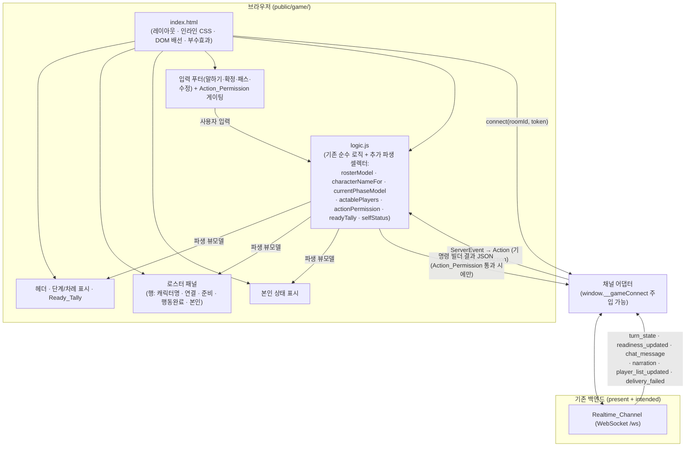

# Design Document

## Overview

이 문서는 기존 **게임 플레이 화면(`game-play` 스펙, `public/game/`)** 위에 **여러 동시 접속 플레이어를 위한 차례/행동 표시 계층(Multiplayer_Game_View)** 을 추가하는 설계를 정의한다. 본 스펙은 `game-play`를 **대체하지 않고** 다음을 순수 파생(derivation)과 렌더링으로 **가산(additive)** 한다.

- **참가자 로스터(Roster)**: 방의 모든 활성 플레이어와 각자의 캐릭터 이름·연결 상태·이번 라운드의 준비/행동 완료 여부.
- **현재 단계·행동 가능 플레이어 표시**: 단계 기반 기본 동작(자유 단계에서 아직 준비를 마치지 않은 플레이어가 "행동 가능") + 의도된 턴 기반(`activePlayerId`/`turnOrder`) 표시.
- **단계별 행동 제출 권한(Action_Permission)**: 본인이 지금 말하기/행동 확정/패스/수정을 보낼 수 있는지.
- **본인 상태(Self_Status)**: 본인의 준비/보류 행동/행동 완료 여부, 관전(spectator) 구분.
- **여러 플레이어 준비 체크(Ready_Tally)**: 준비 X/전체 집계와 각 행의 준비 상태.
- **재연결 재동기화**: 재연결 시 Turn_State로부터 로스터·단계·본인 상태·권한을 결정적으로 복원.

핵심 설계 원칙은 기존 `game-play`와 동일하다. **순수 파생은 `public/game/logic.js`의 순수 함수로 추가**하고(vitest + fast-check), **부수효과(WebSocket·DOM 렌더)는 `public/game/index.html`** 이 담당한다(happy-dom). 빌드 단계 없는 정적 `public/*.html`, 바닐라 JS ES 모듈, 인라인 CSS, 다크 테마 관례를 그대로 따른다.

### 설계 목표

- 요구사항 1~8을 모두 충족하는 멀티플레이 표시 계층을 추가한다.
- **기존 reducer/state/visibility/command 경로를 변경 없이 보존**하고, 로스터·자기 상태·권한·차례 표시는 **가능한 한 새 상태가 아니라 파생 뷰 모델 셀렉터**로 구현한다(`turn_state`/`readiness_updated`/`chat_message`/`narration` 처리는 이미 존재 — 재사용).
- 의도된(intended) 계약(로스터의 `characterName`·`connectionStatus`, `activePlayerId`/`turnOrder`)은 **모킹된 `turn_state`** 로 명세·테스트하고, 값이 없을 때를 위한 **결정적 폴백**을 정의한다.
- 플레이어별 `playerId` WebSocket 연결을 **변경 없이 보존**한다(`effectivePlayerId` → `buildConnectParams`).

### present vs intended 계약 요약

| 항목 | 상태 | 근거 / 폴백 |
| --- | --- | --- |
| 활성 플레이어 집합·준비/보류 행동 | **present** | `turn_state.readiness[]` = 활성 플레이어당 `{ playerId, status, actionKind, actionText }` |
| 채팅 귀속(`characterName`) | **present** | `chatLog[].characterName` |
| 플레이어별 `playerId` 연결 | **present** | `resolveSocketIdentity`(변경 없이 보존) |
| 로스터 캐릭터 이름 | **intended** | `readiness[].characterName` → 없으면 해당 `playerId`의 최근 `chatLog.characterName` → 없으면 `playerId` |
| 로스터 연결 상태 | **intended** | `readiness[].connectionStatus`(또는 별도 로스터) → 없으면 `unknown` |
| 활성 플레이어·턴 순서 | **intended** | `turn_state.activePlayerId`/`turnOrder` → 없으면 단계 기반 폴백 |

intended 항목은 현재 백엔드 `turn_state`에 아직 실리지 않으므로, 프론트엔드는 이를 **모킹된 `turn_state` 페이로드**로 명세·검증한다. 실제 동작은 해당 백엔드 배선이 추가된 뒤 검증된다.

## Architecture

### 계층 구조 (game-play 미러링)

본 계층은 기존 3계층 구조(순수 로직 / 부수효과 / View)에 **새 파생 셀렉터와 렌더 영역만 추가**한다. 새 WebSocket·새 상태·새 reducer 분기를 도입하지 않는 것이 원칙이다.



### 가산 설계 원칙 (핵심)

- **상태 재사용**: 로스터·단계·차례·준비 집계·본인 상태·행동 권한은 모두 **기존 `GameState`(특히 `turn_state`가 채우는 `readiness`, `phase`, `roundNumber`, `chatEntries`)에서 파생**한다. 새 reducer 분기나 새 영속 상태를 추가하지 않는다.
- **단일 진실 원천**: `readiness`가 활성 플레이어 집합·준비/행동 완료의 단일 원천이다. 로스터 행 집합은 `readiness`에서 1:1로 도출한다.
- **의도된 계약의 안전한 흡수**: `turn_state`에 intended 필드(`activePlayerId`/`turnOrder`/`readiness[].characterName`/`readiness[].connectionStatus`)가 실려도 기존 reducer는 이를 무시·보존만 하면 되고, 파생 셀렉터가 `turn_state`(또는 그 파생 스냅샷)에서 읽어 표시한다.
- **명령 게이팅 확장**: 기존 `canSend()`(입력 잠금·연결 가드)에 **`actionPermission`을 AND 조건으로 추가**한다. 권한이 없으면 채널 `send`도 로컬 에코 `dispatch`도 하지 않는다.

### 데이터 흐름 (기존 단방향 흐름 보존)

```
ServerEvent ─(eventToAction)→ Action ─(reduce)→ GameState ─┐
                                                           ├─(파생 셀렉터)→ 뷰모델 → render → DOM
사용자 입력 ─(Action_Permission 통과 시)→ 명령 send + 로컬에코 dispatch ┘
```

로스터·단계·권한·본인 상태는 `reduce` 이후 **읽기 전용 파생**으로 계산되므로, 실시간 갱신(`turn_state`/`readiness_updated`)이 들어오면 재렌더 시 자동으로 최신 `readiness`/`phase`를 반영한다(요구사항 4.2, 4.4, 5.4).

### turn_state 파생 스냅샷의 확장

기존 reducer의 `TURN_STATE` 처리는 `roundNumber`/`phase`/`readiness`/`readyCheckDeadline`만 상태로 흡수한다. 로스터 캐릭터 이름·연결 상태·차례 정보는 **`readiness` 항목과 `turn_state`의 intended 필드에서 파생**해야 한다. 두 가지 통합 방식이 있다.

1. **(권장) `readiness` 항목 확장 보존**: intended 계약에서 서버가 `readiness[]` 항목에 `characterName`·`connectionStatus`를 함께 실으면, 기존 `TURN_STATE` 처리가 `Array.isArray(turnState.readiness)`를 그대로 저장하므로 **추가 reducer 변경 없이** 파생 셀렉터가 그 필드를 읽는다.
2. **턴 메타(`activePlayerId`/`turnOrder`) 파생 스냅샷**: 이 둘은 `readiness` 항목이 아니라 `turn_state` 최상위 필드다. 새 상태 필드(`activePlayerId`, `turnOrder`)를 **기존 `TURN_STATE` 분기에 선택적으로 흡수**하되(`turnState.activePlayerId !== undefined ? … : state.activePlayerId`), 값이 없으면 `null`/`[]`로 유지한다. 이는 가산적이며 기존 필드 처리에 영향을 주지 않는다.

본 설계는 1을 기본으로 하고, 2의 `activePlayerId`/`turnOrder`만 `GameState`에 **선택적 필드로 추가**한다(기본값 `null`/`[]`, 없으면 단계 기반 폴백).

## Components and Interfaces

아래 셀렉터는 모두 `public/game/logic.js`에 **추가**하는 순수 함수다. 기존 export(예: `computeReadyCount`, `effectivePlayerId`, `esc`, `isInputLocked`)는 재사용한다.

### 1. characterNameFor (캐릭터 이름 폴백 도출)

- **책임**: 한 `playerId`의 표시용 Character_Name을 결정적으로 도출한다(요구사항 1.2).
- **폴백 순서**: intended `readinessEntry.characterName`(트림 후 비어 있지 않으면) → 해당 `playerId`의 **가장 최근** `chatLog` 항목의 `characterName`(트림 후 비어 있지 않으면) → `playerId` 자체.
- **인터페이스**
  - `characterNameFor(playerId: string, readinessEntry: ReadinessEntry | null, chatLog: ChatEntry[]): string`
  - 보조: `latestChatCharacterName(playerId, chatLog): string` — `chatLog`를 끝에서부터 훑어 `playerId`가 일치하는 첫 항목의 트림된 `characterName`(없으면 `""`).

### 2. rosterModel (참가자 로스터 도출)

- **책임**: `readiness` 항목 하나당 Roster_Entry 하나를 도출한다(요구사항 1.1, 1.4, 1.5, 4.2, 5.2).
- **각 행 도출**
  - `playerId`: `readiness[i].playerId`.
  - `characterName`: `characterNameFor(playerId, entry, chatLog)`.
  - `connectionStatus`: intended `entry.connectionStatus`가 `"connected"`/`"disconnected"`이면 그 값, 아니면 `"unknown"`(요구사항 1.5).
  - `status`: `entry.status`(`"ready"`/`"not_ready"`).
  - `actionKind`: `entry.actionKind`(`null` 가능).
  - `hasActed`: `entry.actionKind != null`(요구사항 4.2, 6.x).
  - `isSelf`: `playerId === viewerPlayerId`(요구사항 1.4).
- **인터페이스**
  - `rosterModel(turnState: { readiness, chatLog }, viewerPlayerId: string): RosterEntry[]`
  - `readiness`가 배열이 아니면 `[]`. 입력 순서를 보존한다.

### 3. currentPhaseModel / actablePlayers (단계·행동 가능 플레이어)

- **책임**: 현재 `phase` 식별 표시와 Actable_Players 집합을 도출한다(요구사항 2.1~2.5).
- **단계 기반 기본(폴백)**: `phase`가 `free_chat` 또는 `ready_check`이면 `status !== "ready"`인 활성 플레이어가 Actable. `resolving`/`ended`이면 Actable 없음.
- **의도된 턴 기반**: `turnState.activePlayerId`가 존재하면 그 플레이어만 활성 차례로 표시(요구사항 2.3). `turnState.turnOrder`가 존재하면 그 순서로 정렬해 차례 순서를 표시(요구사항 2.4). 둘 다 없으면 단계 기반 폴백(요구사항 2.5).
- **인터페이스**
  - `currentPhaseModel(turnState, viewerPlayerId): { phase, activePlayerId: string | null, turnOrder: string[], actablePlayerIds: string[], isTurnBased: boolean }`
  - `actablePlayers(turnState): string[]` — 위 도출의 핵심(단계 기반/턴 기반 통합).

### 4. actionPermission (단계별 행동 제출 권한)

- **책임**: 본인이 지금 보낼 수 있는 명령 집합을 도출한다(요구사항 3.1~3.5).
- **규칙**
  - `phase`가 `resolving`/`ended`이면 모든 명령 불허(`isInputLocked` 재사용, 요구사항 3.2).
  - `phase`가 `free_chat`/`ready_check`이면 기본 허용(요구사항 3.1).
  - intended `activePlayerId`가 존재하고 `≠ viewerPlayerId`이면 `confirm`·`pass` 불허(말하기는 허용 가능)(요구사항 3.3).
  - 본인 Self_Status가 관전(본인 `readiness` 항목 없음)이면 `confirm`·`pass` 불허(요구사항 3.5).
- **인터페이스**
  - `actionPermission(turnState, viewerPlayerId): { canChat: boolean, canConfirm: boolean, canPass: boolean, canRevise: boolean, locked: boolean, spectator: boolean }`

### 5. readyTally (준비 집계)

- **책임**: 준비 X/전체를 도출한다(요구사항 5.1, 4.4). 기존 `computeReadyCount`를 **재사용**해 `{ ready, total }`을 반환한다.
- **인터페이스**: `readyTally(readiness): { ready: number, total: number }`(= `computeReadyCount`의 별칭/위임).

### 6. selfStatus (본인 상태·관전 도출)

- **책임**: `readiness`에서 `playerId === viewerPlayerId`인 항목으로 Self_Status를 도출한다(요구사항 6.1, 6.2, 6.4).
- **규칙**: 본인 항목이 있으면 `{ status, actionKind, actionText, hasActed: actionKind != null, spectator: false }`. 없으면 `{ status: null, actionKind: null, actionText: null, hasActed: false, spectator: true }`(요구사항 6.2).
- **인터페이스**: `selfStatus(readiness, viewerPlayerId): SelfStatus`

### 7. 명령 게이팅 통합 (부수효과 계층)

- **책임**: 기존 `canSend()`에 명령별 `actionPermission`을 AND로 결합한다(요구사항 3.4).
- **동작**: 말하기 전송 전 `canChat`, 확정 전 `canConfirm`, 패스 전 `canPass`, 수정 전 `canRevise`를 확인. 불허면 채널 `send`도 로컬 에코 `dispatch`도 하지 않는다. 기존 잠금/연결 가드(`computeVisibility(state).inputDisabled`, `connection === OPEN`)는 그대로 유지한다.

### 8. 재연결 재동기화 (부수효과 계층, 기존 경로 재사용)

- **책임**: 기존 재연결 경로(`scheduleReconnect` → `openChannel` → `connection-open` → 서버가 `turn_state` 전달 → `TURN_STATE` reduce)를 그대로 사용한다(요구사항 7.1~7.4).
- **동작**: 재연결 시 도착하는 `turn_state`가 `readiness`/`phase`/`roundNumber`를 갱신하면, 파생 셀렉터(`rosterModel`/`currentPhaseModel`/`readyTally`/`selfStatus`/`actionPermission`)가 그 스냅샷에서 다시 도출되어 로스터·단계·본인 상태·입력 활성/비활성을 **결정적으로 복원**한다. `viewerPlayerId`는 기존 `effectivePlayerId` → `buildConnectParams`로 연결 파라미터에 인코딩된다(요구사항 7.1, 변경 없이 보존).

### 9. 렌더 영역 (index.html, 부수효과)

- **로스터 패널**: `rosterModel` 결과를 행으로 렌더. 각 행에 캐릭터명(esc), 연결 상태 배지, 준비 상태, 행동 완료(`hasActed`) 표시, 본인 표시(`isSelf`)(요구사항 1.3, 1.4, 4.2, 5.2).
- **단계/차례 표시**: `currentPhaseModel`로 현재 단계와 (턴 기반이면) 활성 플레이어/순서, (단계 기반이면) "행동 가능" 표시(요구사항 2.1~2.5).
- **Ready_Tally**: 헤더에 "준비 X/전체"(기존 `#ready` 재사용 가능)(요구사항 5.1).
- **본인 상태 표시**: `selfStatus`로 준비/행동 완료/관전 표시(요구사항 6.4).
- **a11y/반응형**: 로스터에 `aria-live` 라이브 영역(포커스 이동 없이 낭독), 비어 있지 않은 접근성 레이블, 보이는 포커스 표시, 320~767px 가로 스크롤 없음(요구사항 8.1~8.4).

## Data Models

### 추가 타입 (파생 뷰 모델)

```typescript
// 로스터 한 행 (요구사항 1.x, 4.2, 5.2)
interface RosterEntry {
  playerId: string;
  characterName: string;                       // characterNameFor 폴백 결과
  connectionStatus: "connected" | "disconnected" | "unknown";
  status: "ready" | "not_ready";
  actionKind: string | null;
  hasActed: boolean;                           // actionKind != null
  isSelf: boolean;                             // playerId === viewerPlayerId
}

// 본인 상태 (요구사항 6.x)
interface SelfStatus {
  status: "ready" | "not_ready" | null;        // 관전이면 null
  actionKind: string | null;
  actionText: string | null;
  hasActed: boolean;
  spectator: boolean;                          // 본인 readiness 항목 없음
}

// 단계·차례 모델 (요구사항 2.x)
interface PhaseModel {
  phase: Phase | null;
  activePlayerId: string | null;               // intended, 없으면 null
  turnOrder: string[];                         // intended, 없으면 []
  actablePlayerIds: string[];                  // 단계 기반/턴 기반 통합
  isTurnBased: boolean;                        // activePlayerId 또는 turnOrder 존재 여부
}

// 행동 권한 (요구사항 3.x)
interface ActionPermission {
  canChat: boolean;
  canConfirm: boolean;
  canPass: boolean;
  canRevise: boolean;
  locked: boolean;                             // isInputLocked(phase)
  spectator: boolean;
}
```

### intended turn_state 확장 (모킹 대상)

파생 셀렉터가 읽는 `turn_state`의 intended 모양(현재 백엔드에 아직 실리지 않음 → 모킹으로 검증):

```typescript
interface TurnState {
  roundNumber: number;
  phase: "free_chat" | "ready_check" | "resolving" | "ended";
  readiness: Array<{
    playerId: string;
    status: "ready" | "not_ready";
    actionKind: string | null;
    actionText: string | null;
    characterName?: string;          // [intended] 없으면 chatLog 폴백
    connectionStatus?: "connected" | "disconnected";  // [intended] 없으면 unknown
  }>;
  chatLog: Array<{ playerId: string; characterName: string; text: string; ts: string }>;
  readyCheckDeadline: string | null;
  activePlayerId?: string;           // [intended] 없으면 단계 기반 폴백
  turnOrder?: string[];              // [intended] 없으면 단계 기반 폴백
  // ... 기존 필드(narrativeContext, checks 등) 보존
}
```

### GameState 선택적 확장

기존 `GameState`에 **선택적 필드 두 개만 가산**한다(기본값 유지, 기존 처리 영향 없음).

```typescript
interface GameState {
  // ... 기존 필드 전부 그대로 ...
  activePlayerId: string | null;     // [intended] TURN_STATE에서 흡수, 없으면 null
  turnOrder: string[];               // [intended] TURN_STATE에서 흡수, 없으면 []
}
```

> 로스터의 `characterName`/`connectionStatus`는 별도 상태로 두지 않는다. `readiness` 항목과 `chatEntries`에서 **렌더 시 파생**하므로 단일 진실 원천을 유지한다. `activePlayerId`/`turnOrder`만 `turn_state` 최상위 필드라 상태로 흡수한다.

### 백엔드 계약 매핑 (추가 파생)

| 입력(present/intended) | 파생 셀렉터 | 화면 표시 | 요구사항 |
| --- | --- | --- | --- |
| `readiness[]` (present) | `rosterModel` | 로스터 행 집합 | 1.1, 4.2, 5.2 |
| `readiness[].characterName` (intended) → `chatLog`(present) → `playerId` | `characterNameFor` | 행 캐릭터명 | 1.2 |
| `readiness[].connectionStatus` (intended) | `rosterModel` | 연결 배지(없으면 unknown) | 1.5 |
| `phase` (present) + `activePlayerId`/`turnOrder` (intended) | `currentPhaseModel`/`actablePlayers` | 단계·차례·행동 가능 | 2.1~2.5 |
| `phase` + `activePlayerId` + 본인 항목 유무 | `actionPermission` | 입력 게이팅 | 3.1~3.5 |
| `readiness` (present) | `readyTally`(=`computeReadyCount`) | 준비 X/전체 | 5.1, 4.4 |
| `readiness` + `viewerPlayerId` | `selfStatus` | 본인 상태/관전 | 6.1, 6.2, 6.4 |
| `turn_state`(재연결) | 위 셀렉터 전부 | 재동기화 복원 | 7.2~7.4 |

## Correctness Properties

*속성(property)이란 시스템의 모든 유효한 실행에서 참이어야 하는 특성 또는 동작으로, 시스템이 무엇을 해야 하는지에 대한 형식적 진술이다. 속성은 사람이 읽는 명세와 기계가 검증 가능한 정확성 보증 사이의 다리 역할을 한다.*

본 계층의 PBT 대상은 `public/game/logic.js`에 추가하는 **순수 파생 셀렉터**(`characterNameFor`, `latestChatCharacterName`, `rosterModel`, `currentPhaseModel`, `actablePlayers`, `actionPermission`, `readyTally`, `selfStatus`)다. 이들은 모두 모킹된 `turn_state`(present + intended 필드)와 `viewerPlayerId`만 입력으로 받는 순수 함수이므로 입력을 무작위 생성해 속성으로 검증할 수 있다. intended 계약 항목(`characterName`/`connectionStatus`/`activePlayerId`/`turnOrder`)은 **모킹된 `turn_state` 페이로드**로 검증한다.

다음은 본 스펙에서 **새로 검증할** 속성이며, 기존 `game-play` 속성으로 이미 커버되는 항목(채팅 reduce·서사 추가·카운트다운·로컬 에코 누적·연결 토큰 전달·`esc`)은 재사용하고 여기서 다시 정의하지 않는다. 부수효과 가드(3.4)·DOM 렌더(1.3, 6.4, 8.2, 8.3)·반응형/포커스 CSS(8.1, 8.4)는 예제·통합·스냅샷으로 다룬다(Testing Strategy 참조).

### Property 1: 로스터는 readiness에서 1:1·순서 보존으로 도출된다

*For any* `readiness` 배열(임의 길이, `status`·`actionKind`·intended `characterName`/`connectionStatus` 혼합)과 임의 `chatLog`, `viewerPlayerId`에 대해, `rosterModel`은 (a) `readiness` 항목당 정확히 한 Roster_Entry를 같은 순서로 도출하고, (b) `i`번째 행의 `playerId`·`status`가 `readiness[i]`와 일치하며, (c) `hasActed === (readiness[i].actionKind != null)`이고, (d) `connectionStatus`는 intended 값이 `"connected"`/`"disconnected"`이면 그 값, 아니면 `"unknown"`이며, (e) `isSelf === (playerId === viewerPlayerId)`이다.

**Validates: Requirements 1.1, 1.4, 1.5, 4.2, 5.2, 5.4**

### Property 2: 캐릭터 이름은 결정적 폴백 순서를 따른다

*For any* `playerId`, intended `readinessEntry.characterName`의 유무, 그리고 임의 `chatLog`에 대해, `characterNameFor`는 (a) `readinessEntry.characterName`이 트림 후 비어 있지 않으면 그 값을, (b) 아니면 해당 `playerId`와 일치하는 가장 최근(끝에서부터 첫) `chatLog` 항목의 트림된 `characterName`이 비어 있지 않으면 그 값을, (c) 그것도 없으면 `playerId` 자체를 반환한다. 반환값은 항상 비어 있지 않다(단, `playerId`가 비어 있지 않은 한).

**Validates: Requirements 1.2**

### Property 3: 단계·차례 모델은 단계 기반/턴 기반을 정확히 도출한다

*For any* `turn_state`의 `phase`, `readiness`, intended `activePlayerId`/`turnOrder`에 대해, `currentPhaseModel`은 (a) `phase`를 그대로 식별하고, (b) `activePlayerId`와 `turnOrder`가 모두 없으면 `isTurnBased === false`이며 `phase`가 `free_chat`/`ready_check`일 때 `actablePlayerIds`가 정확히 `status !== "ready"`인 `playerId` 집합이고 `resolving`/`ended`일 때 빈 집합이며, (c) `activePlayerId`가 존재하면 `isTurnBased === true`이고 그 값을 활성 차례로 반영하고, (d) `turnOrder`가 존재하면 그 순서를 보존해 반영한다.

**Validates: Requirements 2.1, 2.2, 2.3, 2.4, 2.5**

### Property 4: 행동 권한은 단계·차례·관전에서 정확히 도출된다

*For any* `turn_state`의 `phase`, intended `activePlayerId`, 본인 `readiness` 항목 유무와 임의 `viewerPlayerId`에 대해, `actionPermission`은 (a) `phase`가 `resolving`/`ended`이면 `locked === true`이고 `canChat`/`canConfirm`/`canPass`/`canRevise`가 모두 false이며, (b) `phase`가 `free_chat`/`ready_check`이고 본인 항목이 있으며 `activePlayerId`가 없거나 `viewerPlayerId`와 같으면 네 권한이 모두 true이고, (c) `activePlayerId`가 존재하고 `≠ viewerPlayerId`이면 `canConfirm`·`canPass`가 false이며, (d) 본인 `readiness` 항목이 없으면 `spectator === true`이고 `canConfirm`·`canPass`가 false이다. 또한 `locked === isInputLocked(phase)`이다.

**Validates: Requirements 3.1, 3.2, 3.3, 3.5, 7.4**

### Property 5: 준비 집계는 readiness에서 정확히 도출된다

*For any* `readiness` 배열에 대해, `readyTally`는 `ready`로 `status === "ready"`인 항목 수를, `total`로 배열 전체 길이를 반환하며, 항상 `0 <= ready <= total`이다.

**Validates: Requirements 5.1, 4.4, 5.4**

### Property 6: 본인 상태는 본인 항목/관전을 정확히 도출한다

*For any* `readiness` 배열과 `viewerPlayerId`에 대해, `selfStatus`는 (a) `playerId === viewerPlayerId`인 항목이 있으면 `spectator === false`이고 `status`·`actionKind`·`actionText`가 그 항목과 일치하며 `hasActed === (actionKind != null)`이고, (b) 그런 항목이 없으면 `spectator === true`이고 `status`·`actionKind`·`actionText`가 `null`이며 `hasActed === false`이다.

**Validates: Requirements 6.1, 6.2, 6.4, 7.3**

### Property 7: 파생 셀렉터는 결정적이라 재연결 재동기화가 안정적이다

*For any* 동일한 `turn_state` 스냅샷과 `viewerPlayerId`에 대해, `rosterModel`·`currentPhaseModel`·`readyTally`·`selfStatus`·`actionPermission`을 두 번(또는 임의 횟수) 호출하면 매번 **구조적으로 동일한** 결과를 반환한다(순수·결정적). 따라서 끊겼다 재연결되어 같은 `turn_state`를 다시 적용해도 로스터·단계·Ready_Tally·본인 상태·입력 활성/비활성이 동일하게 복원된다.

**Validates: Requirements 7.2, 7.3, 7.4**

## Error Handling

### 누락·무효 입력 방어

- `rosterModel`/`selfStatus`/`readyTally`는 `readiness`가 배열이 아니면 빈 결과(`[]`/`{ready:0,total:0}`/관전)로 처리한다. `chatLog`가 배열이 아니면 `characterNameFor`는 chatLog 폴백을 건너뛴다.
- `characterNameFor`는 모든 후보를 트림 후 빈 문자열 검사하므로, intended `characterName`이 공백·`null`·누락이어도 다음 폴백으로 안전하게 진행한다.
- `currentPhaseModel`/`actionPermission`은 `phase`가 알 수 없는 값이어도 단계 기반 폴백(자유 단계 아님 → Actable 없음, 잠금 아님 → 기존 `isInputLocked` 규칙)을 따르며 예외를 던지지 않는다.

### intended 필드 부재 처리

intended 필드(`characterName`/`connectionStatus`/`activePlayerId`/`turnOrder`)가 `turn_state`에 없을 때(현재 백엔드의 실제 상태)도 셀렉터는 결정적 폴백(캐릭터명은 chatLog→playerId, 연결은 `unknown`, 차례는 단계 기반)으로 동작한다. 백엔드 배선이 추가되면 추가 코드 변경 없이 값이 반영된다.

### 권한 없는 명령 가드 (부수효과)

`actionPermission`이 허용하지 않는 명령은 부수효과 계층이 채널 `send`도, 본인 로컬 에코 `dispatch`도 하지 않는다(요구사항 3.4). 기존 잠금/연결 가드(`computeVisibility(state).inputDisabled`, `connection === OPEN`)와 AND로 결합한다. 이 가드는 가짜 채널을 쓰는 통합 테스트로 검증한다.

### 텍스트 이스케이프

로스터 캐릭터 이름·본인 상태 텍스트는 기존 `esc()`로 `&`/`<`/`>`를 이스케이프해 HTML 주입을 방지한다(요구사항 1.3). `esc` 자체의 정확성은 `game-play` 속성이 커버하며, 로스터 렌더가 `esc`를 거치는지는 예제 DOM 테스트로 확인한다.

### 재연결

재연결 자체는 기존 `game-play` 경로(`scheduleReconnect`/`openChannel`)를 그대로 사용한다. 재연결 후 도착하는 `turn_state`에 대한 파생 결정성은 Property 7이, 타이머·소켓 수명주기는 가짜 채널·가짜 타이머 통합 테스트가 보장한다.

## Testing Strategy

### 이중 테스트 접근

- **속성 테스트(Property tests)**: 위 Correctness Properties 1~7을 추가 순수 셀렉터에 대해 검증한다(로스터 도출, 캐릭터명 폴백, 단계·차례 모델, 행동 권한, 준비 집계, 본인 상태, 파생 결정성).
- **예제/단위 테스트(Example tests)**: 로스터 행 DOM 렌더(캐릭터명 `esc` 이스케이프·연결 배지·준비/행동완료·본인 표시), 본인 상태 표시, 비어 있지 않은 접근성 레이블, 라이브 영역 갱신 시 포커스 미이동을 검증한다(happy-dom).
- **통합 테스트(Integration tests)**: 권한 없는 명령의 채널 미전송·로컬 에코 미발생(3.4), 재연결 시 `viewerPlayerId` 연결 파라미터 인코딩(7.1)을 가짜 채널·가짜 타이머로 검증한다.
- **스냅샷/수동**: 320~767px 가로 스크롤 부재(8.1), 보이는 포커스 표시(8.4)는 반응형/`:focus-visible` CSS로 다룬다.

### 도구

- **속성 테스트 라이브러리**: `fast-check`(이미 devDependency). 직접 구현하지 않는다.
- **테스트 러너**: `vitest`(이미 존재). 순수 셀렉터는 노드 환경에서 직접 import 해 테스트하고, 로스터 렌더·게이팅 테스트는 `happy-dom` 환경에서 수행한다. `vitest.config.ts`의 `include`가 이미 `public/**/*.test.js`를 매칭한다.
- 새 빌드 도구는 도입하지 않는다.

### 속성 테스트 규칙

- 각 속성 테스트는 최소 **100회 반복**으로 실행한다(`fast-check`의 `numRuns: 100` 이상).
- 각 속성 테스트는 설계 문서의 속성을 주석으로 참조한다.
- 태그 형식: **Feature: multiplayer-game-ux, Property {번호}: {속성 텍스트}**
- 각 Correctness Property는 **하나의** 속성 기반 테스트로 구현한다.

#### 생성기(Generator) 전략

- **readiness 생성기**: 0개 포함 임의 길이, `playerId`(중복 가능/고유 변형), `status` `ready`/`not_ready` 혼합, `actionKind` `null`/문자열 혼합, intended `characterName`(누락/공백/값), intended `connectionStatus`(누락/`connected`/`disconnected`/무효값) — Property 1, 4, 5, 6.
- **chatLog 생성기**: 임의 `playerId`·`characterName`(공백·비-ASCII·이모지 포함)·`ts`, 같은 `playerId`의 여러 항목(최근 항목 선택 검증), 해당 `playerId` 부재 케이스 — Property 2.
- **phase 생성기**: `free_chat`/`ready_check`/`resolving`/`ended`와 알 수 없는 문자열 — Property 3, 4, 7.
- **턴 메타 생성기**: `activePlayerId` 누락/roster 내/roster 외 값, `turnOrder` 누락/임의 순서 — Property 3, 4.
- **viewerPlayerId 생성기**: roster 내 존재/부재(관전) 케이스 — Property 1, 4, 6.
- **turn_state 스냅샷 생성기**: 위 요소를 조합한 완전한 모킹 `turn_state`(present + intended) — Property 7(동일 입력 반복 호출 결정성).

### 예제·통합·스냅샷 대상 (속성 비적용 요구사항)

- **1.3 / 6.4** — 로스터·본인 상태 DOM 렌더에서 `esc` 이스케이프·표시(예제 DOM).
- **3.4** — 권한 없는 명령 채널 미전송·로컬 에코 미발생(통합, 가짜 채널).
- **4.1 / 4.3 / 5.3 / 6.3 / 7.1** — 기존 `game-play` 속성/통합 재사용(채팅 reduce·서사 추가·카운트다운·로컬 에코 누적·연결 파라미터 인코딩).
- **8.1** — 모바일 320~767px 단일 열·가로 스크롤 부재(반응형 CSS, 수동/스냅샷).
- **8.2** — 로스터 상호작용 요소의 비어 있지 않은 접근성 레이블(예제 DOM).
- **8.3** — 로스터·준비·차례 갱신을 포커스 이동 없이 `aria-live` 라이브 영역으로 낭독(예제 DOM).
- **8.4** — 보이는 포커스 표시(`:focus-visible` CSS, 수동/스냅샷).

## 요구사항 추적 요약

| 요구사항 | 설계 반영 |
| --- | --- |
| 1.1 readiness당 행 1:1 | Property 1 |
| 1.2 캐릭터명 폴백 | Property 2 |
| 1.3 캐릭터명 이스케이프 | 예제 DOM |
| 1.4 본인 항목 표시(isSelf) | Property 1 |
| 1.5 연결 상태/unknown | Property 1 |
| 2.1 현재 phase 표시 | Property 3 |
| 2.2 단계 기반 Actable | Property 3 |
| 2.3 activePlayerId 활성 차례 | Property 3 |
| 2.4 turnOrder 순서 표시 | Property 3 |
| 2.5 둘 다 없으면 단계 폴백 | Property 3 |
| 3.1 자유 단계 모든 명령 허용 | Property 4 |
| 3.2 resolving/ended 불허·비활성 | Property 4 |
| 3.3 activePlayerId≠self이면 confirm/pass 불허 | Property 4 |
| 3.4 권한 없는 명령 미전송·미에코 | 통합(가짜 채널) |
| 3.5 관전이면 confirm/pass 불허 | Property 4 |
| 4.1 chat_message characterName 귀속 추가 | game-play 속성 재사용 |
| 4.2 각 행 준비/행동완료 갱신 | Property 1 |
| 4.3 narration 순서 추가 | game-play Property(서사) 재사용 |
| 4.4 Ready_Tally 재도출 | Property 5 |
| 5.1 준비 X/전체 표시 | Property 5 |
| 5.2 각 행 준비 상태 | Property 1 |
| 5.3 카운트다운 0 이상 | game-play Property(카운트다운) 재사용 |
| 5.4 갱신 시 tally·행 재도출 | Property 1, 5 |
| 6.1 본인 Self_Status 도출 | Property 6 |
| 6.2 본인 항목 없으면 관전 | Property 6 |
| 6.3 로컬 에코 viewerPlayerId 귀속 | game-play Property(로컬에코) 재사용 / 통합 |
| 6.4 hasActed·준비 상태 표시 | Property 6 / 예제 DOM |
| 7.1 viewerPlayerId 연결 인코딩·보존 | 통합(가짜 connect) |
| 7.2 재연결 로스터·단계·tally 재동기화 | Property 7 |
| 7.3 재연결 Self_Status 복원 | Property 6, 7 |
| 7.4 재연결 phase로 잠금·권한 복원 | Property 4, 7 |
| 8.1 반응형 가로 스크롤 없음 | 수동/스냅샷(CSS) |
| 8.2 접근성 레이블 | 예제 DOM |
| 8.3 라이브 영역 낭독·포커스 미이동 | 예제 DOM |
| 8.4 보이는 포커스 표시 | 수동/스냅샷(CSS) |
