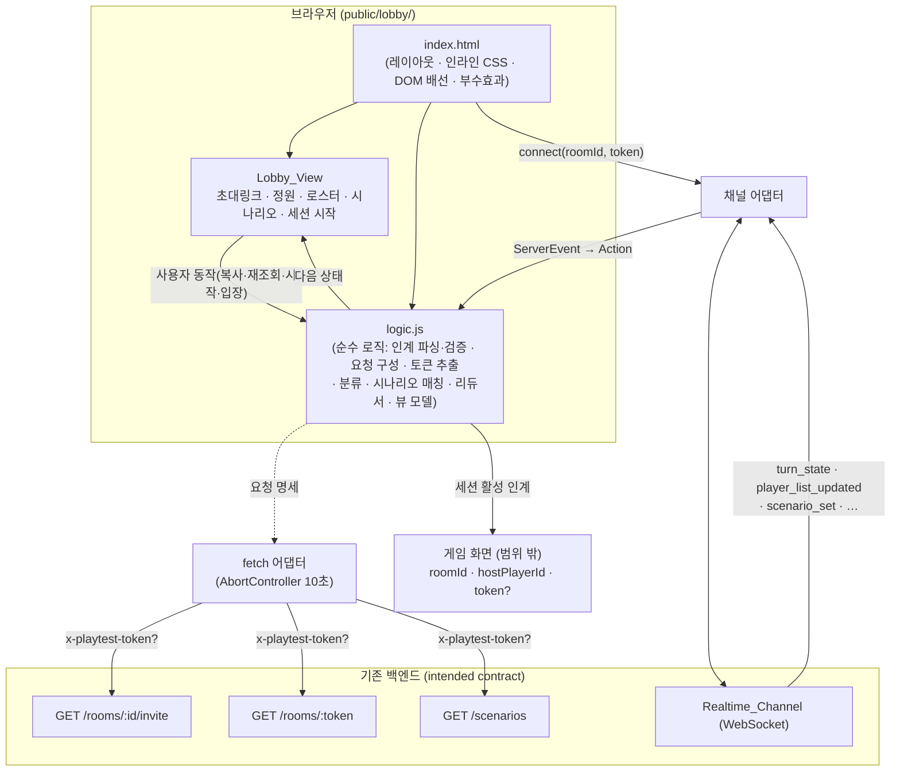

# Design Document

## Overview

이 문서는 ready-gm의 두 번째 프론트엔드 화면인 **"호스트 로비(대기실)" 화면(Room_Lobby_App)** 의 설계를 정의한다. 이 화면은 이미 완료된 **host-entry(랜딩 / 방 생성)** 화면의 인계 대상이다. host-entry는 방 생성 성공 후 `/host-entry/lobby?roomId=...&hostPlayerId=...&token=...` 로 이동하면서 식별자(그리고 공유 비밀이 사용될 때 `token`)를 쿼리로 인계한다. 본 화면은 그 인계 계약으로 진입하는 **호스트 전용 화면**으로, 호스트가 다음을 수행하는 경험을 다룬다.

- 인계된 식별자로 올바른 방의 로비에 도착한다.
- 초대 링크를 다시 조회·복사해 늦게 합류하는 친구에게 공유한다.
- 방의 정원(`maxPlayers`)과 선택된 시나리오의 제목·소개를 확인한다.
- 실시간 채널로 들어오는 플레이어 로스터를 본다.
- 친구들이 모이면 세션을 시작하고, 방이 세션 진행 상태로 전이하면 게임 화면(범위 밖)으로 인계한다.

### 설계 목표

- 요구사항 1~11을 모두 충족하는 단일 화면 프론트엔드를 구현한다.
- host-entry가 확립한 아키텍처·관례를 **그대로 미러링**한다(빌드 단계 없는 정적 `public/*.html`, 바닐라 JS ES 모듈, 인라인 CSS, 다크 테마, 순수 로직 분리).
- 비즈니스 로직(인계 파싱·검증, 토큰 헤더 구성, 응답/오류 분류, 초대 토큰 추출, 시나리오 매칭, 로스터·세션 상태 전이, 인계 구성)을 DOM·네트워크·WebSocket·클립보드에서 분리해 자동 테스트가 가능하도록 한다.
- 부수효과(`fetch`, `WebSocket`, 클립보드, 타이머, 네비게이션)를 **주입 가능(injectable)** 하게 만들어, 아직 배선되지 않은 백엔드 항목에 대해서도 모킹으로 완전히 단위/DOM 테스트할 수 있게 한다.

### 기술 선택과 근거 (host-entry 일관성)

`package.json`에는 프론트엔드 빌드 도구(번들러·프레임워크·JSX 변환기)가 없다. 현재 프론트엔드는 빌드 없이 Express 정적 서빙으로 제공되는 바닐라 JS + 인라인 CSS이며, host-entry(`public/host-entry/`)가 이미 `?token=` → `x-playtest-token` 헤더, `fetch` + `AbortController` 10초 타임아웃, 클립보드 복사 + 수동 폴백, `esc()` HTML 이스케이프, `computeVisibility` 형태의 뷰 모델, 1회 인계(handoff-once) 패턴을 검증된 형태로 보여준다.

따라서 본 화면도 **새 빌드 도구를 도입하지 않고** `public/lobby/` 아래 정적 HTML 페이지(바닐라 JS ES 모듈, 인라인 CSS)로 구현하며, host-entry와 동일하게 순수 로직을 `public/lobby/logic.js`로 분리하고 `public/lobby/index.html`이 그 모듈을 import 해 DOM·부수효과에 배선한다. 이유:

- 요구사항이 단일 화면 범위(소수의 REST 호출 + 단일 WebSocket 구독 + 클립보드/네비게이션)이며 프레임워크 비용을 정당화할 복잡도가 없다.
- host-entry와 서빙 방식·스타일·토큰 처리·테스트 방식을 일관되게 유지한다.
- 순수 로직 분리는 새 런타임 의존성이나 빌드 단계를 추가하지 않으면서 vitest(이미 devDependency)로 노드 환경에서 직접 테스트할 수 있게 한다. DOM·실시간 배선은 happy-dom 환경에서 검증한다. `vitest.config.ts`의 `include`는 이미 `public/**/*.test.js`를 매칭한다.

#### 주입 가능성(Injectability)과 가정(Assumptions)

요구사항의 "범위 밖 / 가정" 절은 **로비용 실시간 연결 티켓 발급, 브라우저발 `START_SESSION` 매핑, 방 플레이어 목록 REST, 세션 시작 REST** 가 현재 플레이테스트 서버에 아직 배선되지 않았음을 명시한다. 본 화면은 이들을 **의도된(intended) 백엔드 계약** 으로 삼아 설계하되, 모든 외부 의존성을 어댑터로 주입받아 모킹 가능하게 한다.

- **`fetch`**: 부수효과 계층이 전역 `fetch`를 사용하지만, 순수 로직은 요청 명세(`{ url, method, headers }`)를 만들기만 하고 실행하지 않는다. 테스트는 `fetch`를 모킹한다.
- **WebSocket(Realtime_Channel)**: 순수 로직은 WebSocket을 모른다. 부수효과 계층은 **`connect(roomId, token)` 어댑터 함수**를 통해 채널을 연다. 이 어댑터는 `{ send, close, onEvent, onClose }` 형태의 핸들을 반환하며, 들어오는 `ServerEvent`를 순수 액션으로 환원해 `dispatch`한다. 테스트는 가짜 채널 어댑터를 주입한다.
- **클립보드**: host-entry처럼 `copyInviteLink(inviteLink, clipboard)`가 주입된 클립보드 어댑터(`navigator.clipboard`)를 사용한다.

> 보안 메모: 백엔드 REST(`src/http/app.ts`)는 MVP에서 인증되지 않은 엔드포인트다. 공개 바인딩 시 운영자는 `?token=` 공유 비밀로 접근을 제한하며, 본 화면은 그 토큰을 모든 REST 요청의 `x-playtest-token` 헤더로, 그리고 게임 화면 인계 시 쿼리로 전달하는 책임만 진다(요구사항 10). 토큰 검증·발급은 서버/운영의 책임이다. 실시간 연결은 서버 발급 연결 티켓을 요구하지만(범위 밖 가정), 본 화면의 실시간 요구사항은 "유효한 티켓을 획득할 수 있다"는 가정 위에서 정의되며, `connect` 어댑터 뒤에 캡슐화된다.

## Architecture

### 컴포넌트 구조

본 화면은 정적 페이지 하나와, 그 페이지가 import 하는 순수 로직 모듈로 구성된다. host-entry와 동일한 3계층 구조다.



### 계층 분리 원칙 (host-entry 미러링)

- **순수 로직 계층 (`logic.js`)**: DOM·네트워크·WebSocket·클립보드에 의존하지 않는 순수 함수들. 인계 파싱·검증, REST 요청 명세 구성(헤더 포함), 초대 링크에서 초대 토큰 추출, 응답/오류 분류, 시나리오 매칭/기본 선택, 상태 전이(reducer), 뷰 모델 도출, 게임 화면 인계 페이로드 구성을 담당한다. vitest로 직접 테스트한다.
- **부수효과 계층 (`index.html`의 스크립트)**: `fetch` 호출과 10초 `AbortController` 타임아웃, 실시간 채널 `connect`/구독/재연결, 클립보드 접근, 타이머, 네비게이션, DOM 갱신을 담당한다. 순수 로직이 만든 결정·명세를 실행만 한다.
- **View 계층**: 단일 상태 객체를 받아 화면을 렌더한다. 상태가 단일 진실 원천이며 View는 상태의 순수 함수다.

### 단방향 데이터 흐름 (실시간 이벤트 인입 경로 포함)

```
사용자 동작 ─┐
            ├─→ 액션(Action) → reduce(state, action) → 새 상태 → render(상태) → DOM
실시간 이벤트 ┘                         │
ServerEvent → (채널 어댑터가 액션으로 환원) ┘
                                       │
                          부수효과 요청(REST 전송 / 채널 send / 네비게이션)
                                       │
                                  부수효과 계층 실행 → 결과 액션
```

REST 응답·네트워크오류·타임아웃과 **실시간 `ServerEvent`** 는 모두 동일한 `dispatch` 통로를 거쳐 순수 `reduce`로 흡수된다. 즉 실시간 이벤트도 부수효과 계층(채널 어댑터)에서 순수 액션으로 변환된 뒤 단일 방향으로 흐른다. 부수효과는 액션을 통해서만 트리거된다.

## Components and Interfaces

### 1. Handoff_Reader (인계 파라미터 파서 + 검증기)

페이지 URL 쿼리에서 인계 값을 읽고 유효성을 판정한다.

- **책임**
  - `roomId`·`hostPlayerId`의 공백 제거 후 값을 읽고, 공백 제거 후 비어 있지 않은 `token`을 Access_Token으로 보존한다. (요구사항 1.1, 1.2)
  - 공백 제거 후 `roomId` 또는 `hostPlayerId` 중 하나라도 비면 인계를 무효로 판정한다. (요구사항 1.3)
- **인터페이스 (순수 로직)**
  - `parseHandoff(search: string): { roomId: string; hostPlayerId: string; token: string }` — 쿼리 문자열에서 트림된 값 추출(토큰은 공백 제거 후 빈 문자열이면 `""`).
  - `isHandoffValid(handoff): boolean` — `roomId`와 `hostPlayerId`가 모두 비어 있지 않을 때만 true.

### 2. Auth_Header_Builder (토큰 전달)

- **책임**: 길이 ≥ 1인 Access_Token이 있으면 모든 REST 요청에 `x-playtest-token` 헤더로 값 그대로 첨부, 없으면 헤더 자체를 생략한다. (요구사항 1.2, 1.5, 10.1, 10.2)
- **인터페이스 (순수 로직)**
  - `buildAuthHeaders(token: string): Record<string, string>` — 토큰 비어 있지 않으면 `{ "x-playtest-token": token }`, 아니면 `{}`.

### 3. Invite_Client (초대 링크 재조회 클라이언트)

`GET /rooms/:id/invite`를 호출하는 요청을 구성하고 응답/오류를 분류한다.

- **책임**
  - Room_Id와 (있으면) Access_Token으로 Invite_Endpoint에 조회를 요청한다. (요구사항 2.1, 2.6)
  - 200 → `inviteLink` 전체 문자열 표시(요구사항 2.3), 404 → "방을 찾을 수 없음"(요구사항 2.4), 네트워크/타임아웃/500+ → "초대 링크를 불러오지 못함" + 재조회 동작 제공(요구사항 2.5).
- **인터페이스 (순수 로직)**
  - `buildInviteRequest(roomId, token): { url, method, headers }` — `url = "/rooms/" + encodeURIComponent(roomId) + "/invite"`, `method = "GET"`.

### 4. Room_Resolve_Chain (방 정보 조회 체인 + 초대 토큰 추출)

초대 링크에서 초대 토큰을 추출해 `GET /rooms/:token`을 호출한다.

- **책임**
  - `inviteLink`에서 끝의 슬래시·질의 문자열을 제외한 마지막 경로 세그먼트를 Invite_Token으로 추출한다. (요구사항 4.1)
  - 추출한 토큰으로 Room_Resolve_Endpoint에 방 정보를 요청한다. (요구사항 4.2)
  - 성공 응답의 `maxPlayers`(1 이상 정수)와 `scenarioId`(비어 있지 않음)를 검증해 보존하거나, 누락/무효 시 방 정보 오류로 처리한다. (요구사항 4.3, 4.6)
  - 토큰을 추출할 수 없으면 요청을 생략한다. (요구사항 4.4)
  - 네트워크/타임아웃/404/500+ → "방 정보를 불러오지 못함" 오류. (요구사항 4.5)
- **인터페이스 (순수 로직)**
  - `extractInviteToken(inviteLink: string): string` — 질의(`?`/`#`) 제거 → 끝의 `/` 제거 → 마지막 `/` 뒤 세그먼트. 추출 불가면 `""`.
  - `buildRoomResolveRequest(inviteToken, token): { url, method, headers }` — `url = "/rooms/" + encodeURIComponent(inviteToken)`.
  - `validateRoomInfo(body): { ok: boolean; maxPlayers?: number; scenarioId?: string }` — `maxPlayers`가 1 이상 정수이고 `scenarioId`가 비어 있지 않은 문자열일 때만 `ok: true`.

### 5. Scenarios_Client (시나리오 클라이언트 + 매칭/기본 선택)

- **책임**
  - Scenarios_Endpoint에 목록을 요청한다. (요구사항 5.1)
  - Selected_Scenario 식별자가 목록의 한 `id`와 일치하면 그 `title`·`summary`를 표시한다. (요구사항 5.2)
  - 시나리오가 정확히 1개이고 선택 식별자가 미확정이면 그 단일 시나리오를 기본 선택으로 적용한다. (요구사항 5.3)
  - 빈 목록 → "표시할 시나리오 없음"(요구사항 5.6), 불일치 → "선택된 시나리오를 찾을 수 없음"(요구사항 5.7).
  - 네트워크/타임아웃/500+ → 오류 + 기존 표시 유지. (요구사항 5.5)
- **인터페이스 (순수 로직)**
  - `buildScenariosRequest(token): { url, method, headers }` — `url = "/scenarios"`.
  - `selectScenario(scenarios, selectedScenarioId): { kind: "matched" | "default" | "empty" | "unmatched"; scenario?: { title, summary } }` — 매칭/기본/빈/불일치 분기.

### 6. Realtime_Channel_Adapter (실시간 채널 어댑터 + 이벤트 리듀서)

주입 가능한 `connect` 어댑터 뒤에서 WebSocket을 캡슐화하고, `ServerEvent`를 순수 액션으로 환원한다.

- **책임 (부수효과 계층)**
  - Room_Id·Host_Player_Id가 유효하면 채널 연결을 시작한다. (요구사항 6.1)
  - 연결 활성/끊김 상태를 액션으로 dispatch 하고, 끊기면 일정 간격으로 재연결을 시도한다. (요구사항 6.3, 6.4)
- **이벤트 → 액션 환원 (순수 로직)**
  - `player_list_updated` → `PLAYER_LIST_UPDATED { players }`
  - `scenario_set` → `SCENARIO_SET { scenarioId, title, summary }`
  - `turn_state` → `TURN_STATE { state }`
  - 연결 상태 → `CONNECTION_OPENED` / `CONNECTION_LOST`
  - `eventToAction(event: ServerEvent): Action | null` — 관심 없는 이벤트(`chat_message`, `narration`, `readiness_updated`, `delivery_failed`)는 `null`(로비 무시).

### 7. Player_Roster_View (플레이어 로스터 뷰)

- **책임**
  - `player_list_updated`로 받은 목록으로 로스터를 교체하고 각 `displayName`·`isHost`를 표시한다. (요구사항 6.2)
  - 현재 인원 수와 Max_Players를 함께 표시한다. (요구사항 6.5)
  - 0명이면 "아직 모인 플레이어 없음" 표시. (요구사항 6.6)
- **인터페이스 (순수 로직)**
  - `renderRoster(roster, maxPlayers): string` — 로스터 마크업(이스케이프, 인원/정원, 호스트 표시 포함).

### 8. Start_Session_Control (호스트 전용 세션 시작 제어 + 인계-once)

- **책임**
  - Start_Session_Action을 표시하고(요구사항 7.1), 연결 활성 && 시나리오 확정 && 로스터 ≥ 1명일 때만 활성화한다(요구사항 7.2, 7.3).
  - 활성 상태에서 클릭 시 Host_Player_Id 발신 Start_Session_Command를 채널로 정확히 1회 전송하고 즉시 비활성화한다. (요구사항 7.4)
  - 방이 Session_Active_State로 전이하면 게임 화면 인계를 1회만 수행한다. (요구사항 7.5, 7.6)
  - 전송 실패 시 한국어 오류 + 재활성화. (요구사항 7.7)
- **인터페이스 (순수 로직)**
  - `computeStartEnabled(state): boolean` — 세 조건의 논리곱.
  - `detectSessionActive(turnState | roomState): boolean` — `roundNumber >= 1` 또는 방 상태 `in_session`이면 true.
  - `buildGameHandoff(handoff): { roomId, hostPlayerId, token? }` — 식별자 + (있으면) 토큰.

### 9. Clipboard_Copier (초대 링크 복사)

host-entry의 검증된 어댑터를 재사용한다.

- **책임**: `inviteLink` 전체를 클립보드에 복사(요구사항 3.2), 성공 시 확인 메시지 최소 3초 표시(요구사항 3.3), 실패 시 수동 복사용 텍스트 노출(요구사항 3.4).
- **인터페이스 (순수 로직)**: `copyInviteLink(inviteLink, clipboard): Promise<boolean>` — host-entry와 동일 시그니처/동작.

### 10. Loading_Error_Model (로딩/오류 모델 + 결과 분류)

영역별 로딩·오류 상태와 요청 결과 분류를 담당한다.

- **책임**
  - 각 REST 영역(초대/방정보/시나리오)에 대해 전송 200ms 이내 로딩 인디케이터 표시, 동일 요청 재트리거 컨트롤 비활성화. (요구사항 8.1, 8.2)
  - 완료 200ms 이내 인디케이터 해제 + 컨트롤 재활성화. (요구사항 8.3)
  - 세션 시작 인디케이터(전송~활성 전)와 30초 타임아웃. (요구사항 8.5, 8.6)
  - 오류 종류별(타임아웃/네트워크/서버/404) 한국어 메시지와 재시도 동작. (요구사항 9.x)
- **인터페이스 (순수 로직)**
  - `classifyResponse({ ok, status }): "success" | "notfound" | "server" | "unknown"`
  - `classifyOutcome({ kind, response? }): "success" | ErrorKind` — 응답/네트워크/타임아웃을 단일 결과로 환원.
  - `computeVisibility(state): { ... }` — 영역별 로딩/오류/세션시작 가시성을 상태의 함수로 도출.

## Data Models

### 상태 모델 (State Model)

화면 전체는 하나의 상태 객체로 표현되며, 모든 렌더링은 이 상태의 함수다. 영역(초대/방정보/시나리오)마다 독립적인 로딩 단계를 가진다.

```typescript
// 영역별 로딩 단계 (요구사항 8.x)
type AreaPhase =
  | "idle"      // 아직 요청 전(인계 무효 시 포함)
  | "loading"   // 요청 전송~응답 도착 전: 인디케이터 표시, 재트리거 비활성
  | "loaded"    // 성공
  | "error";    // 복구 가능 오류: 재시도 동작 제공

// 오류 종류 (사용자에게 보일 한국어 메시지를 결정)
type ErrorKind =
  | "notfound"  // HTTP 404 (요구사항 2.4 / 4.5)
  | "server"    // HTTP 5xx (요구사항 9.4)
  | "network"   // 네트워크 실패 (요구사항 9.3)
  | "timeout"   // 클라이언트 타임아웃 (요구사항 9.1, 9.2)
  | "invalid";  // 방 정보 응답이 형식 위반 (요구사항 4.6)

// 실시간 연결 상태 (요구사항 6.3, 6.4)
type ConnectionStatus = "connecting" | "open" | "disconnected";

interface RealtimePlayer { id: string; displayName: string; isHost: boolean; }

interface SelectedScenario { scenarioId: string | null; title: string | null; summary: string | null; }

interface AreaState<T> {
  phase: AreaPhase;
  errorKind: ErrorKind | null;
  data: T | null;
}

interface LobbyState {
  // 인계 (요구사항 1.x, 10.x) — 불변(REST 오류로도 변하지 않음, 요구사항 9.6)
  handoff: { roomId: string; hostPlayerId: string; token: string };
  handoffValid: boolean;

  // REST 영역별 상태
  invite: AreaState<string>;            // data = inviteLink (요구사항 2.x)
  room: AreaState<{ maxPlayers: number; scenarioId: string }>; // (요구사항 4.x)
  scenarios: AreaState<unknown>;        // 진행/오류 추적용 (요구사항 5.x)

  // 시나리오 표시 (요구사항 5.x) — scenario_set / 매칭 / 기본 선택으로 갱신
  selectedScenario: SelectedScenario;
  scenarioNotice: string | null;        // 빈/불일치 안내 (요구사항 5.6, 5.7)

  // 실시간 (요구사항 6.x)
  connection: ConnectionStatus;
  roster: RealtimePlayer[];

  // 세션 시작 (요구사항 7.x, 8.5/8.6)
  startCommandSent: boolean;            // 정확히 1회 전송 보장 (요구사항 7.4)
  sessionStarting: boolean;             // 전송~활성 전 인디케이터 (요구사항 8.5)
  startError: string | null;            // 시작 실패/타임아웃 (요구사항 7.7, 8.6)
  handoffDone: boolean;                 // 게임 화면 인계 1회 보장 (요구사항 7.5, 7.6)

  // 복사 (요구사항 3.x)
  copyConfirmedUntil: number | null;    // 복사 확인 표시 만료 시각(ms) (요구사항 3.3)
  copyFailed: boolean;                  // 수동 복사 폴백 노출 (요구사항 3.4)
}
```

### 액션 모델 (Action Model)

REST 결과와 실시간 이벤트, 사용자 동작을 모두 단일 액션 통로로 흡수한다.

```typescript
type Action =
  // 인계 (요구사항 1.x)
  | { type: "HANDOFF_PARSED"; handoff: { roomId: string; hostPlayerId: string; token: string } }
  // 초대 링크 (요구사항 2.x)
  | { type: "INVITE_STARTED" }
  | { type: "INVITE_SUCCEEDED"; inviteLink: string }
  | { type: "INVITE_FAILED"; kind: ErrorKind }
  // 방 정보 (요구사항 4.x)
  | { type: "ROOM_STARTED" }
  | { type: "ROOM_SUCCEEDED"; maxPlayers: number; scenarioId: string }
  | { type: "ROOM_INVALID" }                          // 형식 위반 (요구사항 4.6)
  | { type: "ROOM_FAILED"; kind: ErrorKind }
  // 시나리오 (요구사항 5.x)
  | { type: "SCENARIOS_STARTED" }
  | { type: "SCENARIOS_SUCCEEDED"; scenarios: { id: string; title: string; summary: string }[] }
  | { type: "SCENARIOS_FAILED"; kind: ErrorKind }
  // 실시간 이벤트 (요구사항 5.4, 6.x, 7.5)
  | { type: "PLAYER_LIST_UPDATED"; players: RealtimePlayer[] }
  | { type: "SCENARIO_SET"; scenarioId: string; title: string; summary: string }
  | { type: "TURN_STATE"; roundNumber: number; roomState?: string }
  | { type: "CONNECTION_OPENED" }
  | { type: "CONNECTION_LOST" }
  // 세션 시작 (요구사항 7.x, 8.5/8.6)
  | { type: "START_SESSION" }
  | { type: "START_SESSION_FAILED" }
  | { type: "START_SESSION_TIMEOUT" }
  // 복사 (요구사항 3.x)
  | { type: "COPY_SUCCEEDED"; now: number }
  | { type: "COPY_FAILED" };
```

핵심 전이 규칙 (`reduce(state, action) -> state`):

- `HANDOFF_PARSED`: `handoff` 저장, `isHandoffValid`로 `handoffValid` 설정. 무효면 모든 영역 `phase`는 `idle`로 두고 조작 비활성(요구사항 1.3/1.4).
- `*_STARTED`: 해당 영역 `phase = "loading"`, `errorKind = null`(요구사항 8.1/8.2).
- `INVITE_SUCCEEDED`: `invite.phase = "loaded"`, `data = inviteLink`(요구사항 2.3).
- `ROOM_SUCCEEDED`: `room.phase = "loaded"`, `maxPlayers`/`scenarioId` 보존(요구사항 4.3). `ROOM_INVALID`: `room.phase = "error"`, `errorKind = "invalid"`(요구사항 4.6).
- `*_FAILED`: 해당 영역 `phase = "error"`, `errorKind` 설정, **인계 식별자·토큰 불변**(요구사항 9.5/9.6). 시나리오 실패는 기존 `selectedScenario`를 보존(요구사항 5.5).
- `SCENARIOS_SUCCEEDED`: `selectScenario(scenarios, room.data?.scenarioId)` 결과로 `selectedScenario`/`scenarioNotice` 갱신(요구사항 5.2/5.3/5.6/5.7).
- `SCENARIO_SET`: `selectedScenario`를 이벤트의 `title`/`summary`로 갱신(요구사항 5.4).
- `PLAYER_LIST_UPDATED`: `roster`를 이벤트 목록으로 **교체**(요구사항 6.2).
- `CONNECTION_OPENED`/`CONNECTION_LOST`: `connection` 갱신(요구사항 6.3/6.4).
- `START_SESSION`: `startCommandSent === false`이고 `computeStartEnabled(state)`일 때만 `startCommandSent = true`, `sessionStarting = true`로 전이(정확히 1회, 요구사항 7.4). 그 외 무변화.
- `TURN_STATE`: `detectSessionActive`가 true이고 `handoffDone === false`이면 `handoffDone = true`, `sessionStarting = false`(인계 1회, 요구사항 7.5/7.6).
- `START_SESSION_FAILED`/`START_SESSION_TIMEOUT`: `sessionStarting = false`, `startCommandSent = false`(재시도 허용), `startError` 설정(요구사항 7.7/8.6).
- `COPY_SUCCEEDED`: `copyConfirmedUntil = now + 3000`(요구사항 3.3). `COPY_FAILED`: `copyFailed = true`(요구사항 3.4).

### 백엔드 계약 매핑

`src/http/app.ts`, `src/services/*`, `src/realtime/connection.ts`의 실제 코드에 맞춘 매핑이다.

| 엔드포인트 | 성공 | 오류 | 화면 처리 |
| --- | --- | --- | --- |
| `GET /rooms/:id/invite` | 200 `{ inviteLink }` | 404 `{ error }` | `INVITE_SUCCEEDED` → 표시(2.3) / 404 → `INVITE_FAILED("notfound")`(2.4) / net·timeout·5xx → `INVITE_FAILED`(2.5) |
| `GET /rooms/:token` | 200 `{ roomId, state, maxPlayers, scenarioId }` | 404 `{ error }` | `validateRoomInfo` 통과 시 `ROOM_SUCCEEDED`(4.3), 형식 위반 시 `ROOM_INVALID`(4.6) / 404·net·timeout·5xx → `ROOM_FAILED`(4.5) |
| `GET /scenarios` | 200 `{ scenarios: Scenario[] }` | 5xx 등 | `SCENARIOS_SUCCEEDED` → `selectScenario`(5.2/5.3/5.6/5.7) / net·timeout·5xx → `SCENARIOS_FAILED`(5.5) |

> **초대 링크 형식**: `DEFAULT_INVITE_BASE_URL = "https://ready-gm/r/"`이므로 `inviteLink`는 `https://ready-gm/r/{token}` 형태다. `extractInviteToken`은 마지막 경로 세그먼트(`{token}`)를 추출한다. 형식이 어긋나 토큰을 얻을 수 없으면 방 정보 조회를 우아하게 생략한다(요구사항 4.4).

> **실시간 이벤트**: `ServerEvent`(`src/realtime/connection.ts`)의 `player_list_updated.players`는 `{ id, displayName, isHost }[]`, `scenario_set`은 `{ scenarioId, title, summary }`, `turn_state`는 `{ state: TurnState }`(여기서 `state.roundNumber`로 Session_Active 판정)이다. 로비는 `chat_message`/`narration`/`readiness_updated`/`delivery_failed`를 무시한다.

### 타임아웃 정책

- REST: 모든 요청에 **10초(10000ms)** 클라이언트 타임아웃을 `AbortController`로 적용한다(요구사항 2.5/4.5/5.1/8.4/9.1). 10초 경과 시 진행 중 fetch를 취소하고 `timeout` 결과를 만든다. host-entry의 `REQUEST_TIMEOUT_MS`와 동일하다.
- 세션 시작: Start_Session_Command 전송 후 **30초(30000ms)** 이내에 방이 Session_Active_State로 전이하지 않으면 `START_SESSION_TIMEOUT`을 dispatch 한다(요구사항 8.6).
- 복사 확인: `COPY_CONFIRM_MS = 3000`(요구사항 3.3), host-entry와 동일.

## Correctness Properties

*속성(property)이란 시스템의 모든 유효한 실행에서 참이어야 하는 특성 또는 동작으로, 시스템이 무엇을 해야 하는지에 대한 형식적 진술이다. 속성은 사람이 읽는 명세와 기계가 검증 가능한 정확성 보증 사이의 다리 역할을 한다.*

본 화면의 PBT 대상은 DOM·네트워크·WebSocket·클립보드에 의존하지 않는 **순수 로직 계층**(`parseHandoff`, `isHandoffValid`, `buildAuthHeaders`, `buildInviteRequest`/`buildRoomResolveRequest`/`buildScenariosRequest`, `extractInviteToken`, `validateRoomInfo`, `classifyResponse`/`classifyOutcome`, `selectScenario`, `renderRoster`, `computeStartEnabled`, `detectSessionActive`, `buildGameHandoff`, `reduce`, `computeVisibility`, 그리고 모킹 가능한 `copyInviteLink`)이다. 실시간 채널 배선·타이머·레이아웃·접근성은 속성이 아닌 예제 및 통합 테스트로 검증한다(아래 Testing Strategy 참조). 아래 속성들은 prework 분석에서 도출·통합한 것이다.

### Property 1: 인계 파싱과 검증

*For any* `roomId`·`hostPlayerId`·`token` 값(앞뒤에 임의의 공백이 붙을 수 있음)으로 구성된 쿼리 문자열에 대해, `parseHandoff`는 각 값을 공백 제거한 결과로 추출하고, `isHandoffValid`는 트림된 `roomId`와 `hostPlayerId`가 둘 다 비어 있지 않을 때에만 true를 반환한다. 인계가 무효이면 `HANDOFF_PARSED`를 reduce 한 뒤에도 어떤 REST 영역도 `loading` 단계로 진입하지 않는다.

**Validates: Requirements 1.1, 1.3**

### Property 2: 접근 토큰과 요청 헤더는 동치다

*For any* 토큰 문자열과 임의의 요청 빌더(`buildInviteRequest`, `buildRoomResolveRequest`, `buildScenariosRequest`)에 대해, 토큰이 비어 있지 않으면 생성된 요청 헤더는 `x-playtest-token`에 그 값을 한 글자도 변경하지 않고 포함하고, 토큰이 비어 있거나 없으면 헤더에 `x-playtest-token`이 존재하지 않는다.

**Validates: Requirements 1.2, 1.5, 10.1, 10.2**

### Property 3: REST 요청 명세는 올바른 URL과 메서드를 만든다

*For any* `roomId`와 Invite_Token에 대해, `buildInviteRequest`는 `GET /rooms/{encodeURIComponent(roomId)}/invite`를, `buildRoomResolveRequest`는 `GET /rooms/{encodeURIComponent(token)}`를, `buildScenariosRequest`는 `GET /scenarios`를 생성한다.

**Validates: Requirements 2.1, 4.2, 5.1**

### Property 4: 요청 결과는 오류 종류로 정확히 환원된다

*For any* 요청 결과(`response`/`network`/`timeout`)에 대해, `classifyOutcome`는 네트워크 실패를 `network`, 타임아웃을 `timeout`, HTTP 404 응답을 `notfound`, HTTP 500 이상 응답을 `server`로 환원하고, 2xx 성공 응답을 `success`로 환원한다.

**Validates: Requirements 2.4, 2.5, 4.5, 9.1, 9.2, 9.3, 9.4**

### Property 5: 초대 토큰 추출 라운드트립

*For any* 비어 있지 않은 Invite_Token에 대해, 기본 초대 URL에 토큰을 이어 붙여 만든 `inviteLink`(끝 슬래시·질의 문자열이 임의로 붙어도)에서 `extractInviteToken`은 원래 토큰을 복원한다. 마지막 경로 세그먼트를 만들 수 없는 `inviteLink`에 대해서는 빈 문자열을 반환하여 방 정보 조회가 생략되게 한다.

**Validates: Requirements 4.1, 4.4**

### Property 6: 방 정보 검증과 보존

*For any* 방 정보 응답 본문에 대해, `validateRoomInfo`는 `maxPlayers`가 1 이상의 정수이고 `scenarioId`가 비어 있지 않은 문자열일 때에만 `ok: true`를 반환하며, 이때 `ROOM_SUCCEEDED`를 reduce 하면 `maxPlayers`와 `scenarioId`가 변경 없이 상태에 보존된다. 그 외의 모든 본문(누락·0·음수·비정수·빈 식별자)에 대해서는 `ok: false`이며 `ROOM_INVALID`로 처리된다.

**Validates: Requirements 4.3, 4.6**

### Property 7: 시나리오 매칭과 기본 선택

*For any* 시나리오 목록과 선택 식별자에 대해, `selectScenario`는 (a) 식별자가 목록의 한 `id`와 일치하면 그 시나리오의 `title`·`summary`로 `matched`, (b) 목록이 정확히 1개이고 식별자가 미확정이면 그 단일 시나리오로 `default`, (c) 목록이 비어 있으면 `empty`, (d) 식별자가 어떤 `id`와도 일치하지 않으면 `unmatched`를 반환한다.

**Validates: Requirements 5.2, 5.3, 5.6, 5.7**

### Property 8: scenario_set 이벤트는 표시 시나리오를 갱신한다

*For any* `scenario_set` 이벤트(`scenarioId`·`title`·`summary`)에 대해, `SCENARIO_SET`을 reduce 하면 `selectedScenario`가 이벤트의 `title`과 `summary`로 갱신된다.

**Validates: Requirements 5.4**

### Property 9: 시나리오 실패는 기존 표시를 보존한다

*For any* 이미 시나리오가 표시된(`selectedScenario`가 채워진) 상태와 임의의 오류 종류에 대해, `SCENARIOS_FAILED`를 reduce 하면 `scenarios` 영역은 `error`가 되지만 `selectedScenario`의 `title`·`summary`는 변경되지 않는다.

**Validates: Requirements 5.5**

### Property 10: 로스터 교체와 인원·정원 표시

*For any* 이전 로스터와 `player_list_updated` 이벤트의 플레이어 목록에 대해, `PLAYER_LIST_UPDATED`를 reduce 하면 `roster`는 이벤트의 목록으로 완전히 교체되고, `renderRoster`의 출력에는 모든 플레이어의 `displayName`과 호스트 표시, 현재 인원 수, 그리고 Max_Players가 포함된다(빈 목록일 때는 아직 모인 플레이어가 없다는 안내를 포함한다).

**Validates: Requirements 6.2, 6.5, 6.6**

### Property 11: 세션 시작 활성 술어

*For any* 화면 상태에 대해, `computeStartEnabled`는 실시간 연결이 활성(`open`)이고 Selected_Scenario가 확정되었으며 로스터에 1명 이상이 있을 때에만 true를 반환하고, 세 조건 중 하나라도 어긋나면 false를 반환한다.

**Validates: Requirements 7.2, 7.3**

### Property 12: 세션 시작 명령은 정확히 한 번 전송된다

*For any* `computeStartEnabled`가 true인 상태와 임의 횟수(N≥1)의 `START_SESSION` 액션에 대해, `startCommandSent`는 정확히 한 번만 false→true로 전이하고(이후 추가 `START_SESSION`은 무효), 전이 직후 `sessionStarting`이 true가 되어 Start_Session_Action이 비활성으로 표시된다.

**Validates: Requirements 7.4, 8.5**

### Property 13: 세션 활성 감지와 게임 화면 인계 1회

*For any* 임의 횟수(N≥1)의 `TURN_STATE` 액션에 대해, `detectSessionActive`(`roundNumber >= 1` 또는 방 상태 `in_session`)가 참인 이벤트가 도착하면 인계는 정확히 한 번만 수행되고(`handoffDone`이 true가 된 이후 추가 이벤트는 무효), `detectSessionActive`가 거짓인 동안에는 인계가 수행되지 않으며, `buildGameHandoff`의 결과는 `roomId`·`hostPlayerId`를 포함하고 Access_Token이 비어 있지 않으면 그 토큰도 포함한다.

**Validates: Requirements 7.5, 7.6, 10.3, 10.4**

### Property 14: 세션 시작 실패·타임아웃은 재시도 가능 상태로 되돌린다

*For any* `sessionStarting`이 true인 상태에 대해, `START_SESSION_FAILED` 또는 `START_SESSION_TIMEOUT`을 reduce 하면 `sessionStarting`이 false, `startCommandSent`가 false가 되어 Start_Session_Action을 다시 수행할 수 있게 되고, `startError`가 설정된다.

**Validates: Requirements 7.7, 8.6**

### Property 15: 가시성은 상태의 함수다

*For any* 화면 상태에 대해, `computeVisibility`는 각 REST 영역의 로딩 인디케이터를 그 영역의 `phase === "loading"`일 때만 표시하고 같은 영역의 재트리거 컨트롤을 그때 비활성화하며, 영역이 `loaded`/`error`로 완료되면 인디케이터를 해제하고 컨트롤을 재활성화한다. 또한 실시간 연결 활성 표시는 `connection === "open"`일 때만, 세션 시작 인디케이터는 `sessionStarting`일 때만 표시하고, 데이터 적재 전(인계 직후)에는 사용자 조작 컨트롤을 비활성으로 둔다.

**Validates: Requirements 1.4, 2.2, 6.3, 8.1, 8.2, 8.3**

### Property 16: 복사 동작은 초대 링크 전체를 그대로 기록한다

*For any* `inviteLink` 문자열에 대해, `copyInviteLink`를 실행하면 클립보드 어댑터에 전달되는 값은 `inviteLink` 전체 문자열과 정확히 일치하며(잘림·변형·공백 추가 없음), 어댑터가 없거나 거부·예외를 던지면 false를 반환한다.

**Validates: Requirements 3.2, 3.4**

### Property 17: 복사 성공 확인 메시지는 최소 3초 표시된다

*For any* 시각 값 `now`에 대해, `COPY_SUCCEEDED`를 reduce 하면 `copyConfirmedUntil`은 정확히 `now + 3000`(ms)으로 설정된다.

**Validates: Requirements 3.3**

### Property 18: 복구 가능 오류는 입력을 보존하고 재시도를 허용한다

*For any* 임의의 인계 상태와 임의의 복구 가능 오류 액션 시퀀스(`INVITE_FAILED`, `ROOM_FAILED`, `SCENARIOS_FAILED` 중 임의 조합)에 대해, reduce를 모두 적용한 뒤에도 `handoff`의 `roomId`·`hostPlayerId`·`token`은 변경되지 않고, 실패한 영역은 동일 입력으로 재요청할 수 있는 `error` 단계가 된다.

**Validates: Requirements 2.6, 9.5, 9.6**

## Error Handling

### 오류 분류와 사용자 메시지

모든 REST 실패 경로는 단일 결과 타입(`ErrorKind`)으로 환원한 뒤 영역별 `*_FAILED`(또는 `ROOM_INVALID`) 액션으로 reduce 한다. 영역과 종류 조합에 따라 한국어 메시지가 매핑된다.

| 영역 | ErrorKind | 발생 조건 | 사용자 메시지(요지) | 요구사항 |
| --- | --- | --- | --- | --- |
| Invite | `notfound` | HTTP 404 | 해당 방을 찾을 수 없다는 안내 | 2.4 |
| Invite | `network`/`timeout`/`server` | fetch reject / 10초 초과 / 5xx | 초대 링크를 불러오지 못했다는 안내 + 재조회 동작 | 2.5 |
| Room | `notfound`/`network`/`timeout`/`server` | 404 / reject / 10초 초과 / 5xx | 방 정보를 불러오지 못했다는 안내 | 4.5 |
| Room | `invalid` | `maxPlayers`/`scenarioId` 누락·무효 | 방 정보를 불러오지 못했다는 안내(정원·시나리오 미표시) | 4.6 |
| Scenarios | `network`/`timeout`/`server` | reject / 10초 초과 / 5xx | 시나리오 정보를 불러오지 못했다는 안내(기존 표시 유지) | 5.5 |
| (공통) | `timeout` | 10초 초과 | 연결이 지연되어 완료되지 못했다는, 네트워크·서버와 구분되는 안내 | 9.2 |
| (공통) | `network` | 응답 미수신 | 네트워크 연결 문제 안내 | 9.3 |
| (공통) | `server` | HTTP ≥ 500 | 서버 오류 안내(타임아웃·네트워크와 구분) | 9.4 |

세션 시작 경로는 별도다: 전송 실패는 `START_SESSION_FAILED`(요구사항 7.7), 30초 내 미전이는 `START_SESSION_TIMEOUT`(요구사항 8.6)으로 모두 "세션 시작에 실패/지연되었다"는 한국어 메시지 + 재활성으로 처리한다.

### 회복 정책

- 모든 복구 가능 오류에서 인계 식별자·Access_Token을 보존하고 동일 입력 재요청 동작을 제공한다(Property 18). 인계 값은 어떤 오류로도 변경되지 않는다(요구사항 9.6).
- 시나리오 실패는 기존에 표시된 시나리오를 유지한다(Property 9).
- 진행 인디케이터는 영역 `phase`가 `loading`을 벗어나면(`loaded`/`error`) 자동 해제된다(Property 15).

### 타임아웃 처리 (REST)

각 REST 요청에 `AbortController`로 10초 타이머를 건다. 10초 내 응답이 없으면 fetch를 취소(`abort`)하고 `timeout` 결과를 만들어(요구사항 9.1) 해당 영역을 `error`로 전이시킨다. 응답이 먼저 도착하면 타이머를 해제한다. 이 타이머 발화 자체는 가짜 타이머를 쓰는 통합 테스트로 검증하고, `timeout`으로의 분류는 Property 4가 커버한다.

### 실시간 재연결

`connect` 어댑터가 채널 종료를 알리면 `CONNECTION_LOST`를 dispatch 해 연결 끊김 표시를 제공하고(요구사항 6.4), 부수효과 계층이 일정 간격(예: 지수 백오프 또는 고정 간격)으로 재연결을 시도한다. 재연결 성공 시 `CONNECTION_OPENED`로 활성 표시를 복원한다. 재연결 타이머·소켓 수명주기는 가짜 채널 어댑터를 쓰는 통합 테스트로 검증한다.

### 세션 시작 타임아웃

Start_Session_Command 전송 후 30초 타이머를 건다. 30초 내 `TURN_STATE`로 Session_Active 전이가 관측되지 않으면 `START_SESSION_TIMEOUT`을 dispatch 한다(요구사항 8.6). 전이가 먼저 관측되면 타이머를 해제하고 인계한다(Property 13).

### 클립보드 폴백

`navigator.clipboard.writeText`를 우선 시도한다(`copyInviteLink`). API가 없거나 거부되면 `COPY_FAILED`로 복사 실패 표시를 제공하고, `inviteLink` 전체를 `readonly` 입력 요소로 노출해 수동 복사를 항상 가능하게 한다(요구사항 3.4). 이 폴백 요소는 초대 패널에 항상 존재한다.

## Testing Strategy

### 이중 테스트 접근

- **속성 테스트(Property tests)**: 위 Correctness Properties 1~18을 순수 로직 계층(`logic.js`)에 대해 검증한다. 인계 파싱·검증, 토큰 헤더, 요청 구성, 초대 토큰 추출, 결과 분류, 방 정보 검증, 시나리오 매칭, 로스터·세션·복사 상태 전이, 가시성, 인계가 입력 전반에서 성립함을 보장한다.
- **예제/단위 테스트(Example tests)**: 특정 한국어 메시지 문구, 정적 DOM 존재(복사 버튼·시작 버튼·접근성 레이블·라이브 영역), 키보드 포커스 순서를 검증한다.
- **통합 테스트(Integration tests)**: 부수효과(10초 `AbortController` 타임아웃 발화, fetch 배선, 실시간 `connect` 어댑터 구독/재연결, 30초 세션 시작 타임아웃, 클립보드 어댑터)를 가짜 의존성으로 검증한다.

### 도구

- **속성 테스트 라이브러리**: `fast-check`(이미 `package.json` devDependency). 직접 구현하지 않고 이 라이브러리를 사용한다.
- **테스트 러너**: `vitest`(이미 존재). 순수 로직 모듈은 노드 환경에서 직접 import 해 테스트하고, DOM·실시간 배선 테스트는 `happy-dom` 환경에서 수행한다. `vitest.config.ts`의 `include`가 이미 `public/**/*.test.js`를 매칭한다.
- 새로운 무거운 빌드 도구는 도입하지 않는다.

### 속성 테스트 규칙

- 각 속성 테스트는 최소 **100회 반복**으로 실행한다(`fast-check`의 `numRuns: 100` 이상).
- 각 속성 테스트는 설계 문서의 속성을 주석으로 참조한다.
- 태그 형식: **Feature: room-lobby, Property {번호}: {속성 텍스트}**
- 각 Correctness Property는 **하나의** 속성 기반 테스트로 구현한다.

#### 생성기(Generator) 전략

- **인계 생성기**: 앞뒤 임의 공백이 붙은 `roomId`/`hostPlayerId`/`token`과, 공백만/빈 값 조합 — Property 1, 2.
- **토큰 생성기**: 빈 문자열과 임의의 비공백 문자열(특수문자 포함) — Property 2, 13.
- **초대 링크 생성기**: 기본 베이스 URL + 임의 토큰, 끝 슬래시/질의 문자열(`?`,`#`) 변형, 그리고 세그먼트를 만들 수 없는 형식 — Property 5.
- **방 정보 본문 생성기**: 유효(정수 ≥1 + 비빈 식별자)와 무효(0·음수·비정수·누락·빈 식별자) 조합 — Property 6.
- **상태 코드 생성기**: 200/201, 404, 임의 4xx, 임의 5xx, 기타 비-2xx, 그리고 `network`/`timeout` 결과 — Property 4.
- **시나리오 목록 생성기**: 0개/1개/다수, 일치/불일치 식별자, 미확정(null) — Property 7.
- **로스터 생성기**: 0명 포함 임의 길이, `isHost` 혼합, 비-ASCII `displayName` — Property 10.
- **불리언 조합 생성기**: 연결 상태·시나리오 확정·로스터 인원의 모든 조합 — Property 11.
- **TURN_STATE 생성기**: `roundNumber` 0/≥1, 방 상태 `lobby`/`in_session` — Property 13.
- **엣지 케이스**: 특수문자/이모지/매우 긴 `inviteLink`(전체 일치 확인) — Property 16.

### 예제·통합·스냅샷 테스트 대상 (속성 비적용 요구사항)

다음 요구사항은 입력에 따라 의미 있게 달라지지 않거나(정적 렌더·문구), 부수효과 배선·시각/접근성 영역이라 속성이 아닌 예제·통합·수동/스냅샷으로 다룬다:

- **3.1, 7.1** — 성공 패널의 복사 버튼·시작 버튼 존재(예제 DOM 테스트).
- **3.4(폴백 노출)** — 복사 실패 시 수동 복사용 링크 요소 노출(예제 통합 테스트, 클립보드 어댑터 실패 모킹). 분류 자체는 Property 16.
- **5.1(요청)** — 시나리오 요청 URL/헤더 예제(토큰은 Property 2, URL은 Property 3).
- **6.1** — 유효 인계 시 `connect` 어댑터 호출(통합 테스트, 가짜 채널).
- **6.4(재연결)** — 끊김 후 재연결 시도(통합 테스트). reduce 부분은 Property 15/상태에 반영.
- **8.4 / 9.1(타이머·취소)** — 가짜 타이머로 10초 경과 시 `AbortController`가 fetch를 취소하는지(통합 테스트). 분류는 Property 4.
- **8.6(타이머)** — 30초 세션 시작 타이머 발화(통합 테스트). reduce는 Property 14.
- **9.2 / 9.4(문구)** — 타임아웃·서버 오류 메시지가 서로 구분되는지(예제 테스트). 분류는 Property 4.
- **11.1** — 모바일 뷰포트(320~767px) 단일 열·가로 스크롤 부재(반응형 CSS, 수동/스냅샷).
- **11.2, 11.3** — Tab 포커스 순서가 DOM 순서와 일치, Enter/Space 활성화(예제 DOM 테스트).
- **11.4** — 보이는 포커스 표시(CSS `:focus-visible`, 수동/스냅샷).
- **11.5, 11.6** — 비어 있지 않은 접근성 레이블, 메시지 라이브 영역(`aria-live`)(예제 DOM 테스트).

## 요구사항 추적 요약

| 요구사항 | 설계 반영 |
| --- | --- |
| 1.1 인계 값 트림 읽기 | Property 1 |
| 1.2 토큰 보존·헤더 첨부 | Property 2 |
| 1.3 인계 무효 시 차단 | Property 1 |
| 1.4 placeholder·조작 비활성 | Property 15 |
| 1.5 토큰 없이 요청 | Property 2 |
| 2.1 초대 조회 요청 | Property 2, 3 |
| 2.2 조회 진행 표시 | Property 15 |
| 2.3 inviteLink 전체 표시 | Property 16 / reduce |
| 2.4 404 방 못 찾음 | Property 4 / 예제(문구) |
| 2.5 net·timeout·5xx + 재조회 | Property 4, 18 |
| 2.6 재조회 동일 입력 | Property 18 |
| 3.1 복사 요소 | 예제 DOM |
| 3.2 inviteLink 전체 복사 | Property 16 |
| 3.3 복사 확인 3초 | Property 17 |
| 3.4 복사 폴백 | Property 16 / 예제 |
| 4.1 초대 토큰 추출 | Property 5 |
| 4.2 토큰으로 방 정보 요청 | Property 2, 3 |
| 4.3 maxPlayers·scenarioId 보존 | Property 6 |
| 4.4 토큰 추출 불가 시 생략 | Property 5 |
| 4.5 net·timeout·404·5xx 오류 | Property 4 |
| 4.6 형식 위반 오류 | Property 6 |
| 5.1 시나리오 요청 | Property 2, 3 / 예제 |
| 5.2 일치 시 표시 | Property 7 |
| 5.3 1개 기본 선택 | Property 7 |
| 5.4 scenario_set 갱신 | Property 8 |
| 5.5 실패 시 기존 유지 | Property 9 |
| 5.6 빈 목록 안내 | Property 7 |
| 5.7 불일치 안내 | Property 7 |
| 6.1 채널 연결 시작 | 통합(가짜 connect) |
| 6.2 로스터 교체·표시 | Property 10 |
| 6.3 연결 활성 표시 | Property 15 |
| 6.4 끊김 표시·재연결 | 통합 / Property 15 |
| 6.5 인원·정원 표시 | Property 10 |
| 6.6 0명 표시 | Property 10 |
| 7.1 시작 요소 표시 | 예제 DOM |
| 7.2 시작 활성 조건 | Property 11 |
| 7.3 시작 비활성 조건 | Property 11 |
| 7.4 명령 1회·즉시 비활성 | Property 12 |
| 7.5 활성 전이 인계 1회 | Property 13 |
| 7.6 활성 전 인계 안 함 | Property 13 |
| 7.7 시작 실패 재활성 | Property 14 |
| 8.1 로딩 인디케이터 | Property 15 / 통합(200ms) |
| 8.2 로딩 중 재트리거 차단 | Property 15 |
| 8.3 완료 시 해제·재활성 | Property 15 |
| 8.4 10초 타임아웃 해제 | 통합 / Property 4 |
| 8.5 시작 인디케이터 | Property 12, 15 |
| 8.6 30초 시작 타임아웃 | Property 14 / 통합 |
| 9.1 10초 타임아웃·취소 | Property 4 / 통합 |
| 9.2 타임아웃 메시지 | Property 4 / 예제(문구) |
| 9.3 네트워크 메시지 | Property 4 / 예제(문구) |
| 9.4 서버 오류 메시지 | Property 4 / 예제(문구) |
| 9.5 재시도 동작 | Property 18 |
| 9.6 입력·토큰 불변 | Property 18 |
| 10.1 토큰 헤더 그대로 | Property 2 |
| 10.2 토큰 없으면 생략 | Property 2 |
| 10.3 인계에 토큰 전달 | Property 13 |
| 10.4 토큰 없으면 미포함 | Property 13 |
| 11.1 반응형 단일 열 | 수동/스냅샷(CSS) |
| 11.2 키보드 포커스 순서 | 예제 DOM |
| 11.3 Enter/Space 활성화 | 예제 DOM |
| 11.4 포커스 표시 | 수동/스냅샷(CSS) |
| 11.5 접근성 레이블 | 예제 DOM |
| 11.6 라이브 영역 낭독 | 예제 DOM |
