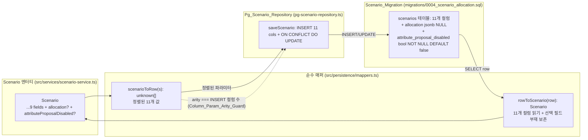

# Design Document

## Overview

이 문서는 ready-gm의 **시나리오 영속 매퍼 동기화(scenario-persistence-sync)** 횡단 관심사 설계를 정의한다. 목표는 `Scenario` 엔터티에 추가된 두 선택 필드(`allocation?: AllocationRule`, `attributeProposalDisabled?: boolean`)가 영속 계층 — SQL 마이그레이션, 순수 행<->엔터티 매퍼, Postgres 리포지토리의 INSERT/UPDATE — 세 곳에 모두 반영되어, Postgres를 거치는 라운드 트립이 더 이상 이 필드들을 조용히 누락하지 않게 하는 것이다. 동시에 **앞으로 새 필드가 한 곳에만 추가되고 다른 곳에 빠졌을 때 시끄럽게 실패하는 회귀 가드**를 세운다.

핵심 설계 원칙은 다음과 같다.

- **가산적 변경(additive only)**: 기존 9개 컬럼(`id`, `title`, `summary`, `opening_seed`, `ending_condition`, `genre`, `category`, `has_special_rules`, `system`)의 정의·순서·동작과 기존 매퍼 테스트를 보존한다. 새 컬럼 두 개를 `Scenario_Column_List`의 끝(tail)에 추가한다.
- **단일 정렬(single source of column ordering)**: `scenarioToRow` 출력 순서, 마이그레이션 컬럼 목록, 리포지토리 INSERT 컬럼 목록이 모두 동일한 `Scenario_Column_List` 정렬을 따른다. 이 정렬을 코드 주석으로 명시하고(Column_Ordering_Convention), arity 가드로 보호한다.
- **매퍼 순수성(mapper purity)**: 매퍼는 `pg` 의존성이 없고 도메인 규칙을 검증하지 않는다. `allocation`의 구조가 유효한 `AllocationRule`인지 따지지 않고 들어온 값을 변형 없이(verbatim) 저장·복원한다. 정규화는 `normalizeAllocationRule`(다른 계층)이 담당한다.
- **선택 필드의 부재 보존(absent stays absent)**: 두 필드 모두 선택이므로, 부재한 입력은 라운드 트립 후에도 부재해야 한다. 그래야 기존 형태(두 필드 없음)의 시나리오에 대해 구조적 동등(round-trip identity)이 성립한다.

### 설계 목표

- 요구사항 1~6을 모두 충족하는 마이그레이션·매퍼·리포지토리 확장 설계를 정의한다.
- 기존 `flexible-stat-allocation`·`scenario-character-cards` 스펙이 확립한 영속 계층 관례를 그대로 미러링한다(TypeScript `src/persistence`, `snake_case` SQL / `camelCase` 엔터티, `jsonb` 컬럼은 `toJsonParam`/`parseJsonColumn` + `::jsonb` 캐스트, vitest + fast-check).
- 매퍼를 `pg`·네트워크에서 분리된 **순수 함수**로 유지해 canned row만으로 완전히 단위·속성 테스트할 수 있게 한다.

### 영속 계약 매핑 (실제 코드 근거)

본 설계는 다음 실제 코드 계약 위에서 동작을 정의한다(요구사항 "영속 드리프트의 실제 코드 근거" 절과 일치).

| 구성요소 | 실제 코드 근거 | 본 스펙의 확장 |
| --- | --- | --- |
| `Scenario` 인터페이스 | `src/services/scenario-service.ts` (`allocation?`, `attributeProposalDisabled?` 이미 추가됨) | 변경 없음(소비처일 뿐) |
| `scenarioToRow` / `rowToScenario` | `src/persistence/mappers.ts` (9개 컬럼만 매핑) | 두 필드를 라운드 트립하도록 확장 |
| `toJsonParam` / `parseJsonColumn` | `src/persistence/mappers.ts` 기존 헬퍼 | `allocation` jsonb 직렬화/역직렬화에 재사용 |
| `PgScenarioRepository.saveScenario` | `src/persistence/pg-scenario-repository.ts` (9개 컬럼 INSERT + ON CONFLICT) | 두 컬럼/파라미터 추가, `::jsonb` 캐스트 |
| `scenarios` 테이블 | `migrations/0001_init.sql` + `0003_scenario_metadata.sql` | `migrations/0004_scenario_allocation.sql` 신규(멱등 ADD COLUMN) |
| 매퍼 라운드 트립 테스트 | `src/persistence/mappers.test.ts` | 두 필드 케이스 + arity 가드 추가 |

> **범위 밖**: 프론트엔드(`public/*`)는 손대지 않는다. 마이그레이션 러너 자체는 본 스펙 범위 밖이며, 마이그레이션 SQL은 `0003` 스타일을 따라 멱등하게 작성한다.

## Architecture

### 세 위치 동기화 개요



**핵심 불변식**: `Scenario_Column_List`라는 하나의 정렬된 컬럼 목록이 세 위치(`scenarioToRow`·마이그레이션·리포지토리 INSERT)의 단일 진실 공급원이다. 세 위치가 어긋나면 라운드 트립이 깨지거나 INSERT가 실패한다. arity 가드가 매퍼와 리포지토리 사이의 정렬을 컴파일/테스트 시점에 강제한다.

### Scenario_Column_List 정렬 (Column_Ordering_Convention)

```
index  column                         source field                 형태
0      id                             scenario.id                  text
1      title                          scenario.title               text
2      summary                        scenario.summary             text
3      opening_seed                   scenario.openingSeed         text
4      ending_condition               scenario.endingCondition     text
5      genre                          scenario.genre               text
6      category                       scenario.category            text
7      has_special_rules              scenario.hasSpecialRules      boolean
8      system                         scenario.system              text
9      allocation                     scenario.allocation          jsonb (nullable)   ← 신규
10     attribute_proposal_disabled    scenario.attributeProposalDisabled  boolean    ← 신규
```

- **규약**: 인덱스 0~8(기존 9개)의 순서를 절대 바꾸지 않는다. 새 컬럼은 항상 끝(tail)에 가산적으로 추가한다. 세 위치가 이 정렬을 동일하게 따른다.
- 이 표는 `mappers.ts`의 `scenarioToRow`·`rowToScenario` 위에 코드 주석으로, 그리고 `pg-scenario-repository.ts`의 `saveScenario` 위에 요약 주석으로 남긴다(요구사항 5.1·5.2).

### 계층 분리 (sibling 미러링)

기존 영속 스펙과 동일한 분리를 유지한다.

- **순수 매핑 계층**(`src/persistence/mappers.ts`): `scenarioToRow`/`rowToScenario`는 `pg` 의존성이 없는 순수 함수다. canned row와 엔터티만으로 라운드 트립을 단위·속성 테스트한다.
- **부수효과 계층**(`src/persistence/pg-scenario-repository.ts`): 실제 SQL 문자열·파라미터 바인딩·`::jsonb` 캐스트를 담당한다. `scenarioToRow`가 만든 정렬된 파라미터 배열을 그대로 INSERT에 전달한다.
- **스키마 계층**(`migrations/*.sql`): 컬럼 정의. `0004`는 `0003` 스타일의 멱등 `ALTER TABLE ... ADD COLUMN IF NOT EXISTS`다.

### 선택 필드의 부재/기본값 처리 전략

두 필드는 선택이므로, 매핑은 "부재(absent)"와 "값 있음(present)"을 구별하고 라운드 트립에서 그 구별을 보존해야 한다. 단, `allocation`(jsonb nullable)과 `attribute_proposal_disabled`(boolean NOT NULL)은 컬럼 형태가 달라 전략이 다르다.

**allocation (jsonb, nullable)**

- 쓰기(`scenarioToRow`): `allocation`이 있으면 `toJsonParam(scenario.allocation)`, 부재하면 `null`.
- 읽기(`rowToScenario`): 컬럼 값이 `null`/`undefined`이면 복원 엔터티에 `allocation` 키를 부여하지 않는다(부재 유지). 비어 있지 않으면 `parseJsonColumn`으로 복원해 부여한다.
- 결과: 부재→`null`→부재(라운드 트립 항등), 값 있음→직렬화→복원(변형 없음). `null`과 부재가 같은 의미이므로 일관성이 유지된다.

**attribute_proposal_disabled (boolean, NOT NULL DEFAULT false)**

- 쓰기(`scenarioToRow`): `scenario.attributeProposalDisabled === true`이면 `true`, 그 외(부재 또는 `false`)는 `false`. 컬럼이 NOT NULL이므로 항상 불리언을 쓴다.
- 읽기(`rowToScenario`): 컬럼이 `true`이면 `attributeProposalDisabled: true` 부여, `false`이면 키를 부여하지 않는다(부재 유지).
- 결과: 선택 불리언의 인메모리 의미("부재 == false == 기본 동작")와 일관된다. 부재→`false`→부재, `true`→`true`→`true`가 보존된다. 명시적 `false`는 부재로 정규화되지만 두 상태는 의미상 동등하다(가정 절 참조).

> 이 비대칭(`allocation`은 `null` 보존, `attribute_proposal_disabled`는 `false`로 흡수)은 컬럼 nullability 차이에서 비롯되며, 두 경우 모두 **선택 필드의 부재가 라운드 트립 후에도 부재로 남는다**는 동일한 불변식을 만족한다.

## Components and Interfaces

### 1. Scenario_Migration — `migrations/0004_scenario_allocation.sql` (신규)

- **책임**
  - `scenarios` 테이블에 `allocation jsonb`(NULL 허용)과 `attribute_proposal_disabled boolean NOT NULL DEFAULT false` 컬럼을 멱등하게 추가한다(요구사항 1.1·1.2).
  - `0003`의 헤더 주석·`ADD COLUMN IF NOT EXISTS`·요구사항 주석 스타일을 따른다(요구사항 1.3).
  - 기존 9개 컬럼 정의를 변경하지 않는다(요구사항 1.4).
- **형태**
  ```sql
  ALTER TABLE scenarios
    ADD COLUMN IF NOT EXISTS allocation                  JSONB,
    ADD COLUMN IF NOT EXISTS attribute_proposal_disabled BOOLEAN NOT NULL DEFAULT false;
  ```
- `allocation`은 기본값 없이 NULL 허용(부재 시 NULL). `attribute_proposal_disabled`는 `NOT NULL DEFAULT false`이므로 기존 행도 안전하게 `false`로 백필된다.

### 2. Scenario_Mapper 확장 — `scenarioToRow` / `rowToScenario` (`src/persistence/mappers.ts`)

- **책임**
  - `scenarioToRow`: 기존 9개 값 뒤에 인덱스 9(`allocation`: 있으면 `toJsonParam`, 없으면 `null`)와 인덱스 10(`attribute_proposal_disabled`: `=== true ? true : false`)를 가산적으로 추가한다(요구사항 2.1·2.2, 3.1·3.2).
  - `rowToScenario`: 기존 9개 필드 복원에 더해, `allocation` 컬럼이 비어 있지 않으면 `parseJsonColumn`으로 복원해 부여하고 `null`이면 키를 생략하며(요구사항 2.3·2.4), `attribute_proposal_disabled`가 `true`이면 `attributeProposalDisabled: true`를 부여하고 `false`이면 키를 생략한다(요구사항 3.3·3.4).
  - 도메인 규칙을 검증하지 않는다 — `allocation`의 구조가 유효한지 따지지 않고 변형 없이 처리한다(요구사항 2.5).
- **인터페이스(시그니처 불변, 동작 확장)**
  ```ts
  export function scenarioToRow(scenario: Scenario): unknown[];
  export function rowToScenario(row: QueryResultRow): Scenario;
  ```
- **구현 스케치**
  ```ts
  export function scenarioToRow(scenario: Scenario): unknown[] {
    return [
      scenario.id,
      scenario.title,
      scenario.summary,
      scenario.openingSeed,
      scenario.endingCondition,
      scenario.genre,
      scenario.category,
      scenario.hasSpecialRules,
      scenario.system,
      // tail (additive) — Column_Ordering_Convention 참조
      scenario.allocation !== undefined ? toJsonParam(scenario.allocation) : null,
      scenario.attributeProposalDisabled === true,
    ];
  }

  export function rowToScenario(row: QueryResultRow): Scenario {
    const scenario: Scenario = {
      id: row.id as string,
      title: row.title as string,
      summary: row.summary as string,
      openingSeed: row.opening_seed as string,
      endingCondition: row.ending_condition as string,
      genre: (row.genre as string | undefined) ?? "",
      category: (row.category as string | undefined) ?? "",
      hasSpecialRules: (row.has_special_rules as boolean | undefined) ?? false,
      system: (row.system as string | undefined) ?? "EZFudge",
    };
    if (row.allocation !== null && row.allocation !== undefined) {
      scenario.allocation = parseJsonColumn(row.allocation);
    }
    if (row.attribute_proposal_disabled === true) {
      scenario.attributeProposalDisabled = true;
    }
    return scenario;
  }
  ```

### 3. Pg_Scenario_Repository 확장 — `saveScenario` (`src/persistence/pg-scenario-repository.ts`)

- **책임**
  - INSERT 컬럼 목록에 `allocation`, `attribute_proposal_disabled`를 추가하고 위치 파라미터(`$10`, `$11`)를 `scenarioToRow` 출력과 정렬한다(요구사항 4.1·4.4).
  - `ON CONFLICT (id) DO UPDATE SET`에 두 컬럼의 `EXCLUDED` 갱신을 추가한다(요구사항 4.2).
  - `allocation` 파라미터를 `$10::jsonb`로 캐스트한다(요구사항 4.3).
  - 기존 9개 컬럼 동작과 다른 메서드를 변경하지 않는다(요구사항 4.5).
- **구현 스케치**
  ```sql
  INSERT INTO scenarios
    (id, title, summary, opening_seed, ending_condition, genre, category,
     has_special_rules, system, allocation, attribute_proposal_disabled)
  VALUES ($1, $2, $3, $4, $5, $6, $7, $8, $9, $10::jsonb, $11)
  ON CONFLICT (id) DO UPDATE SET
    title = EXCLUDED.title,
    summary = EXCLUDED.summary,
    opening_seed = EXCLUDED.opening_seed,
    ending_condition = EXCLUDED.ending_condition,
    genre = EXCLUDED.genre,
    category = EXCLUDED.category,
    has_special_rules = EXCLUDED.has_special_rules,
    system = EXCLUDED.system,
    allocation = EXCLUDED.allocation,
    attribute_proposal_disabled = EXCLUDED.attribute_proposal_disabled
  ```

### 4. Column_Param_Arity_Guard — 회귀 가드 (`src/persistence/mappers.test.ts`)

- **책임**
  - `scenarioToRow`가 산출하는 값 개수(현재 11)가 리포지토리 INSERT가 기록하는 컬럼 개수와 같은지 단언한다(요구사항 5.3).
  - 미래에 한 곳에만 필드가 추가되면 실패한다(요구사항 5.4).
- **전략**
  - 리포지토리 INSERT 컬럼 개수를 테스트가 참조할 수 있도록, `pg-scenario-repository.ts`에 정렬된 컬럼 목록 상수 `SCENARIO_INSERT_COLUMNS: readonly string[]`를 export 하고 `saveScenario`가 그 상수로 INSERT 절을 구성한다. 가드는 `scenarioToRow(anyScenario).length === SCENARIO_INSERT_COLUMNS.length`를 단언한다.
  - 이로써 정렬 규약이 코드(상수)와 테스트(단언) 두 곳에서 강제된다.

## Data Models

### Scenario (기존, 변경 없음 — 소비처)

```ts
interface Scenario {
  id: string;
  title: string;
  summary: string;
  openingSeed: string;
  endingCondition: string;
  genre: string;
  category: string;
  hasSpecialRules: boolean;
  system: string;
  allocation?: AllocationRule;          // 선택, 신뢰 불가(untrusted), 정규화 별도 계층
  attributeProposalDisabled?: boolean;  // 선택, 부재 == false
}
```

### Scenario_Column_List (정렬된 컬럼 목록 — 본 스펙의 핵심 모델)

```ts
// pg-scenario-repository.ts 에서 export, mappers.test.ts 가드가 참조
const SCENARIO_INSERT_COLUMNS = [
  "id", "title", "summary", "opening_seed", "ending_condition",
  "genre", "category", "has_special_rules", "system",
  "allocation", "attribute_proposal_disabled", // tail (additive)
] as const;
```

- `scenarioToRow` 출력의 인덱스 i는 `SCENARIO_INSERT_COLUMNS[i]` 컬럼에 대응한다.
- 라운드 트립 테스트는 이 목록으로 `scenarioToRow` 출력을 컬럼명에 결합해 행(row)을 만든 뒤 `rowToScenario`로 복원한다(`rowFromColumns` 헬퍼).

### 행 형태 (DB 행, `QueryResultRow`)

| 컬럼 | 타입 | `null`/부재 시 |
| --- | --- | --- |
| `allocation` | `jsonb`(pg가 파싱한 객체 또는 JSON 문자열) | `null` → 엔터티에서 키 생략 |
| `attribute_proposal_disabled` | `boolean` | `false` → 엔터티에서 키 생략 |

### rowFromColumns 테스트 헬퍼

```ts
// scenarioToRow 출력 배열 + 컬럼 목록 → QueryResultRow (라운드 트립용)
function rowFromColumns(values: unknown[], columns: readonly string[]): QueryResultRow {
  const row: Record<string, unknown> = {};
  columns.forEach((col, i) => { row[col] = values[i]; });
  // allocation: scenarioToRow 는 JSON 문자열을 쓰므로 pg 의 jsonb 파싱을 모사하려면
  // parseJsonColumn 이 문자열/객체 모두 수용함을 이용한다(그대로 전달).
  return row as QueryResultRow;
}
```

## Correctness Properties

*속성(property)이란 시스템의 모든 유효한 실행에서 참이어야 하는 특성 또는 동작으로, 시스템이 무엇을 해야 하는지에 대한 형식적 진술이다. 속성은 사람이 읽는 명세와 기계가 검증 가능한 정확성 보증 사이의 다리 역할을 한다.*

본 기능의 PBT 대상은 `pg`·네트워크에서 분리된 **순수 매핑 로직**이다: `scenarioToRow`·`rowToScenario`. 매핑은 입력 시나리오의 구조(두 선택 필드의 유무, `allocation`의 임의 JSON 형태)에 따라 의미 있게 달라지므로 임의 입력 100회 이상 반복이 부재 보존·verbatim 보존 경계 사례(빈 객체, 중첩 객체, 무효 모드 문자열 등)를 드러낸다. 마이그레이션 DDL 텍스트·리포지토리 SQL 텍스트·`ON CONFLICT` 절·`::jsonb` 캐스트·주석 규약은 입력에 따라 변하지 않으므로 속성이 아닌 예제/통합 테스트로 다룬다(Testing Strategy 참조). 아래 두 속성은 prework 분석을 reflection으로 통합한 것이다(요구사항 2·3·6.1의 매핑 항목은 단일 라운드 트립 속성으로, 4.4·5.3은 단일 arity 속성으로 흡수).

### Property 1: 시나리오 매핑 라운드 트립 항등 (verbatim · 부재 보존)

*For any* `Scenario` `s`(두 선택 필드가 모두 있음 / 모두 부재 / `allocation`만 있음(유효·부분·무효 JSON 포함) / `attributeProposalDisabled`만 있음 / 명시적 `false` 등 모든 조합), `rowToScenario(rowFromColumns(scenarioToRow(s), SCENARIO_INSERT_COLUMNS))`는 다음을 만족하는 `Scenario`를 던지지 않고(no throw) 복원한다 — (a) 9개 기존 필드는 `s`와 같다, (b) `s.allocation`이 있으면 복원값의 `allocation`이 `s.allocation`과 깊은 동등(deep-equal)이고 없으면 복원값에 `allocation` 키가 없다, (c) `s.attributeProposalDisabled === true`이면 복원값의 `attributeProposalDisabled === true`이고 그 외(부재 또는 `false`)이면 복원값에 `attributeProposalDisabled` 키가 없다.

**Validates: Requirements 2.1, 2.2, 2.3, 2.4, 2.5, 3.1, 3.2, 3.3, 3.4, 6.1**

### Property 2: 컬럼/파라미터 arity 정렬 불변식

*For any* `Scenario` `s`, `scenarioToRow(s)`가 산출하는 값의 개수는 `SCENARIO_INSERT_COLUMNS`의 길이(리포지토리 `saveScenario` INSERT가 기록하는 컬럼 개수)와 정확히 같다. 또한 `SCENARIO_INSERT_COLUMNS`의 처음 9개 원소는 기존 9개 컬럼 이름과 순서가 같고, 마지막 두 원소는 `allocation`·`attribute_proposal_disabled`이다.

**Validates: Requirements 4.4, 5.3**

## Error Handling

### 매퍼의 무검증·무예외 원칙

- `scenarioToRow`/`rowToScenario`는 도메인 검증을 수행하지 않는다. `allocation`이 유효한 `AllocationRule`이 아니더라도(예: 알 수 없는 `mode`, 누락 매개변수, 비객체) 예외를 던지지 않고 변형 없이 직렬화/복원한다(요구사항 2.5). 정규화·거부는 상위 계층(`normalizeAllocationRule`)의 책임이다.
- `parseJsonColumn`은 기존 동작대로 문자열이면 `JSON.parse`, 이미 파싱된 객체이면 그대로 통과시킨다. `scenarioToRow`가 `toJsonParam`(JSON 문자열)을 쓰고 실제 pg는 jsonb를 파싱된 객체로 돌려주므로, 두 경로(문자열/객체) 모두 라운드 트립 테스트로 다룬다.

### NULL / 부재 경계

- `allocation` 컬럼이 `null` 또는 `undefined`이면 복원 엔터티에서 키를 생략한다(요구사항 2.4). 이는 "부재 == NULL"이라는 jsonb nullable 의미와 일치한다.
- `attribute_proposal_disabled`는 `NOT NULL DEFAULT false`이므로 기존 행도 `false`로 백필되어 NULL이 없다. 복원 시 `false`는 키 생략으로 흡수된다(요구사항 3.4).

### 마이그레이션 적용 실패

- `0004`는 `ADD COLUMN IF NOT EXISTS`를 사용해 재적용 시 오류가 없다(요구사항 1.2). 컬럼이 이미 있으면 무연산(no-op)이다.
- `attribute_proposal_disabled`의 `NOT NULL DEFAULT false`는 기존 행에 안전한 기본값을 제공하므로 NOT NULL 추가가 실패하지 않는다.

## Testing Strategy

### 이중 테스트 접근

- **속성 테스트(Property tests)**: 위 Correctness Property 1~2를 검증한다. `src/persistence/mappers.test.ts`(vitest, 노드 환경)에서 `fast-check`로 임의 `Scenario`를 생성해 라운드 트립 항등과 arity 정렬 불변식을 검증한다. 생성기는 두 선택 필드의 모든 유무 조합과 `allocation`에 임의 JSON(유효 `AllocationRule`이 아닌 값 포함)을 둔다.
- **예제/단위 테스트(Example tests)**: 입력에 따라 의미 있게 변하지 않는 항목 — 기존 시나리오(`the-sunless-crypt`, `판타지 던전 탐험`) 라운드 트립 보존(요구사항 6.2), 기존 9개 컬럼 INSERT 형태 보존(요구사항 4.5), `SCENARIO_INSERT_COLUMNS`의 처음 9개가 기존 컬럼과 일치하고 새 두 컬럼이 끝에 있음(요구사항 5.2), 리포지토리 SQL 텍스트가 `allocation`·`attribute_proposal_disabled`를 INSERT/`ON CONFLICT DO UPDATE`에 포함하고 `$10::jsonb` 캐스트를 사용함(요구사항 4.1·4.2·4.3), `0004` 마이그레이션 텍스트가 두 컬럼을 올바른 타입/제약으로 `ADD COLUMN IF NOT EXISTS` 하고 기존 컬럼을 DROP/ALTER 하지 않음(요구사항 1.1·1.4·1.2의 `IF NOT EXISTS` 정적 확인).
- **통합 테스트(Integration tests)**: 실제 Postgres가 가용한 환경에서만(선택) — `0004`를 2회 적용해 멱등성을 확인하고(요구사항 1.2), `information_schema.columns`로 컬럼 타입/nullability를 확인한다. 실제 DB가 없으면 텍스트 단언 예제로 대체한다.
- **스모크/리뷰(Smoke)**: Column_Ordering_Convention 주석 존재(요구사항 5.1)와 `0003` 스타일 준수(요구사항 1.3)는 코드 리뷰로 확인한다.

### 도구

- **속성 테스트 라이브러리**: `fast-check`(기존 `package.json` devDependency). 직접 구현하지 않고 이 라이브러리를 사용한다.
- **테스트 러너**: `vitest`(기존). `src/persistence/**/*.test.ts`는 노드 환경에서 실행한다.
- **빌드/검증 명령**: Windows cmd 셸이 명령 첫 글자를 누락하므로 모든 빌드/테스트 명령은 `& ` 접두사를 붙인다 — `& npm run build`, `& npx vitest run src/persistence/`.

### 속성 테스트 규칙

- 각 속성 테스트는 최소 **100회 반복**으로 실행한다(`fast-check`의 `numRuns: 100` 이상).
- 각 속성 테스트는 설계 문서의 속성을 주석으로 참조한다.
- 태그 형식: **Feature: scenario-persistence-sync, Property {번호}: {속성 텍스트}**
- 각 Correctness Property는 **하나의** 속성 기반 테스트로 구현한다.

#### 생성기(Generator) 전략

- **Scenario 생성기**: 9개 기존 필드(임의 문자열·불리언)에 더해, 두 선택 필드를 다음 조합으로 생성한다 — 둘 다 부재 / 둘 다 있음 / `allocation`만 / `attributeProposalDisabled`만 / 명시적 `false`. `allocation` 값은 (a) 유효 `AllocationRule`(`LADDER_SELECT`·`POINT_BUY`·`FIXED_VALUE`·`DICE_ROLL`), (b) 부분/무효 JSON(빈 객체, 알 수 없는 `mode`, 누락 매개변수, 중첩 객체, 배열)을 섞어 매퍼의 무검증·verbatim 보존을 압박한다 — Property 1.
- **arity용 Scenario 생성기**: 두 필드 유무와 무관하게 `scenarioToRow` 출력 길이가 항상 일정함을 확인 — Property 2.
- **JSON 경로 모사**: `rowFromColumns`로 `scenarioToRow` 출력을 컬럼명에 결합하되, `allocation`은 (a) `scenarioToRow`가 만든 JSON 문자열 그대로(문자열 경로)와 (b) `JSON.parse`한 객체(pg jsonb 경로)를 모두 시험해 `parseJsonColumn`의 두 경로를 덮는다.
