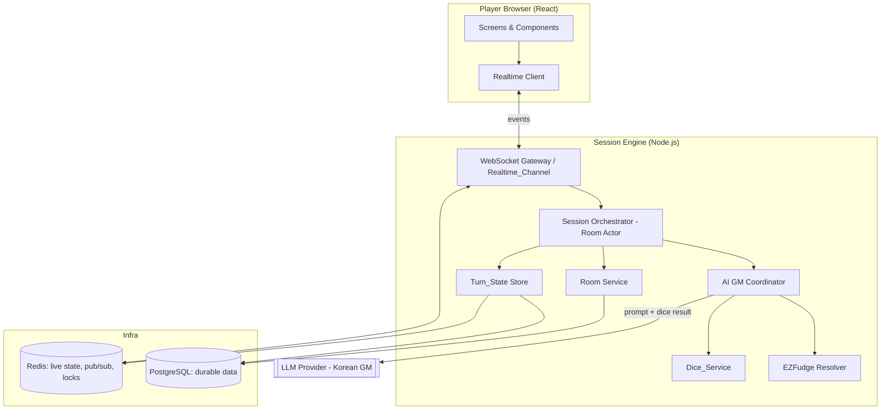
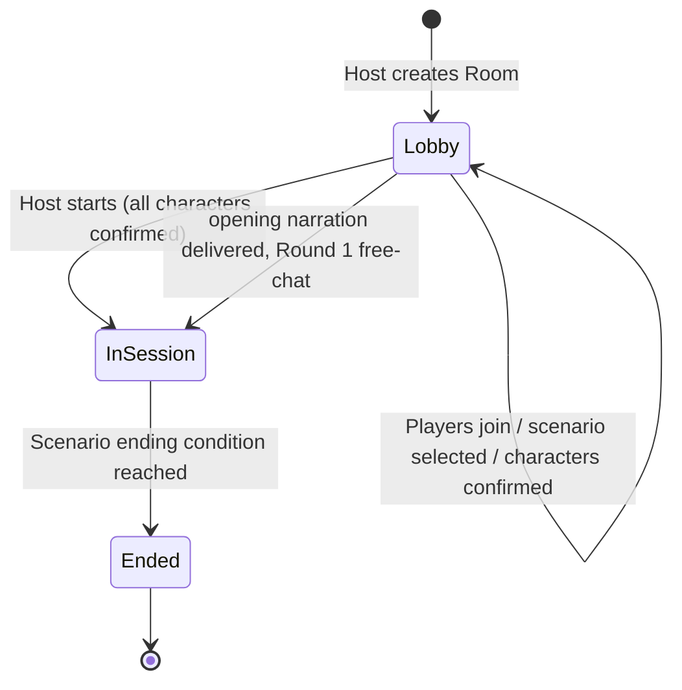
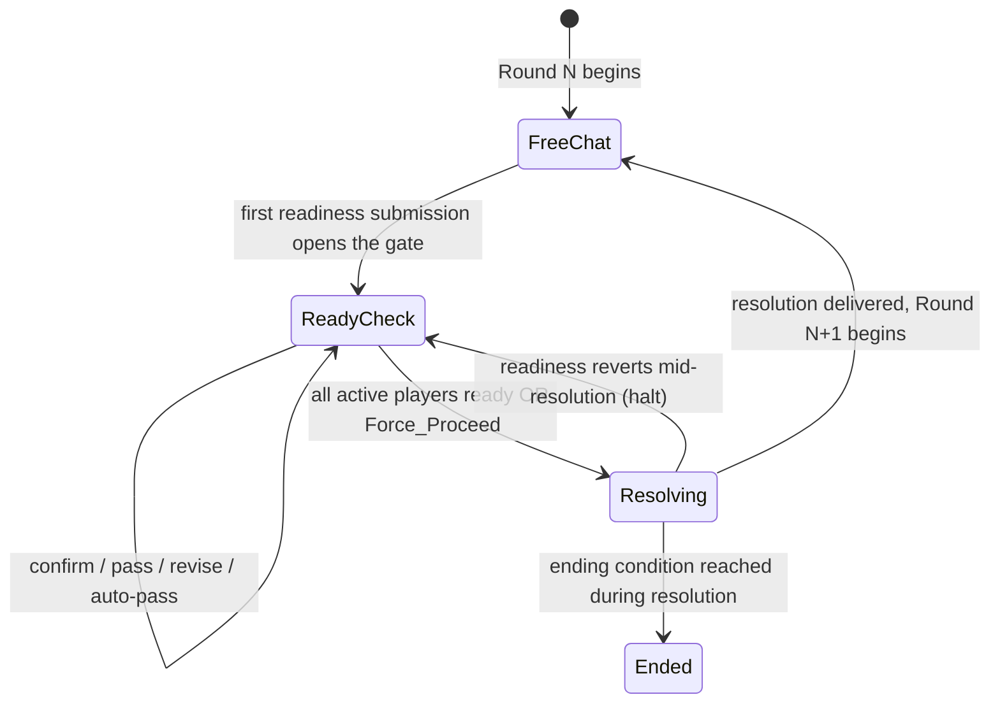
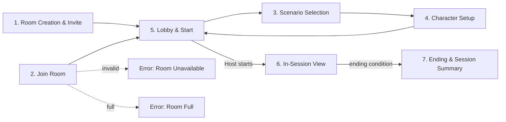
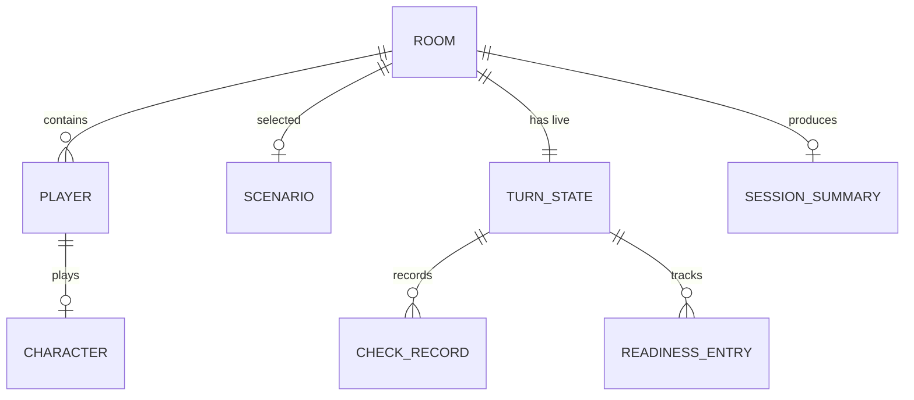

# Design Document

## Overview

The **TRPG Session Engine** is the Phase 1 MVP core of an AI-powered TRPG Game Master web service. It lets up to six friends join a shared, remotely-hosted room and play one ~2-hour one-shot session narrated by an AI Game Master (AI GM).

The defining challenge of this engine is combining two things that are each tricky on their own:

1. **A ready-check hybrid real-time session** — players roleplay freely in real time, then converge on a synchronized "everyone is ready" gate before the round resolves.
2. **An AI GM progression loop** — each round flows `free-chat → ready-check → server-side dice resolution → single AI GM narration`, with short-term memory carried across rounds as JSON.

The engine is the **single source of authority** for game state. It owns room lifecycle, the round state machine, readiness, dice rolls, EZFudge difficulty judgment, Turn_State, and real-time fan-out. The AI GM is treated as an untrusted, non-deterministic *narration service*: it chooses which check applies and at what difficulty, but it never produces random numbers and never advances the round on its own. This separation is what makes outcomes fair, costs predictable, and the loop testable.

### Design Goals

- **Authoritative server, thin clients.** Clients render state and send intents; the server decides everything that matters (readiness gating, dice, round advancement).
- **Exactly-once round resolution.** At most one AI GM resolution request per round, whether triggered by all-ready, auto-pass, or host force-proceed (Requirements 10.3, 16.1).
- **Convergent real-time state.** All connected players see the same Turn_State within 2 seconds, and reconnecting players are re-synced to current state (Requirement 13).
- **Graceful failure.** AI and connectivity failures preserve the round's actions so it can be retried rather than lost (Requirement 17).
- **Korean-native immersion.** The GM narrates in Korean by default and fails loudly rather than silently switching languages (Requirement 14).

### Scope

In scope: room lifecycle, joining, scenario selection, AI-assisted character setup, session start, the free-chat/ready-check/resolution round loop, server-side dice + EZFudge, Turn_State short-term memory, real-time sync, Korean GM tone, one-shot ending + summary, AI cost control, and error handling.

Out of scope (deferred): payment, illustrations, user-generated scenarios, long-term/campaign memory, multi-session continuity, random scenario generation.

### Key Terminology

This document uses the glossary terms from the requirements (Room, Host, Player, AI_GM, Scenario, Character, Round, Ready_Check, Confirmed_Action, Pass, Auto_Pass, Force_Proceed, Dice_Service, EZFudge, Difficulty_Grade, Outcome_Grade, Turn_State, Realtime_Channel, Session_Summary) with the same meaning.

## Architecture

### Technology Choices and Rationale

This is a greenfield project. The choices below favor a small, fast MVP that still respects the hard real-time/authority requirements. They are recommendations open to revision during review.

| Concern | Choice | Rationale |
|---|---|---|
| Frontend | **React + TypeScript (Next.js)** | Component model fits the screen inventory; SSR/routing handles invite links cleanly; TS gives shared types with the backend. |
| Realtime transport | **WebSocket via Socket.IO** | Bidirectional, room/broadcast primitives, automatic reconnection and heartbeat (supports Requirement 13.3–13.5). |
| Backend runtime | **Node.js + TypeScript** | Shares Turn_State/EZFudge types with the frontend; strong WebSocket and LLM-SDK ecosystem. |
| Authoritative state + coordination | **Redis** | Holds live Turn_State, provides pub/sub fan-out across server instances, and distributed locks for single-writer-per-room ordering (Requirement 13.6). |
| Durable persistence | **PostgreSQL** | Stores Rooms, Players, Characters, Scenarios, and Session_Summaries; survives restarts (Requirements 12.3, 15.3). |
| AI GM | **Pluggable LLM provider behind an `AiGmClient` interface** | Lets us select a Korean-capable model and route per-request to a configured model tier (Requirement 16.2) without coupling the engine to one vendor. |

The engine logic (round loop, EZFudge, Turn_State transitions) is written as **pure, transport-agnostic modules** so it can be unit- and property-tested without a network, AI, or database.

### System Context



### Layered Responsibilities

- **WebSocket Gateway (Realtime_Channel):** Connection lifecycle, authentication of player/room membership, heartbeats, reconnection, and broadcasting Turn_State diffs. Translates socket events into orchestrator commands and orchestrator state changes into outbound events.
- **Session Orchestrator (Room Actor):** The heart of the engine. One logical actor per room processes commands **sequentially**, runs the round state machine, and is the only writer of that room's Turn_State. Sequential processing is how concurrent readiness changes are made convergent (Requirement 13.6) and how "at most one resolution per round" is guaranteed (Requirement 10.3).
- **Room Service:** Room creation, invite tokens, capacity enforcement, player join/leave, display-name uniqueness, scenario association, character recording, room state transitions.
- **Turn_State Store:** Reads/writes the JSON Turn_State to Redis (live) and Postgres (durable), and produces the context object passed to the AI GM.
- **AI GM Coordinator:** Builds prompts, enforces the one-request-per-round budget, applies token-budget truncation, drives retries, calls the Dice_Service when a check is needed, and validates that returned narration is Korean.
- **Dice_Service:** Server-side dice: sums one or more unbiased uniform dice (configurable) for checks.
- **EZFudge Resolver:** Pure function mapping `(attribute level, difficulty grade, dice roll)` to an Outcome_Grade.

### Room Lifecycle State Machine



- A Room may only start when every player has confirmed a character (Requirements 4.7, 5.1).
- Players may join only while `Lobby` (Requirement 1.5).
- An `Ended` room rejects restart/new-session requests (Requirement 15.7).

### Round Loop State Machine

The Turn_State `phase` field tracks where a round is. The orchestrator is the only component that transitions phases.



Notes mapped to requirements:
- During `ReadyCheck`, a per-player timeout runs; expiry produces an Auto_Pass (Requirement 8).
- Submissions can be revised until resolution begins (Requirement 7.6); when resolution begins, readiness is **locked** (Requirement 7.8).
- If a player's readiness reverts to not-ready while resolution is in progress, the in-progress resolution is **halted** and the round returns to `ReadyCheck` (Requirement 7.9). Because the AI call is in flight, "halt" means the orchestrator discards the pending AI response and does not advance the round.
- Exactly one AI GM resolution request is issued per round regardless of trigger (Requirements 10.3, 16.1).

### Concurrency and Consistency Model

Real-time multiplayer creates races: two players hit "ready" at once, a player revises while the timeout fires, force-proceed lands as the last player confirms. The model handles these as follows:

1. **Single-writer per room.** All state-changing commands for a room are funneled through that room's orchestrator actor and processed one at a time from an in-order command queue. There is no in-place concurrent mutation of Turn_State, so concurrent readiness changes are simply applied in sequence and the final Turn_State reflects all of them (Requirement 13.6).
2. **Room ownership lock.** In a multi-instance deployment, a Redis lock assigns each room to one server instance (its actor home). Other instances forward commands to the owner via Redis pub/sub.
3. **Idempotent resolution guard.** Each round carries a `resolutionRequested` flag. The orchestrator checks-and-sets it atomically before issuing the AI request, guaranteeing at-most-once resolution per round even if all-ready and force-proceed arrive nearly simultaneously.
4. **Fan-out.** After every committed Turn_State change, the orchestrator publishes the new state (or a diff) on the Realtime_Channel; the gateway broadcasts to all connected sockets in the room.

## Components and Interfaces

This section defines each component's responsibility and its interface. Types are expressed in TypeScript-like notation; see Data Models for the full shapes.

### 1. Room Service

Owns room records, invite tokens, membership, and lifecycle transitions.

```ts
interface RoomService {
  createRoom(hostPlayer: PlayerInit): Room;                 // R1.1, R1.2
  getInviteLink(roomId: string): string;                    // R1.3
  resolveInvite(token: string): Room | RoomUnavailable;     // R2.1, R2.2
  joinRoom(token: string, player: PlayerInit): JoinResult;  // R2.1–R2.6
  selectScenario(roomId: string, scenarioId: string): void; // R3.2
  recordCharacter(roomId: string, character: Character): void; // R4.5
  canStart(roomId: string): boolean;                        // R4.7, R5.1
  startSession(roomId: string): void;                       // R5.2, R5.4
  setEnded(roomId: string): void;                           // R15.6, R15.7
}

type JoinResult =
  | { ok: true; room: Room; assignedName: string }          // R2.6
  | { ok: false; reason: "ROOM_FULL" }                      // R2.4
  | { ok: false; reason: "ROOM_UNAVAILABLE" };              // R2.2
```

Behavioral rules:
- Capacity is checked **before** adding a player; a 7th join is rejected (Requirements 2.3, 2.4, 1.4).
- Joins are allowed only while the room is in `Lobby` (Requirement 1.5).
- Display names are made unique within the room on join, and character names are rejected if duplicated (Requirements 2.6, 4.6).
- Invite tokens are unguessable (random, high-entropy) and map 1:1 to a room.

### 2. Realtime Channel (WebSocket Gateway)

Synchronizes room and Turn_State changes to all connected players.

```ts
interface RealtimeChannel {
  onConnect(socket, playerId, roomId): void;   // delivers current Turn_State (R13.2)
  onReconnect(socket, playerId, roomId): void;  // re-delivers current Turn_State (R13.5)
  broadcast(roomId: string, event: ServerEvent): void; // R13.1 (<= 2s)
  heartbeat(): void;                            // periodic health check (R13.4)
}
```

Inbound client → server events:
`join_room`, `select_scenario`, `submit_character_concept`, `confirm_character`, `send_chat`, `confirm_action`, `pass`, `revise_action`, `force_proceed`, `start_session`, `request_invite_link`.

Outbound server → client events:
`player_list_updated`, `scenario_set`, `character_recorded`, `chat_message`, `turn_state`, `readiness_updated`, `timer_tick`, `resolution_narration`, `opening_narration`, `closing_narration`, `session_summary`, `auto_pass_applied`, `force_proceed_applied`, `delivery_failed`, `error`.

Reliability rules:
- On connect/reconnect the full current Turn_State is pushed so the client view matches room state (Requirements 13.2, 13.5).
- Lost connections trigger reconnection attempts; a heartbeat detects stale-but-"connected" sockets and forces re-establishment (Requirements 13.3, 13.4).
- Chat delivery failures notify affected players and retry (Requirement 6.5).
- Narration generated while no players are connected is retained and delivered on (re)connection (Requirement 10.7).

### 3. Session Orchestrator (Round Loop)

The per-room actor that runs the state machine. It exposes a command-handling surface; every command mutates Turn_State and publishes the result.

```ts
interface SessionOrchestrator {
  handle(command: RoomCommand): void; // processed sequentially per room
}

type RoomCommand =
  | { type: "START_SESSION"; by: PlayerId }
  | { type: "SEND_CHAT"; from: PlayerId; text: string }
  | { type: "CONFIRM_ACTION"; from: PlayerId; action: string }
  | { type: "PASS"; from: PlayerId }
  | { type: "REVISE"; from: PlayerId; action: string | null }
  | { type: "TIMEOUT_EXPIRED"; player: PlayerId }
  | { type: "FORCE_PROCEED"; by: PlayerId }       // host-only (R9.4)
  | { type: "RESOLUTION_READY"; roundId: string; narration: Narration }
  | { type: "RESOLUTION_FAILED"; roundId: string; error: AiError };
```

Core responsibilities:
- Opens/advances rounds, manages the `phase` field, and initializes Round 1 free-chat on start (Requirement 5.4).
- Records readiness and gates resolution until all active players are ready or force-proceed (Requirements 7.1–7.7).
- Locks readiness when resolution begins; halts and reverts if readiness changes mid-resolution (Requirements 7.8, 7.9).
- Applies Auto_Pass on timeout (Requirement 8.2) and on force-proceed for all unready players (Requirement 9.2).
- Enforces the at-most-once resolution guard per round (Requirements 10.3, 16.1).
- Advances Turn_State to the next round on successful delivery (Requirement 10.5).
- On ending condition, transitions the room to `Ended` and stops accepting new rounds (Requirements 15.4, 15.6).

### 4. AI GM Coordinator

Mediates all AI interaction and guarantees the cost/fairness/language rules.

```ts
interface AiGmCoordinator {
  generateOpening(ctx: TurnStateContext, scenario: Scenario): Promise<Narration>;   // R5.2
  proposeAttributes(concept: string, scenario: Scenario): Promise<AttributeSet>;     // R4.2
  resolveRound(ctx: TurnStateContext): Promise<ResolutionResult>;                    // R10.1
  generateEnding(ctx: TurnStateContext): Promise<{ closing: Narration; summary: SessionSummary }>; // R15.1, R15.2
}

interface AiGmClient { // provider-agnostic adapter
  complete(req: { tier: ModelTier; prompt: Prompt; budget: TokenBudget }): Promise<AiResponse>;
}

type ResolutionResult = {
  narration: Narration;          // Korean (R14.1)
  checks: CheckRequest[];        // checks the GM chose to make (R11.1)
  endingReached: boolean;        // R15.1
};

type CheckRequest = { characterId: string; attribute: AttributeKey; difficulty: DifficultyGrade }; // R11.1
```

Rules:
- For a round resolution, the coordinator first asks the model which checks apply and at what difficulty, calls the **Dice_Service** for each, maps results via **EZFudge**, then asks the model to narrate the combined outcome using the resolved Outcome_Grades (Requirements 10.6, 11.1, 11.4). This keeps randomness server-side (Requirement 11.2).
- Routes each request type to its configured model tier (Requirement 16.2).
- Applies token-budget truncation: when context exceeds budget, it truncates `narrativeContext` to the most recent entries while preserving the **current round's** readiness and actions (Requirement 16.3).
- Retries a failed AI request up to 2 additional times (3 total) before reporting an error (Requirement 17.1).
- Validates the response is Korean; if Korean generation is unavailable, it withholds narration and reports failure rather than substituting another language (Requirements 14.4, 17.3-style withholding).

### 5. Dice Service

```ts
interface DiceService {
  roll(): number; // summed integer in [range.min, range.max] (R11.2, R11.6)
}

// A roll sums `count` unbiased uniform dice, each over `face`.
interface DiceSpec { count: number; face: { min: number; max: number } }
```

- Produces a roll as the sum of `count` server-side dice, each an unbiased uniform draw over its `face` range using a cryptographically seeded generator (Requirement 11.6). The default EZFudge dice (`count: 2`, `face: [-2, +2]`) yield a symmetric, centre-weighted distribution over the aggregate `[-4, +4]` band, so criticals and fumbles are rarer than a flat roll; a single die (`count: 1`) is the flat-uniform special case.
- Returns server-side only; the AI GM never supplies the random value (Requirement 11.2).
- Records the per-die raw values, the summed result, and the seed so a roll replays exactly from `(seed, spec)` (Requirement 18.3).
- On failure to produce a result, the affected resolution narration is withheld until a result is produced (Requirement 17.3).

### 6. EZFudge Resolver

```ts
// Named attribute ladder mapped to integer levels.
type AttributeLevel = number; // e.g., Terrible=-2 ... Superb=+4
type DifficultyGrade = "Trivial" | "Easy" | "Average" | "Hard" | "Formidable";
type OutcomeGrade = "Failure" | "Partial Success" | "Success" | "Critical Success";

function resolveCheck(
  attribute: AttributeLevel,
  difficulty: DifficultyGrade,
  roll: number // from DiceService, summed dice over [-4, +4] (default bell)
): OutcomeGrade;
```

Mapping (pure, deterministic given inputs):
- `margin = (attribute + roll) - difficultyTarget(difficulty)` where targets are `Trivial=-2, Easy=-1, Average=0, Hard=+1, Formidable=+2`.
- `margin < 0` → `Failure`
- `margin == 0` → `Partial Success`
- `margin in 1..2` → `Success`
- `margin >= 3` → `Critical Success`

This is the central pure function and the anchor for property-based testing (Requirement 11.3).

### 7. Turn_State Store

```ts
interface TurnStateStore {
  get(roomId: string): TurnState;            // R12.1
  save(roomId: string, state: TurnState): void; // persist on change (R12.3)
  toContext(state: TurnState, budget?: TokenBudget): TurnStateContext; // R12.4, R16.3
}
```

- Maintains Turn_State as a JSON record per active room (Requirement 12.1).
- Persists on every tracked change (Requirement 12.3) and updates `narrativeContext` after resolution (Requirement 12.5).
- Serializes/deserializes losslessly between live (Redis) and durable (Postgres) stores.

### HTTP/REST Surface (non-realtime)

A small REST surface complements the realtime channel for entry flows:

| Method | Path | Purpose | Requirements |
|---|---|---|---|
| POST | `/rooms` | Create room, return room id + invite link | 1.1, 1.2 |
| GET | `/rooms/:token` | Resolve invite (200 room summary / 404 unavailable / 409 full preview) | 2.1, 2.2 |
| GET | `/rooms/:id/invite` | Fetch invite link | 1.3 |
| GET | `/scenarios` | List available scenarios (one for MVP) | 3.1 |
| GET | `/rooms/:id/summary` | Fetch persisted Session_Summary after end | 15.3 |

All in-session interactions use the Realtime_Channel rather than REST.

## User Interface Design (UI 시안)

This section is the visual design draft. It enumerates **every screen, every container, and every UI object** so the mockups below can be used directly for UI verification. Each screen has a wireframe sketch (ASCII) and a structured component inventory. Korean is the default display language; English labels in sketches are placeholders for the localized strings.

### Screen Map / Navigation Flow



### Global Design System

Shared visual primitives referenced by all screens. The visual direction below is **confirmed**: after reviewing four style explorations (minimalism, maximalism, brutalism, glassmorphism), the chosen direction is **Glassmorphism** with a toned-down, low-saturation background. All 7 screens follow this single unified system.

- **Visual style — Glassmorphism:** Content sits on translucent frosted-glass cards: a semi-transparent white overlay (~6–8% opacity), a backdrop blur of ~18–20px, subtle 1px light borders (~14–18% white), and soft, large drop shadows. These glass surfaces are layered over a calm, muted dark background to create depth without visual noise.
- **Background — muted dark, low saturation:** A dark grey-blue base (roughly `#10131b` → `#161922` via a soft 135° gradient) with very low-opacity (~0.13 alpha) **desaturated** radial color glows for atmosphere. This was deliberately toned down per user feedback that vivid/bright backgrounds hurt the eyes — the glows are subtle and muted, explicitly **not** high-saturation or bright.
- **Layout shell:** Top `AppHeader` bar (fixed) rendered as a glass top strip, main content area on glass cards, optional right rail in-session.
- **Accent colors:**
  - **Warm amber `#ffd9a8`** — reserved for the AI GM voice / narration (GM brand, narration left-border, closing title glow).
  - **Cool mint/blue `#9affd0` / `#8fc2ff`** — player UI, chat names, and readiness states (ready dots, "Live" indicator).
  - **Muted yellow `#ffce6b`** — timers, auto-pass, and reconnecting status.
  - **Soft red** — danger / host force-proceed actions.
- **Typography:** Korean-first font stack (`Pretendard`, `Apple SD Gothic Neo`, `Malgun Gothic`, then system sans fallback); distinct treatment for GM narration (immersive) vs. chat (sans).
- **Reusable components:**

| Component | Purpose | Used on screens |
|---|---|---|
| `AppHeader` | Logo, room name, `ConnectionStatusBadge`, player count | All in-room screens |
| `ConnectionStatusBadge` | Live/Reconnecting/Offline indicator (R13.3–13.5) | All in-room screens |
| `PlayerAvatarChip` | Avatar + display name + host crown + ready dot | Lobby, In-Session |
| `PrimaryButton` / `SecondaryButton` | Standard actions | All |
| `ToastStack` | Transient notifications (join, auto-pass, errors, delivery-fail) | All |
| `Modal` | Confirmations and error dialogs | Multiple |
| `CopyableLinkField` | Invite link with copy button | Creation, Lobby |
| `CountdownRing` | Circular timer for ready-check (R8.3) | In-Session |
| `LoadingNarrationSkeleton` | "GM is narrating…" placeholder | In-Session, Ending |

> **Interactive mockups.** Clickable HTML mockups live alongside this spec for visual verification:
> - `mockups-glass.html` — **the confirmed direction**: the full 7-screen glassmorphism set built on the design system above.
> - `mockups.html` — original dark wireframes, kept for reference.
> - `mockups-styles.html` — the four style explorations (minimalism, maximalism, brutalism, glassmorphism), kept for reference.

### Screen 1 — Room Creation & Invite

Requirements: 1.1, 1.2, 1.3, 1.4.

```
+--------------------------------------------------------------+
|  AppHeader:  [⚔ ready-gm]                      [● Connecting] |
+--------------------------------------------------------------+
|                                                              |
|                Create a New Session                          |
|   +------------------------------------------------------+   |
|   | Your display name:  [ Aria__________________ ]       |   |
|   |                                                      |   |
|   |            [   Create Room   ]  (PrimaryButton)      |   |
|   +------------------------------------------------------+   |
|                                                              |
|   --- After creation: Invite panel ---                      |
|   +------------------------------------------------------+   |
|   | Room created!  Room: "Tavern of Echoes"              |   |
|   | Invite link:                                         |   |
|   | [ https://ready-gm/r/AB12CD34 ]   [ Copy ]           |   |
|   | Players: 1 / 6                                       |   |
|   |            [   Go to Lobby   ]                       |   |
|   +------------------------------------------------------+   |
+--------------------------------------------------------------+
```

| Container | UI objects |
|---|---|
| `CreateRoomCard` | `DisplayNameInput` (text), `CreateRoomButton` (PrimaryButton) |
| `InvitePanel` (post-create) | `RoomTitleLabel`, `CopyableLinkField` (invite link + Copy), `CapacityLabel` (`Players: x/6`), `GoToLobbyButton` |
| `ToastStack` | "Invite link copied" toast |

### Screen 2 — Join Room (via invite link)

Requirements: 2.1, 2.2, 2.4, 2.6.

```
+--------------------------------------------------------------+
|  AppHeader:  [⚔ ready-gm]                          [● Live]  |
+--------------------------------------------------------------+
|              You're invited to "Tavern of Echoes"            |
|   +------------------------------------------------------+   |
|   | Host: Aria      Players: 3 / 6                       |   |
|   | Choose your display name:                            |   |
|   | [ Borin_______________________ ]                     |   |
|   |            [   Join Room   ] (PrimaryButton)         |   |
|   +------------------------------------------------------+   |
+--------------------------------------------------------------+

  Error state E1 (room does not exist) — Modal:
  +--------------------------------------+
  |  Room unavailable                    |
  |  This room link is invalid or the    |
  |  session no longer exists.           |
  |               [ OK ]                 |
  +--------------------------------------+

  Error state E2 (room full) — Modal:
  +--------------------------------------+
  |  Room is full                        |
  |  This room already has 6 players.    |
  |               [ OK ]                 |
  +--------------------------------------+
```

| Container | UI objects |
|---|---|
| `JoinRoomCard` | `RoomTitleLabel`, `HostLabel`, `CapacityLabel`, `DisplayNameInput`, `JoinRoomButton` |
| `RoomUnavailableModal` (E1) | Message text, `OkButton` (R2.2) |
| `RoomFullModal` (E2) | Message text, `OkButton` (R2.4) |
| `NameTakenInline` | Inline error under input when name duplicates (R2.6 / R4.6 pattern) |

### Screen 3 — Scenario Selection

Requirements: 3.1, 3.3, 3.4, 3.5.

```
+--------------------------------------------------------------+
|  AppHeader: [⚔ ready-gm]  Tavern of Echoes        [● Live]  |
+--------------------------------------------------------------+
|  Select Scenario  (Host only controls; others see preview)   |
|   +------------------------------------------------------+   |
|   | ( • )  "The Sunless Crypt"      [ DEFAULT ]          |   |
|   |        A one-shot dungeon delve for 2-6 heroes.      |   |
|   |        Est. 2 hours.                                 |   |
|   +------------------------------------------------------+   |
|                                                              |
|   Scenario summary (shown to all players):                   |
|   +------------------------------------------------------+   |
|   | The village's children have vanished into the old   |   |
|   | crypt beneath the chapel...                          |   |
|   +------------------------------------------------------+   |
|                                                              |
|   [ Confirm Scenario ]   (Host; disabled for non-host)       |
+--------------------------------------------------------------+
```

| Container | UI objects |
|---|---|
| `ScenarioList` | `ScenarioCard` (radio select, title, short desc, `DefaultBadge` when single option pre-selected per R3.4) |
| `ScenarioSummaryPanel` | `ScenarioTitleLabel`, `ScenarioSummaryText` (broadcast to all within 2s, R3.3) |
| `ScenarioControls` | `ConfirmScenarioButton` (host-only; required when >1 option per R3.5) |
| Non-host view | Read-only preview of selection + summary |

### Screen 4 — AI-Assisted Character Setup

Requirements: 4.1, 4.2, 4.3, 4.4, 4.5, 4.6.

```
+--------------------------------------------------------------+
|  AppHeader: [⚔ ready-gm]  Tavern of Echoes        [● Live]  |
+--------------------------------------------------------------+
|  Create Your Character                                        |
|   +-------------------------+  +---------------------------+  |
|   | Name                    |  | AI-Proposed Attributes    |  |
|   | [ Borin Stonefist____ ] |  | (EZFudge ladder)          |  |
|   |                         |  |  Might      [ Great + ]   |  |
|   | Concept / description   |  |  Agility    [ Fair  + ]   |  |
|   | [ A grizzled dwarf___ ] |  |  Wits       [ Good  + ]   |  |
|   | [ blacksmith seeking_ ] |  |  Spirit     [ Fair  + ]   |  |
|   | [ his lost apprentice]  |  |                           |  |
|   |                         |  |  [ Revise ]  [ Re-roll AI]|  |
|   | [ Ask AI to Suggest ]   |  |                           |  |
|   +-------------------------+  +---------------------------+  |
|                                                              |
|   Status: ○ Aria (ready)  ○ Borin (editing)  ○ Cara (...)   |
|                                                              |
|            [   Confirm Character   ]  (locks attributes)     |
+--------------------------------------------------------------+
```

| Container | UI objects |
|---|---|
| `CharacterIdentityCard` | `NameInput`, `ConceptTextarea`, `AskAiSuggestButton` (triggers R4.2), `NameTakenInline` (R4.6) |
| `ProposedAttributesPanel` | `AttributeRow` × N (label + editable ladder value), `ReviseButton` / `RerollAiButton` (R4.3) |
| `PartySetupStatusStrip` | `PlayerSetupChip` per player (editing / ready) for shared awareness (R4.5) |
| `ConfirmCharacterButton` | Confirms and locks attributes (R4.4); disabled until name+attributes valid |
| `AttributesLockedNotice` | Shown post-confirm; attribute fields become read-only |

### Screen 5 — Lobby & Start

Requirements: 1.5, 4.7, 5.1, 5.2.

```
+--------------------------------------------------------------+
|  AppHeader: [⚔ ready-gm]  Tavern of Echoes        [● Live]  |
+--------------------------------------------------------------+
|  Lobby                                Invite: [link] [Copy]   |
|   +------------------ Party (3/6) -----------------------+    |
|   |  👑 Aria   ✔ Character ready                         |    |
|   |     Borin  ✔ Character ready                         |    |
|   |     Cara   … setting up character                    |    |
|   |     (3 empty seats)                                  |    |
|   +------------------------------------------------------+    |
|                                                              |
|   Scenario: The Sunless Crypt                                |
|                                                              |
|   Host control:                                              |
|   [ Start Session ]  (disabled: waiting on Cara's character) |
|   Non-host: "Waiting for host to start…"                     |
+--------------------------------------------------------------+
```

| Container | UI objects |
|---|---|
| `PartyRoster` | `PlayerAvatarChip` per player (host crown, character-ready check), `EmptySeatPlaceholder` up to 6 |
| `InviteInlineField` | `CopyableLinkField` (R1.3) — joining allowed only in lobby (R1.5) |
| `ScenarioBanner` | Selected scenario title |
| `StartControls` | `StartSessionButton` (host-only; enabled only when all characters confirmed per R4.7/R5.1), `WaitingForHostLabel` (non-host) |
| `StartBlockedTooltip` | Explains why start is disabled |

### Screen 6 — In-Session View (primary play screen)

This is the core screen. It must show: the GM narration stream, the free-chat panel, per-player readiness indicators, confirm-action/pass controls, the ready-check countdown timer, the host force-proceed control, and the dice/outcome display.

Requirements: 5.3, 6.1–6.5, 7.1–7.9, 8.3, 8.5, 9.1, 9.2, 9.5, 10.4, 11.x, 13.x.

```
+----------------------------------------------------------------------------------+
| AppHeader: [⚔ ready-gm]  Tavern of Echoes        Round 3 · Free-Chat   [● Live]  |
+----------------------------------------------------------------------------------+
| GM NARRATION STREAM (left, primary)            | PARTY & READINESS (right rail)  |
| +--------------------------------------------+ | +-----------------------------+ |
| | [GM] 횃불이 깜빡이며 통로 끝의 문이...     | | | 👑 Aria    ● Ready (Confirm) | |
| |      (opening / round resolutions appear   | |  |    Borin   ○ Not ready      | |
| |       here, newest at bottom)              | |  |    Cara    ● Ready (Pass)    | |
| |                                            | |  |    Dane    ⏱ Auto-passed    | |
| | --- Dice/Outcome card (inline) ---         | | +-----------------------------+ |
| | | 🎲 Check: Borin · Might · Hard         | | |                                 |
| | |    Roll +2 → Outcome: SUCCESS          | | | READY-CHECK TIMER               |
| | +----------------------------------------+ | | |     (  ◌ 01:12  )  CountdownRing|
| +--------------------------------------------+ | |   "Auto-pass when time runs out"| |
|                                                | +-----------------------------+ |
| FREE-CHAT PANEL (below narration)              | HOST CONTROLS                   |
| +--------------------------------------------+ | +-----------------------------+ |
| | Borin: 문을 천천히 밀어본다.               | | | [ Force Proceed ]  (host only)| |
| | Aria:  내가 뒤를 살필게.                   | | |  "Advance without waiting"    | |
| | [ type message...        ] [ Send ]        | | +-----------------------------+ |
| +--------------------------------------------+ |                                 |
|                                                |                                 |
| ACTION BAR (sticky bottom)                                                       |
| [ Confirm Action: ________________ ]  [ Confirm ]   [ Pass ]   [ Revise ]        |
+----------------------------------------------------------------------------------+
```

| Container | UI objects | Requirements |
|---|---|---|
| `SessionTopBar` | `RoundLabel` (round #), `PhaseBadge` (Free-Chat / Ready-Check / Resolving / Ended), `ConnectionStatusBadge` | 5.4, 13.x |
| `GmNarrationStream` | `OpeningNarrationBlock`, `ResolutionNarrationBlock` (Korean, GM tone), `LoadingNarrationSkeleton` ("GM is narrating…"), auto-scroll | 5.3, 10.4, 14.1, 14.2 |
| `DiceOutcomeCard` (inline in stream) | `CheckTargetLabel` (character·attribute·difficulty), `RollValue`, `OutcomeGradeBadge` (Failure/Partial/Success/Critical) | 11.1, 11.3, 11.4 |
| `FreeChatPanel` | `ChatMessageList` (each `ChatMessage` attributed to **Character name**), `ChatInput`, `SendButton` | 6.1–6.4 |
| `ChatDeliveryFailedNotice` | Inline retry indicator on failed delivery | 6.5 |
| `PartyReadinessRail` | `ReadinessRow` per player: name, `ReadyDot` (ready/not-ready), action tag (Confirmed/Pass), `AutoPassBadge` | 7.1–7.3, 8.5 |
| `ReadyCheckTimerPanel` | `CountdownRing` showing remaining time to Auto_Pass + caption | 8.3 |
| `HostControlsPanel` | `ForceProceedButton` (host-only, visible while awaiting readiness) | 9.1, 9.4 |
| `ActionBar` (sticky) | `ConfirmActionInput`, `ConfirmButton`, `PassButton`, `ReviseButton` (revise enabled until resolution locks) | 7.1, 7.2, 7.6, 7.8 |
| `ResolvingOverlay` | Subtle lock state on action controls during resolution | 7.8 |
| `ToastStack` | `AutoPassToast` (8.5), `ForceProceedToast` ("Host advanced the round", 9.5), `DeliveryFailedToast` (6.5), `ErrorToast` (17.2) |

Interaction notes:
- The `PhaseBadge` and `ActionBar` state are driven entirely by the server's Turn_State `phase`. When `phase = resolving`, controls lock (Requirement 7.8); if resolution halts, they unlock (Requirement 7.9).
- `ForceProceedButton` is rendered only for the host and only while readiness is pending (Requirements 9.1, 9.4).

### Screen 7 — Ending & Session Summary

Requirements: 15.1, 15.2, 15.5, 15.6, 15.7.

```
+--------------------------------------------------------------+
|  AppHeader: [⚔ ready-gm]  Tavern of Echoes   Round Ended     |
+--------------------------------------------------------------+
|  THE END                                                     |
|   +------------------ Closing Narration ----------------+    |
|   | [GM] 아이들은 무사히 구출되었고, 마을은 다시...      |    |
|   |      (Korean closing narration, GM tone)            |    |
|   +------------------------------------------------------+   |
|                                                              |
|   +------------------ Session Summary -------------------+   |
|   | • 일행은 지하 묘지로 내려갔다                          |   |
|   | • 보린이 함정을 발견했다 (Success)                    |   |
|   | • 최종 결전에서 ...                                   |   |
|   +------------------------------------------------------+   |
|                                                              |
|   [ Copy Summary ]      Session is closed. (no new rounds)   |
+--------------------------------------------------------------+
```

| Container | UI objects | Requirements |
|---|---|---|
| `ClosingNarrationPanel` | `ClosingNarrationText` (Korean, GM tone) | 15.1, 15.5 |
| `SessionSummaryPanel` | `SummaryBulletList` of key events, `CopySummaryButton` | 15.2, 15.3, 15.5 |
| `SessionEndedNotice` | "Session is closed" banner; all action controls removed | 15.4, 15.6, 15.7 |
| `ToastStack` | Confirmation toasts |

### Cross-Screen UI States

| State | UI treatment | Requirements |
|---|---|---|
| Reconnecting | `ConnectionStatusBadge` shows "Reconnecting…"; on resync the view replaces with current Turn_State | 13.3–13.5 |
| AI failure (after retries) | `ErrorToast` + inline "Round can be retried" banner; action controls remain populated | 17.1, 17.2, 17.4 |
| Dice failure | Narration withheld; "Resolving…" persists with a "rolling dice" sub-state | 17.3 |
| Korean unavailable | Narration withheld + explicit failure notice (never another language) | 14.4 |

## Data Models

### Entity Relationship Overview



### Durable Entities (PostgreSQL)

```ts
type RoomState = "lobby" | "in_session" | "ended";

interface Room {
  id: string;                 // unique room identifier (R1.1)
  inviteToken: string;        // unguessable, 1:1 with room (R1.2)
  hostPlayerId: string;       // R1.1
  scenarioId: string | null;  // R3.2
  state: RoomState;           // R5.x, R15.6
  maxPlayers: 6;              // R1.4
  createdAt: string;          // ISO timestamp
}

interface Player {
  id: string;
  roomId: string;
  displayName: string;        // unique within room (R2.6)
  isHost: boolean;            // R9.4
  characterId: string | null;
  connectionStatus: "connected" | "disconnected"; // R13.3
}

interface Character {
  id: string;
  playerId: string;
  roomId: string;
  name: string;               // unique within room (R4.6)
  concept: string;            // R4.1
  attributes: Record<AttributeKey, AttributeLevel>; // EZFudge (R4.2)
  confirmed: boolean;         // locks attributes when true (R4.4)
}

interface Scenario {
  id: string;
  title: string;              // R3.1, R3.3
  summary: string;            // R3.3
  openingSeed: string;        // grounding context for opening narration (R5.2)
  endingCondition: string;    // evaluated by AI GM (R15.1)
}

interface SessionSummary {
  roomId: string;
  closingNarration: string;   // R15.1 (Korean)
  summaryText: string;        // R15.2 (key events)
  createdAt: string;          // R15.3
}
```

### Turn_State (JSON short-term memory)

The Turn_State is the canonical per-room JSON record. It lives in Redis for low-latency reads/writes and is persisted to Postgres on change (Requirements 12.1–12.3). It must serialize and deserialize losslessly.

```ts
type Phase = "free_chat" | "ready_check" | "resolving" | "ended";
type ReadinessStatus = "not_ready" | "ready";
type ActionKind = "confirmed_action" | "pass" | "auto_pass" | null;

interface ReadinessEntry {
  playerId: string;
  status: ReadinessStatus;        // R7.1, R7.2
  actionKind: ActionKind;         // confirmed / pass / auto-pass (R8.2)
  actionText: string | null;      // the confirmed action content
}

interface ChatEntry {
  playerId: string;
  characterName: string;          // messages attributed to character (R6.3)
  text: string;
  ts: string;
}

interface CheckRecord {
  characterId: string;
  attribute: AttributeKey;
  difficulty: DifficultyGrade;    // R11.1
  roll: number;                   // server-side dice result (R11.2)
  outcome: OutcomeGrade;          // mapped via EZFudge (R11.3)
}

interface NarrativeContextEntry {
  round: number;
  text: string;                   // resolution/opening narration (R12.5)
}

interface TurnState {
  roomId: string;
  roundNumber: number;            // starts at 1 (R5.4)
  phase: Phase;                   // R5.4, round loop
  readiness: ReadinessEntry[];    // per active player (R12.2)
  chatLog: ChatEntry[];           // current round's chat (R6.4)
  checks: CheckRecord[];          // checks resolved this round (R11.5)
  narrativeContext: NarrativeContextEntry[]; // recent context, newest last (R12.2)
  readyCheckDeadline: string | null; // for the countdown timer (R8.1, R8.3)
  readyCheckTimeoutMs: number;    // default 90000 (R8.4)
  resolutionRequested: boolean;   // at-most-once guard (R10.3, R16.1)
}
```

Turn_State invariants (enforced by the orchestrator and the basis for several correctness properties):

- `roundNumber >= 1` once the session has started.
- `readiness` contains exactly one entry per active player.
- The round may only enter `resolving` when **every active player** has `status = "ready"` or Force_Proceed was invoked (Requirements 7.5, 7.7).
- While `phase = "resolving"`, readiness is locked; any accepted readiness revert moves `phase` back to `ready_check` and clears `resolutionRequested` for a fresh attempt (Requirements 7.8, 7.9).
- Each `CheckRecord.outcome` equals `resolveCheck(attribute, difficulty, roll)` (Requirement 11.3).

### AI GM Context Object

```ts
interface TurnStateContext {
  roomId: string;
  roundNumber: number;
  scenario: { title: string; summary: string; openingSeed: string; endingCondition: string };
  characters: Array<{ name: string; concept: string; attributes: Record<AttributeKey, AttributeLevel> }>;
  thisRound: {
    actions: Array<{ characterName: string; actionKind: ActionKind; actionText: string | null }>;
    checks: CheckRecord[];
  };
  recentNarrative: NarrativeContextEntry[]; // truncated under token budget (R16.3)
}
```

Under a token-budget overflow, `recentNarrative` is truncated to the most recent entries **while `thisRound` (current readiness and actions) is always preserved** (Requirement 16.3).

### Configuration

```ts
interface EngineConfig {
  readyCheckTimeoutMs: number;        // default 90000 (R8.4)
  maxPlayers: number;                 // 6 (R1.4)
  aiMaxRetries: number;               // 2 additional retries => 3 total (R17.1)
  modelTiers: Record<RequestType, ModelTier>; // R16.2
  tokenBudgets: Record<RequestType, number>;  // R16.3
  diceRange: { min: number; max: number };    // aggregate output band (R11.6)
  dice: { count: number; face: { min: number; max: number } }; // dice model (R11.6)
}

type RequestType = "opening" | "attributes" | "resolution" | "ending";
```

## Correctness Properties

*A property is a characteristic or behavior that should hold true across all valid executions of a system — essentially, a formal statement about what the system should do. Properties serve as the bridge between human-readable specifications and machine-verifiable correctness guarantees.*

The following properties were derived from the prework analysis. Acceptance criteria that are timing/realtime delivery (the "within 2 seconds" clauses), AI generation quality, UI prompts, or one-time config checks are validated by integration, smoke, and example-based tests instead (see Testing Strategy), not by the properties below. Redundant criteria were consolidated during property reflection.

### Property 1: Unique room identity and host designation

*For any* sequence of room-creation requests, every created Room has a room identifier and an invite token that are unique across all rooms, and the requesting Player is designated Host of the room they created.

**Validates: Requirements 1.1, 1.2**

### Property 2: Invite link round-trip

*For any* created Room, fetching the invite link for that room returns the exact token generated at creation, and resolving that token returns that same room.

**Validates: Requirements 1.3, 2.1**

### Property 3: Room capacity is never exceeded

*For any* sequence of join attempts against a room, the room's player count never exceeds 6; the count is checked before adding, and a join attempt against a room already holding 6 players is rejected with `ROOM_FULL` while leaving the room unchanged.

**Validates: Requirements 1.4, 2.3, 2.4**

### Property 4: Joins allowed only before session start

*For any* Room and join attempt, the join is admitted if and only if the room is in the `lobby` state and below capacity; joins are rejected once the room has started.

**Validates: Requirements 1.5**

### Property 5: Display names are unique within a room

*For any* sequence of joins (including colliding requested names), the set of assigned display names within a room contains no duplicates.

**Validates: Requirements 2.6**

### Property 6: Scenario association round-trip

*For any* valid scenario selected for a Room, reading the room's scenario afterward returns the selected scenario.

**Validates: Requirements 3.2**

### Property 7: Confirmed characters are immutable

*For any* Character, once it is confirmed, any subsequent attempt to revise its attributes is rejected and the recorded attributes remain equal to the values at confirmation.

**Validates: Requirements 4.4**

### Property 8: Character recording and name uniqueness

*For any* sequence of character confirmations in a Room, each confirmed Character is present in the room's records, and confirming a name already used by another Character in that room is rejected so that confirmed character names remain unique.

**Validates: Requirements 4.5, 4.6**

### Property 9: Session start gating

*For any* Room, the session can start if and only if every Player in the room has confirmed a Character; while any Player is unconfirmed, start is prevented.

**Validates: Requirements 4.7, 5.1**

### Property 10: Turn_State initialization on start

*For any* startable Room, immediately after the Host starts the session the Turn_State has `roundNumber == 1` and `phase == free_chat`.

**Validates: Requirements 5.4**

### Property 11: Free-chat acceptance and attribution

*For any* Round in the `free_chat` phase and any chat message sent by a room member, the message is accepted, retained in the current round's `chatLog` in send order, and attributed to the sending Player's Character name.

**Validates: Requirements 6.1, 6.3, 6.4**

### Property 12: Readiness recording for confirm and pass

*For any* Player who submits a Confirmed_Action, the Turn_State marks that Player `ready` with `actionKind = confirmed_action` and the action text recorded; *for any* Player who submits a Pass, the Player is marked `ready` with `actionKind = pass` and no action text.

**Validates: Requirements 7.1, 7.2**

### Property 13: Resolution gating

*For any* Turn_State, the round enters the `resolving` phase if and only if every active Player is marked `ready` or the Host invoked Force_Proceed; while at least one active Player is not ready and no force-proceed occurred, resolution is withheld.

**Validates: Requirements 7.4, 7.5, 7.7**

### Property 14: Revision allowed only before resolution; locked during resolution

*For any* Player and Round, a readiness revision is accepted while the phase is `ready_check` and rejected once the phase is `resolving`.

**Validates: Requirements 7.6, 7.8**

### Property 15: Mid-resolution revert halts and returns to ready-check

*For any* Round in the `resolving` phase, if an accepted readiness revert occurs, the in-progress resolution is halted (its pending narration discarded and not delivered) and the phase returns to `ready_check`.

**Validates: Requirements 7.9**

### Property 16: Ready-check timeout produces auto-pass

*For any* Player not yet ready when the `ready_check` phase begins, a timeout deadline is set; if it expires before the Player submits, the system applies an Auto_Pass marking the Player `ready` with `actionKind = auto_pass`, which is distinguishable from a manual pass.

**Validates: Requirements 8.1, 8.2, 8.5**

### Property 17: Force-proceed auto-passes all unready players (host only)

*For any* readiness configuration when the Host invokes Force_Proceed, every active Player not already ready is marked `ready` with `actionKind = auto_pass` and resolution is triggered exactly once; a Force_Proceed invoked by a non-host is rejected with the Turn_State unchanged.

**Validates: Requirements 9.2, 9.4**

### Property 18: Resolution incorporates every player's submission

*For any* triggered round resolution, the context provided for narration contains an action entry for every active Player (Confirmed_Action, Pass, or Auto_Pass).

**Validates: Requirements 10.1**

### Property 19: At-most-once resolution per round

*For any* combination of resolution triggers within a single Round (all-ready, timeout auto-pass completion, and/or Force_Proceed, including concurrent arrival), the engine issues at most one AI GM resolution request for that Round.

**Validates: Requirements 10.3, 16.1**

### Property 20: Round advancement after delivery

*For any* Round whose resolution narration is successfully delivered, the Turn_State advances to `roundNumber + 1` with `phase == free_chat`.

**Validates: Requirements 10.5**

### Property 21: Checks resolved before narration uses their outcomes

*For any* resolution that requires a difficulty check, the Dice_Service is invoked and the Outcome_Grade is computed before the outcome is supplied to the AI GM for narration.

**Validates: Requirements 10.6, 11.4**

### Property 22: Dice are server-side and never AI-sourced

*For any* difficulty check, the random value used comes from the Dice_Service; no AI-provided value is ever used as the dice roll.

**Validates: Requirements 11.2**

### Property 23: EZFudge mapping is total and consistent

*For any* attribute level, Difficulty_Grade, and dice roll within range, `resolveCheck` returns exactly one Outcome_Grade on the EZFudge ladder; the result is monotonic — increasing the roll or the attribute never lowers the Outcome_Grade, and increasing difficulty never raises it.

**Validates: Requirements 11.3**

### Property 24: Each check is fully recorded and internally consistent

*For any* resolved check, the Turn_State records its Difficulty_Grade, dice result, and Outcome_Grade, and the recorded Outcome_Grade equals `resolveCheck(attribute, difficulty, roll)`.

**Validates: Requirements 11.5**

### Property 25: Dice are unbiased and follow the configured distribution

*For any* large sample of Dice_Service rolls, every individual die is uniform over its face range (no value over- or under-represented beyond expected variance), and the aggregate roll matches the configured dice model: a single die is flat, while a sum of `count` dice is symmetric and centre-weighted over `[count*faceMin, count*faceMax]`, with the extremes strictly rarer than the centre.

**Validates: Requirements 11.6**

### Property 26: Turn_State serialization round-trip

*For any* valid Turn_State, deserializing its serialized JSON yields a Turn_State equal to the original, and the structure always includes round number, phase, per-player readiness, each player's pending action, and recent narrative context.

**Validates: Requirements 12.1, 12.2**

### Property 27: AI context is derived from the current Turn_State

*For any* AI GM invocation, the provided context is derived from the room's current Turn_State (scenario, characters, current round actions, checks, and recent narrative).

**Validates: Requirements 10.2, 12.4**

### Property 28: Narrative context updated after resolution

*For any* completed round resolution, the resolution narration is appended to the Turn_State's recent narrative context.

**Validates: Requirements 12.5**

### Property 29: Concurrent readiness changes all converge

*For any* set of readiness commands submitted concurrently by different Players, the resulting Turn_State reflects each Player's final submission regardless of interleaving order.

**Validates: Requirements 13.6**

### Property 30: Non-Korean narration is withheld, never substituted

*For any* AI response that is not Korean, the engine withholds the narration and reports a failure rather than delivering narration in another language.

**Validates: Requirements 14.4**

### Property 31: Session summary persistence round-trip

*For any* ended session, the persisted Session_Summary loaded afterward equals the generated closing narration and summary text associated with that Room.

**Validates: Requirements 15.3**

### Property 32: Ended rooms are terminal

*For any* Room that has ended, its state is `ended`, no new round advances, and any request to start or restart a session in that room is rejected.

**Validates: Requirements 15.4, 15.6, 15.7**

### Property 33: AI requests are routed to their configured model tier

*For any* AI request type (opening, attributes, resolution, ending), the AI client is invoked with the model tier configured for that request type.

**Validates: Requirements 16.2**

### Property 34: Token-budget truncation preserves the current round

*For any* AI context exceeding its token budget, the produced context fits within budget and still contains the current Round's readiness and actions; only the oldest narrative context entries are trimmed.

**Validates: Requirements 16.3**

### Property 35: AI retry bound

*For any* pattern of AI request failures, the engine makes at most 3 total attempts (the original plus up to 2 retries) and stops retrying immediately upon a successful response.

**Validates: Requirements 17.1**

### Property 36: Failed resolution preserves the round's state

*For any* round resolution that fails after exhausting retries, an error is reported and the Turn_State — including all recorded Confirmed_Actions and Passes for the current Round — is identical to its pre-request value so the Round can be retried.

**Validates: Requirements 17.2, 17.4**

## Error Handling

The engine treats failures as expected events that must not lose game state. The guiding rule: **a single failure preserves the round and is retryable, never terminal** (Requirement 17).

### AI GM Failures

| Situation | Handling | Requirements |
|---|---|---|
| AI request fails (timeout, 5xx, malformed) | Retry up to 2 additional times (3 total) with backoff | 17.1 |
| AI request fails after all retries | Report error to all connected players via `ErrorToast`; preserve Turn_State so the Round can be retried; do **not** advance the round | 17.2, 17.4 |
| AI returns non-Korean narration | Withhold narration, report failure; never substitute another language | 14.4 |
| Context exceeds token budget | Truncate oldest `narrativeContext` while preserving current round readiness/actions | 16.3 |

The orchestrator only advances `roundNumber` and clears the round on **successful, validated** delivery. On failure, `resolutionRequested` is cleared so a retry can re-trigger exactly one new request.

### Dice Service Failures

If the Dice_Service cannot produce a result for a requested check, the engine reports the failure and **withholds the affected resolution narration until a result is produced** (Requirement 17.3). The round stays in `resolving` with a "rolling dice" sub-state; recorded actions are retained.

### Connectivity Failures

| Situation | Handling | Requirements |
|---|---|---|
| Player connection lost | Attempt reconnection; mark `connectionStatus = disconnected` | 13.3 |
| Stale-but-connected socket detected by heartbeat | Force re-establishment | 13.4 |
| Connection (re)established | Deliver current Turn_State so the view matches room state | 13.2, 13.5 |
| Chat delivery fails to some players | Notify affected players and retry delivery | 6.5 |
| Resolution generated while no players connected | Buffer narration, deliver on (re)connection | 10.7 |

### Force-Proceed Failures

If applying an Auto_Pass to any unready player fails during Force_Proceed, the entire Force_Proceed is **aborted** and resolution is withheld; the round remains in `ready_check` with prior readiness intact (Requirement 9.3).

### Entry / Validation Errors

| Situation | Handling | Requirements |
|---|---|---|
| Invite token does not resolve | "Room unavailable" message (`RoomUnavailableModal`) | 2.2 |
| Join when room is full | "Room full" message (`RoomFullModal`), join rejected | 2.4 |
| Duplicate character name | Reject and request a different name (`NameTakenInline`) | 4.6 |
| Start attempted with unconfirmed characters | Start blocked with explanatory tooltip | 4.7, 5.1 |
| Action submitted during `resolving` | Rejected (controls locked) | 7.8 |
| Start/restart on ended room | Rejected | 15.7 |

## Testing Strategy

The engine uses a **dual testing approach**: property-based tests verify universal correctness across generated inputs, and example/integration/smoke tests cover specific scenarios, timing, external behavior, and configuration. The pure logic modules (EZFudge resolver, round-loop reducer, Turn_State serializer, readiness/capacity/uniqueness rules, token-budget truncation) are designed to be tested without network, AI, or database.

### Property-Based Testing

- **Library:** Use an established property-based testing library for the chosen language (for TypeScript, `fast-check`). Do **not** implement property testing from scratch.
- **Iterations:** Each property test runs a minimum of **100 iterations**.
- **Traceability:** Each property test is tagged with a comment referencing its design property, using the format:
  `// Feature: trpg-session-engine, Property {number}: {property_text}`
- **Coverage:** Implement each of the 36 correctness properties as a **single** property-based test.

Generators required:
- `Room`/`Player` join sequences (including duplicate name requests and over-capacity sequences) — Properties 3, 4, 5.
- `Character` confirmation sequences (including name collisions) — Properties 7, 8.
- `TurnState` instances across all phases — Properties 13, 14, 26, 27, 34.
- Readiness command interleavings (confirm/pass/revise/timeout/force) — Properties 12, 16, 17, 19, 29.
- EZFudge inputs (attribute levels, difficulty grades, dice rolls across range) — Properties 23, 24.
- Dice roll samples for distribution analysis — Property 25.
- AI failure patterns (sequences of fail/success) and oversized contexts — Properties 30, 33, 34, 35, 36.

The orchestrator's round-loop logic is modeled as a **pure reducer** `(TurnState, Command) -> TurnState` so that state-machine properties (gating, locking, at-most-once, convergence) can be tested deterministically by feeding command sequences, with the AI and dice represented by injectable test doubles.

### Example-Based Unit Tests

For criteria classified EXAMPLE/EDGE_CASE in prework:
- Scenario listing and single-scenario default (3.1, 3.4); multi-scenario start gating (3.5).
- Character setup prompts and editability (4.1, 4.3).
- Invalid invite and full-room messages (2.2, 2.4).
- Chat delivery-failure notify + retry (6.5).
- Force-proceed auto-pass failure aborts (9.3).
- Dice-service failure withholds resolution (17.3).
- Narration buffering when no players are connected, delivered on connect (10.7).

### Integration Tests

For criteria that exercise external services, transport, or the "within 2 seconds" timing clauses (NOT suitable for property testing):
- Realtime broadcast latency and connect/reconnect resync (2.5, 3.3, 4.5 notify, 5.3, 6.2, 7.3, 8.3, 9.5, 10.4, 13.1–13.5, 15.5).
- Turn_State persistence on change (12.3).
- End-to-end opening/resolution/ending AI flow with a mocked `AiGmClient` (5.2, 10.x, 15.1, 15.2).
- Korean narration path with a language detector at the boundary (14.1).
- 1–3 representative examples each, not 100+ iterations.

### Smoke / Configuration Tests

- Default ready-check timeout is 90,000 ms (8.4).
- Model-tier and token-budget config load correctly (16.2 wiring, 16.3 thresholds).
- AI attribute proposal returns a complete attribute set (4.2).

### Why PBT Applies Here

This feature is a strong PBT fit because its core is deterministic, input-sensitive logic: the EZFudge resolver, the round-loop state machine, Turn_State serialization, and the capacity/uniqueness/gating/convergence rules all have universal "for all inputs" statements where 100+ generated cases find edge cases (boundary capacities, simultaneous readiness, mid-resolution reverts, extreme roll/attribute combinations) that a handful of examples would miss. The AI generation quality, realtime timing, and persistence wiring are deliberately excluded from PBT and covered by integration/smoke tests instead.
